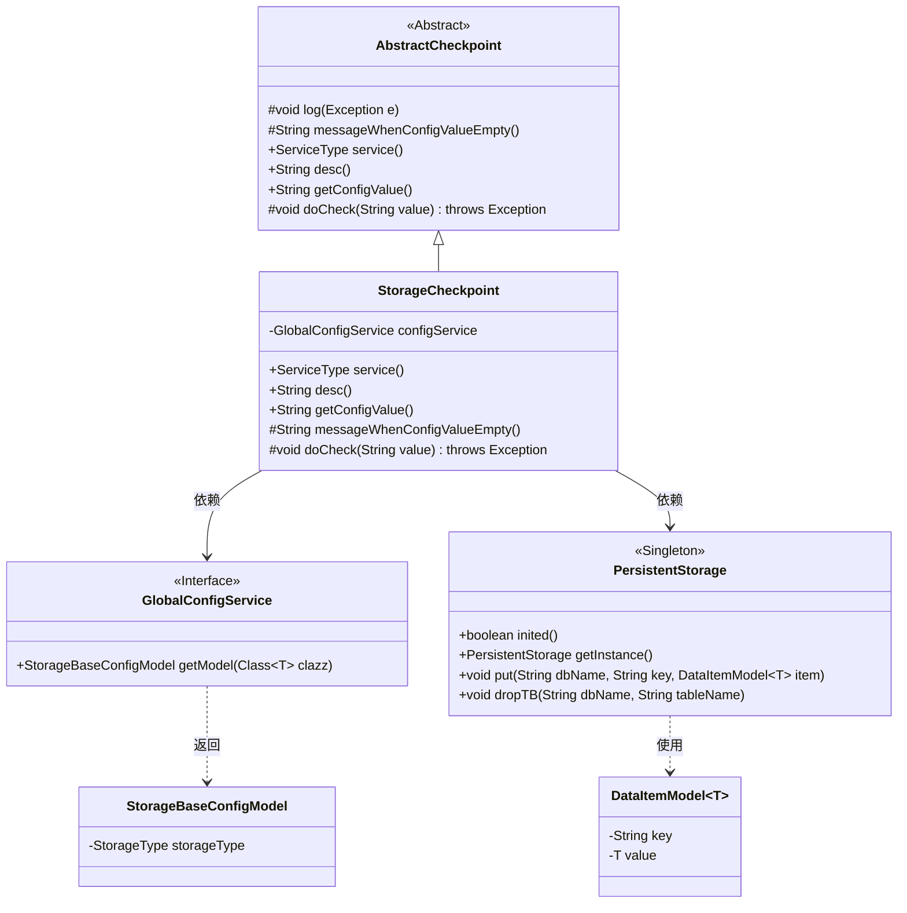
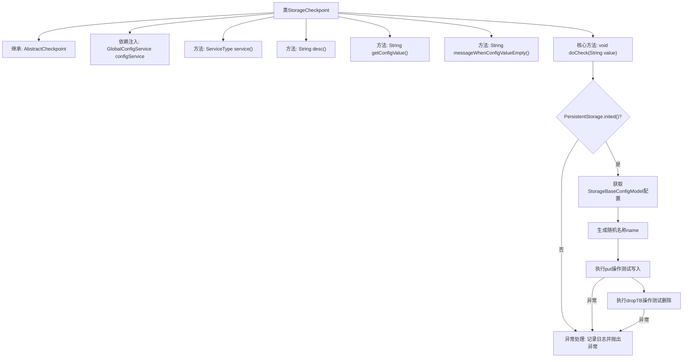

# 基础信息

|      |      |
|------|------|
| 名称 | StorageCheckpoint |
| 编码语言 | .java |
| 代码路径 | WeFe/board/board-service/src/main/java/com/welab/wefe/board/service/service/checkpoint/StorageCheckpoint.java |
| 包名 | com.welab.wefe.board.service.service.checkpoint |
| 依赖项 | ['com.welab.wefe.board.service.service.globalconfig.GlobalConfigService', 'com.welab.wefe.common.data.storage.model.DataItemModel', 'com.welab.wefe.common.data.storage.service.persistent.PersistentStorage', 'com.welab.wefe.common.wefe.checkpoint.AbstractCheckpoint', 'com.welab.wefe.common.wefe.dto.global_config.storage.StorageBaseConfigModel', 'com.welab.wefe.common.wefe.enums.ServiceType', 'org.apache.commons.lang3.RandomStringUtils', 'org.springframework.beans.factory.annotation.Autowired', 'org.springframework.stereotype.Service', 'com.welab.wefe.board.service.service.DataSetStorageService.DATABASE_NAME'] |
| 概述说明 | StorageCheckpoint类检查存储服务访问，验证配置并测试读写操作，异常时提示检查配置。 |

# 说明

StorageCheckpoint是一个继承AbstractCheckpoint的服务类，用于检查board对storage服务的访问状态。它通过GlobalConfigService获取存储配置，并执行两项测试操作：首先使用随机名称向PersistentStorage写入测试数据，然后删除该测试数据。若存储未初始化或操作失败，会抛出异常提示检查存储配置。异常信息会包含具体存储类型和错误详情。

# 类列表 Class Summary

| 名称   | 类型  | 说明 |
|-------|------|-------------|
| StorageCheckpoint | class | StorageCheckpoint类继承AbstractCheckpoint，检查storage服务访问状态，测试读写和删除操作，异常时提示检查配置。 |

## 类 StorageCheckpoint

|      |      |
|------|------|
| 访问范围 | @Service;public |
| 类型 | class |
| 名称 | StorageCheckpoint |
| 说明 | StorageCheckpoint类继承AbstractCheckpoint，检查storage服务访问状态，测试读写和删除操作，异常时提示检查配置。 |

### UML类图

类图描述：该图展示了StorageCheckpoint类继承自AbstractCheckpoint抽象类，并依赖GlobalConfigService接口和PersistentStorage单例类。StorageCheckpoint实现了检查存储服务可用性的功能，通过GlobalConfigService获取存储配置，使用PersistentStorage进行数据操作测试。图中包含了核心类及其关系，清晰地呈现了系统各组件间的协作方式。

### 内部方法调用关系图

这段代码流程图展示了StorageCheckpoint类的核心结构和执行流程。该类继承AbstractCheckpoint并实现多个方法，核心功能是通过doCheck方法验证存储服务的可用性。流程首先检查存储系统是否初始化，然后获取配置信息，接着通过随机生成的测试数据进行写入和删除操作来验证存储功能。每个操作步骤都包含异常处理机制，出现错误时会记录日志并抛出包含详细信息的异常。整个流程严格遵循"配置检查→写入测试→清理测试"的验证逻辑，确保存储服务的完整功能可用性。

### 字段列表 Field List

| 名称  | 类型  | 说明 |
|-------|-------|------|
| configService | GlobalConfigService | 自动注入全局配置服务实例。 |

### 方法列表

| 名称  | 类型  | 说明 |
|-------|-------|------|
| desc | String | 检查board对storage服务的访问状态。 |
| messageWhenConfigValueEmpty | String | 方法重写，返回空值表示配置值为空时的消息。 |
| getConfigValue | String | 重写getConfigValue方法，返回null。 |
| doCheck | void | 检查数据集存储配置并测试存储操作，若未初始化或操作异常则抛出错误提示检查配置。 |
| service | ServiceType | 重写service方法，返回StorageService类型。 |

