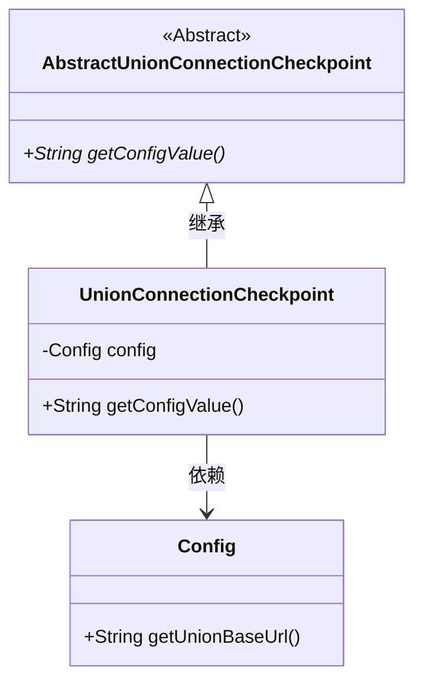
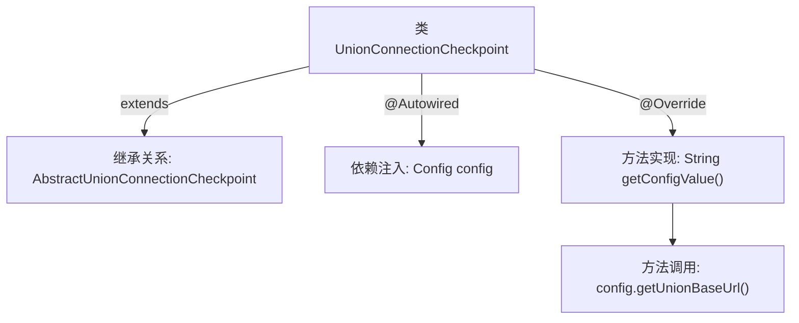

# 基础信息

|      |      |
|------|------|
| 名称 | UnionConnectionCheckpoint |
| 编码语言 | .java |
| 代码路径 | WeFe/board/board-service/src/main/java/com/welab/wefe/board/service/service/checkpoint/UnionConnectionCheckpoint.java |
| 包名 | com.welab.wefe.board.service.service.checkpoint |
| 依赖项 | ['com.welab.wefe.board.service.constant.Config', 'com.welab.wefe.common.wefe.checkpoint.AbstractUnionConnectionCheckpoint', 'org.springframework.beans.factory.annotation.Autowired', 'org.springframework.stereotype.Service'] |
| 概述说明 | UnionConnectionCheckpoint类继承AbstractUnionConnectionCheckpoint，通过@Autowired注入Config，重写getConfigValue方法返回config中的UnionBaseUrl。 |

# 说明

该内容描述了一个名为UnionConnectionCheckpoint的服务类，继承自AbstractUnionConnectionCheckpoint抽象类。该类通过@Autowired注解自动注入了一个Config配置对象，并重写了父类的getConfigValue方法，返回从config对象中获取的unionBaseUrl配置值。整个类主要用于获取联合连接的基础URL配置，属于Spring框架下的服务组件。

# 类列表 Class Summary

| 名称   | 类型  | 说明 |
|-------|------|-------------|
| UnionConnectionCheckpoint | class | UnionConnectionCheckpoint类继承AbstractUnionCheckpoint，通过@Autowired注入Config，重写getConfigValue方法返回config的UnionBaseUrl值。 |

## 类 UnionConnectionCheckpoint

|      |      |
|------|------|
| 访问范围 | @Service;public |
| 类型 | class |
| 名称 | UnionConnectionCheckpoint |
| 说明 | UnionConnectionCheckpoint类继承AbstractUnionCheckpoint，通过@Autowired注入Config，重写getConfigValue方法返回config的UnionBaseUrl值。 |

### UML类图

这段类图展示了Spring服务层组件的继承与依赖关系。UnionConnectionCheckpoint继承自抽象类AbstractUnionConnectionCheckpoint，并实现了其抽象方法getConfigValue()。该类通过@Autowired自动注入Config配置对象，在方法中调用config.getUnionBaseUrl()获取联合基础URL。图中清晰呈现了抽象基类、具体实现类与依赖组件之间的层级关系，体现了Spring依赖注入和模板方法模式的应用。

### 内部方法调用关系图

这段流程图展示了UnionConnectionCheckpoint类的核心结构。该类继承自AbstractUnionConnectionCheckpoint，通过@Autowired自动注入Config配置对象，并重写了getConfigValue()方法。在方法实现中，调用了config对象的getUnionBaseUrl()来获取联合基础URL。整个流程清晰地呈现了类继承、依赖注入和方法调用的关系，体现了Spring服务组件的典型特征。

### 字段列表 Field List

| 名称  | 类型  | 说明 |
|-------|-------|------|
| config | Config | 自动注入受保护的配置对象。 |

### 方法列表

| 名称  | 类型  | 说明 |
|-------|-------|------|
| getConfigValue | String | Java方法重写，返回配置中的联合基础URL。 |

