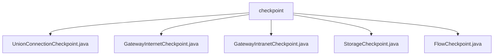

# 基础信息

|      |      |
|------|------|
| 名称 | checkpoint |
| 编码语言 | .java |
| 代码路径 | WeFe/board/board-service/src/main/java/com/welab/wefe/board/service/service/checkpoint |
| 包名 | docs.board.board-service.src.main.java.com.welab.wefe.board.service.service.checkpoint |
| 概述说明 | UnionConnectionCheckpoint获取联合连接URL。GatewayInternetCheckpoint检查公网连通性。GatewayIntranetCheckpoint检查内网连通性。StorageCheckpoint测试存储访问。FlowCheckpoint检查flow服务连通性。 |

# 说明

## 概述  
该模块是Spring框架下的服务健康检查组件，核心职责是验证Board服务与各依赖服务（如Gateway/Storage/Flow等）的连通性配置和可用性。接口规范统一继承AbstractCheckpoint抽象类，需实现服务类型定义、配置获取和连通性测试方法。关键数据结构包括Config配置对象和各类ServiceModel（如FlowConfigModel）。外部依赖涉及GatewayService、GlobalConfigService等基础设施服务。例如UnionConnectionCheckpoint通过config.unionBaseUrl获取联合连接地址，StorageCheckpoint则测试PersistentStorage的读写能力。

## 主要业务场景  
模块采用"检查点"模式统一管理服务健康状态，类似心跳检测机制。典型流程为：获取目标服务配置→执行连通性测试→返回状态或异常。例如GatewayIntranetCheckpoint检查内网地址配置后调用checkGatewayAliveProcessor，FlowCheckpoint则通过flowService.alive()探测存活状态。集成案例覆盖公网/内网检测（GatewayInternet/IntranetCheckpoint）、存储服务验证（StorageCheckpoint）等场景，形成完整的服务依赖健康检查体系。

### 包内部结构视图

该流程图展示了checkpoint目录下的5个Java文件结构。所有文件都直接隶属于checkpoint节点，包括UnionConnectionCheckpoint、GatewayInternetCheckpoint等5个检查点实现类，清晰地反映了这些检查点文件的平行层级关系。

# 文件列表

| 名称   | 类型  | 说明 |
|-------|------|-------------|
| [UnionConnectionCheckpoint.java](UnionConnectionCheckpoint.md) | file | UnionConnectionCheckpoint类继承AbstractUnionConnectionCheckpoint，通过@Autowired注入Config，重写getConfigValue方法返回config中的UnionBaseUrl。 |
| [GatewayInternetCheckpoint.java](GatewayInternetCheckpoint.md) | file | GatewayInternetCheckpoint类继承AbstractCheckpoint，用于检查公网连通性，通过globalConfigService获取配置，调用gatewayService发送请求。 |
| [GatewayIntranetCheckpoint.java](GatewayIntranetCheckpoint.md) | file | GatewayIntranetCheckpoint类继承AbstractCheckpoint，检查board与gateway内网连通性，依赖globalConfigService获取配置，未配置时提示设置内网地址，通过GatewayService检查存活状态。 |
| [StorageCheckpoint.java](StorageCheckpoint.md) | file | StorageCheckpoint类检查存储服务访问，验证配置并测试读写操作，异常时提示检查配置。 |
| [FlowCheckpoint.java](FlowCheckpoint.md) | file | FlowCheckpoint类继承AbstractCheckpoint，检查Flow服务连通性，依赖GlobalConfigService和FlowService，配置缺失时提示设置内网地址。 |

