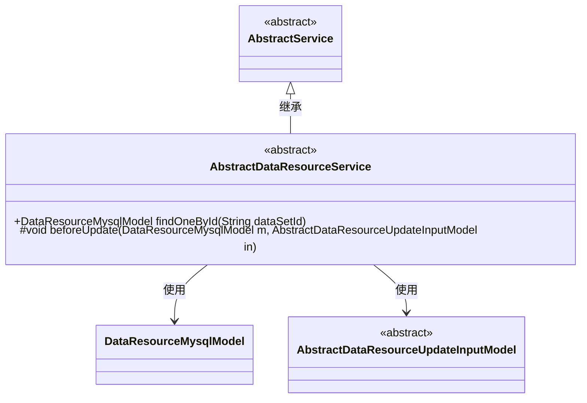
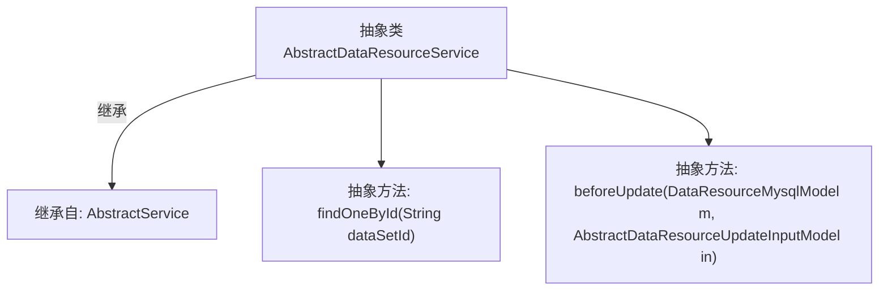

# 基础信息

|      |      |
|------|------|
| 名称 | AbstractDataResourceService |
| 编码语言 | .java |
| 代码路径 | WeFe/board/board-service/src/main/java/com/welab/wefe/board/service/service/data_resource/AbstractDataResourceService.java |
| 包名 | com.welab.wefe.board.service.service.data_resource |
| 依赖项 | ['com.welab.wefe.board.service.database.entity.data_resource.DataResourceMysqlModel', 'com.welab.wefe.board.service.dto.vo.data_resource.AbstractDataResourceUpdateInputModel', 'com.welab.wefe.board.service.service.AbstractService'] |
| 概述说明 | 抽象类AbstractDataResourceService提供按ID查询数据资源和更新前处理的抽象方法。 |

# 说明

这是一个名为AbstractDataResourceService的抽象类，继承自AbstractService。它定义了两个抽象方法：findOneById用于根据数据集ID查询数据资源，返回DataResourceMysqlModel对象；beforeUpdate是一个受保护的方法，在更新数据资源前执行，接收DataResourceMysqlModel和AbstractDataResourceUpdateInputModel作为参数。该类提供了数据资源服务的基础框架，具体实现需由子类完成。

# 类列表 Class Summary

| 名称   | 类型  | 说明 |
|-------|------|-------------|
| AbstractDataResourceService | class | 抽象类AbstractDataResourceService提供两个方法：按ID查询数据资源和更新前的预处理。 |

## 类 AbstractDataResourceService

|      |      |
|------|------|
| 访问范围 | public abstract |
| 类型 | class |
| 名称 | AbstractDataResourceService |
| 说明 | 抽象类AbstractDataResourceService提供两个方法：按ID查询数据资源和更新前的预处理。 |

### UML类图

这段类图展示了抽象服务类的继承关系和依赖结构。AbstractDataResourceService继承自AbstractService，包含两个核心方法：公开的findOneById用于按ID查询数据，受保护的beforeUpdate用于更新前预处理。该类依赖DataResourceMysqlModel作为数据实体，以及AbstractDataResourceUpdateInputModel作为更新输入参数基类。整体设计体现了模板方法模式，通过抽象方法强制子类实现特定业务逻辑。

### 内部方法调用关系图

该流程图展示了AbstractDataResourceService抽象类的结构，它继承自AbstractService基类并定义了两个核心抽象方法。findOneById方法用于通过ID查询数据资源，beforeUpdate方法提供了更新前的预处理钩子。这两个抽象方法需要子类实现具体逻辑，体现了模板方法设计模式的特点，适用于需要统一处理流程但允许步骤差异化的场景。

### 字段列表 Field List

| 名称  | 类型  | 说明 |
|-------|-------|------|

### 方法列表

| 名称  | 类型  | 说明 |
|-------|-------|------|
| beforeUpdate | void | 在更新前执行的抽象方法，参数为MySQL数据模型和更新输入模型。 |
| findOneById | DataResourceMysqlModel | 抽象方法：根据数据集ID查询MySQL数据资源模型。 |

