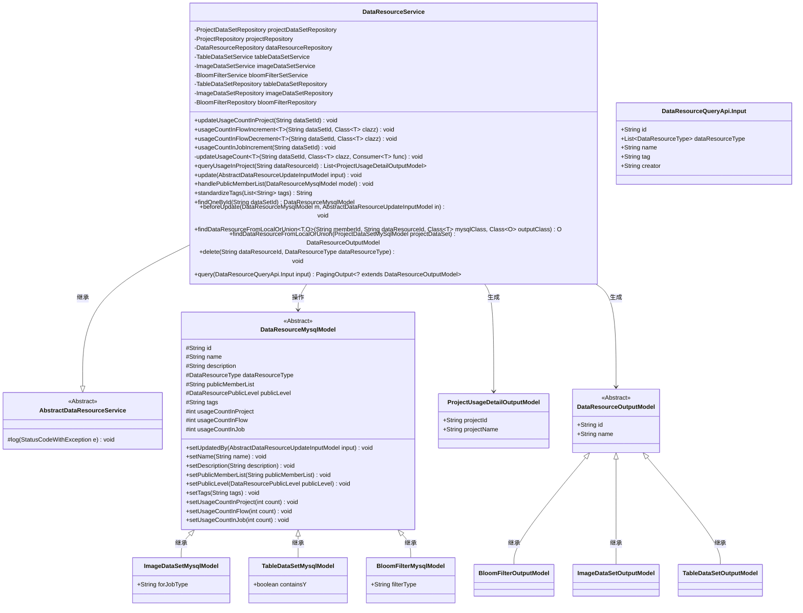
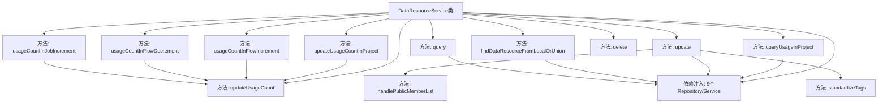
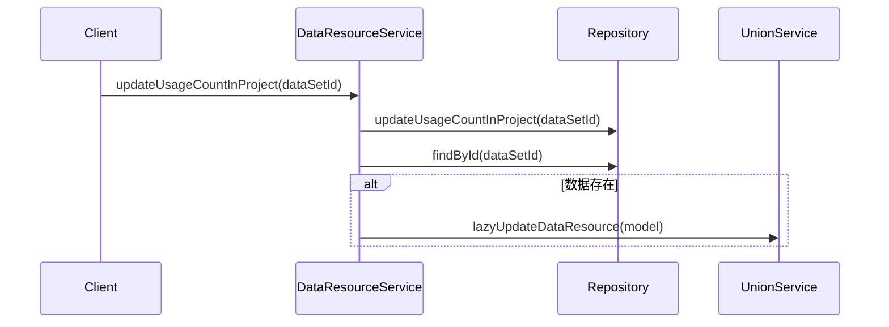

# 基础信息

|      |      |
|------|------|
| 名称 | DataResourceService |
| 编码语言 | .java |
| 代码路径 | WeFe/board/board-service/src/main/java/com/welab/wefe/board/service/service/data_resource/DataResourceService.java |
| 包名 | com.welab.wefe.board.service.service.data_resource |
| 依赖项 | ['com.welab.wefe.board.service.api.data_resource.DataResourceQueryApi', 'com.welab.wefe.board.service.database.entity.data_resource.BloomFilterMysqlModel', 'com.welab.wefe.board.service.database.entity.data_resource.DataResourceMysqlModel', 'com.welab.wefe.board.service.database.entity.data_resource.ImageDataSetMysqlModel', 'com.welab.wefe.board.service.database.entity.data_resource.TableDataSetMysqlModel', 'com.welab.wefe.board.service.database.entity.job.ProjectDataSetMySqlModel', 'com.welab.wefe.board.service.database.entity.job.ProjectMySqlModel', 'com.welab.wefe.board.service.database.repository.ProjectDataSetRepository', 'com.welab.wefe.board.service.database.repository.ProjectRepository', 'com.welab.wefe.board.service.database.repository.base.BaseRepository', 'com.welab.wefe.board.service.database.repository.base.RepositoryManager', 'com.welab.wefe.board.service.database.repository.data_resource.BloomFilterRepository', 'com.welab.wefe.board.service.database.repository.data_resource.DataResourceRepository', 'com.welab.wefe.board.service.database.repository.data_resource.ImageDataSetRepository', 'com.welab.wefe.board.service.database.repository.data_resource.TableDataSetRepository', 'com.welab.wefe.board.service.dto.base.PagingOutput', 'com.welab.wefe.board.service.dto.entity.data_resource.output.BloomFilterOutputModel', 'com.welab.wefe.board.service.dto.entity.data_resource.output.DataResourceOutputModel', 'com.welab.wefe.board.service.dto.entity.data_resource.output.ImageDataSetOutputModel', 'com.welab.wefe.board.service.dto.entity.data_resource.output.TableDataSetOutputModel', 'com.welab.wefe.board.service.dto.entity.project.ProjectUsageDetailOutputModel', 'com.welab.wefe.board.service.dto.vo.data_resource.AbstractDataResourceUpdateInputModel', 'com.welab.wefe.board.service.service.CacheObjects', 'com.welab.wefe.board.service.service.data_resource.bloom_filter.BloomFilterService', 'com.welab.wefe.board.service.service.data_resource.image_data_set.ImageDataSetService', 'com.welab.wefe.board.service.service.data_resource.table_data_set.TableDataSetService', 'com.welab.wefe.common.StatusCode', 'com.welab.wefe.common.data.mysql.Where', 'com.welab.wefe.common.data.mysql.enums.OrderBy', 'com.welab.wefe.common.exception.StatusCodeWithException', 'com.welab.wefe.common.util.StringUtil', 'com.welab.wefe.common.web.util.ModelMapper', 'com.welab.wefe.common.wefe.enums.DataResourcePublicLevel', 'com.welab.wefe.common.wefe.enums.DataResourceType', 'org.apache.commons.collections4.CollectionUtils', 'org.springframework.beans.factory.annotation.Autowired', 'org.springframework.stereotype.Service', 'java.util.ArrayList', 'java.util.List', 'java.util.function.Consumer', 'java.util.stream.Collectors'] |
| 概述说明 | DataResourceService管理数据集资源，提供更新使用计数、查询项目使用情况、标准化标签、处理可见成员列表及数据增删改查功能。 |

# 说明

DataResourceService是一个服务类，继承自AbstractDataResourceService，用于管理数据资源。它通过多个Repository和Service处理不同类型的数据集（如表数据集、图像数据集、布隆过滤器等）。主要功能包括更新数据集在项目中的使用计数、查询项目中使用数据集的信息、更新数据集信息、标准化标签列表、处理可见成员列表、从本地或联合服务获取数据资源详细信息、删除数据资源以及查询数据资源。该类还提供了对数据集使用计数的增减操作，并支持分页查询。

# 类列表 Class Summary

| 名称   | 类型  | 说明 |
|-------|------|-------------|
| DataResourceService | class | DataResourceService类管理数据集资源，提供更新使用计数、查询项目信息、标准化标签、处理可见成员列表及数据增删改查功能。 |

## 类 DataResourceService

|      |      |
|------|------|
| 访问范围 | @Service;public |
| 类型 | class |
| 名称 | DataResourceService |
| 说明 | DataResourceService类管理数据集资源，提供更新使用计数、查询项目信息、标准化标签、处理可见成员列表及数据增删改查功能。 |

### UML类图

这段代码实现了一个数据资源管理服务，主要功能包括：更新数据集使用计数、查询项目使用详情、标准化标签处理、数据资源增删改查等。服务通过多个Repository和Service协作，支持多种数据类型（表格、图像、布隆过滤器），并实现了本地与联合服务的资源获取逻辑。类图展示了核心模型继承关系和主要依赖，体现了分层设计和多态处理能力。

### 内部方法调用关系图

该流程图展示了DataResourceService类的核心结构和主要方法调用关系。类通过依赖注入管理9个Repository/Service组件，提供数据资源使用计数更新、查询、删除等核心功能。updateUsageCount作为核心私有方法被多个公开方法调用，处理不同场景下的计数更新逻辑。update方法包含标签标准化和成员可见性处理等子流程，query方法根据不同类型资源进行差异化查询。时序图则具体展示了updateUsageCountInProject方法执行时的跨组件调用流程。

### 字段列表 Field List

| 名称  | 类型  | 说明 |
|-------|-------|------|
| bloomFilterRepository | BloomFilterRepository | 自动注入布隆过滤器仓库实例。 |
| bloomFilterSetService | BloomFilterService | 自动注入布隆过滤器服务实例。 |
| imageDataSetService | ImageDataSetService | 使用@Autowired自动注入ImageDataSetService实例。 |
| projectDataSetRepository | ProjectDataSetRepository | 自动注入ProjectDataSetRepository实例。 |
| dataResourceRepository | DataResourceRepository | 使用@Autowired自动注入DataResourceRepository实例。 |
| imageDataSetRepository | ImageDataSetRepository | 自动注入ImageDataSetRepository实例。 |
| projectRepository | ProjectRepository | 使用@Autowired自动注入ProjectRepository实例。 |
| tableDataSetRepository | TableDataSetRepository | 使用@Autowired自动注入TableDataSetRepository实例。 |
| tableDataSetService | TableDataSetService | 自动注入TableDataSetService实例。 |

### 方法列表

| 名称  | 类型  | 说明 |
|-------|-------|------|
| standardizeTags | String | 方法standardizeTags处理字符串列表：去逗号、去空、去重、排序后，用逗号拼接并前后加逗号返回。输入空时返回空字符串。 |
| usageCountInFlowDecrement | void | 方法用于减少数据集在流程中的使用计数，接受数据集ID和模型类参数，调用内部更新方法执行减一操作，可能抛出异常。 |
| beforeUpdate | void | 方法beforeUpdate被重写，抛出UnsupportedOperationException异常，表示不支持该操作。 |
| findOneById | DataResourceMysqlModel | 该方法用于通过ID查找数据资源，但当前实现仅抛出未支持操作异常。 |
| update | void | 更新数据资源方法：根据输入参数更新模型属性，处理公共成员列表，保存并同步到联合服务，最后刷新缓存标签。若模型不存在则直接返回。 |
| usageCountInJobIncrement | void | 方法usageCountInJobIncrement根据数据集ID查找资源，若存在则按类型更新其作业使用计数。支持图像、表格和布隆过滤器三种类型。 |
| handlePublicMemberList | void | 处理公共成员列表：若公开级别为PublicWithMemberList且列表包含当前用户ID，则移除该ID并清理多余逗号。 |
| updateUsageCountInProject | void | 更新数据集在项目中的使用计数：先通过仓库更新计数，查询数据模型，若存在则调用服务延迟更新，异常时记录日志。 |
| updateUsageCount | void | 更新数据集使用计数：根据ID查找模型，若存在则应用修改函数并保存，最后触发延迟更新。 |
| usageCountInFlowIncrement | void | 方法`usageCountInFlowIncrement`用于增加数据集在项目中的使用计数，接受数据集ID和模型类参数，调用`updateUsageCount`实现计数加一，可能抛出异常。 |
| queryUsageInProject | List<ProjectUsageDetailOutputModel> | 查询项目中资源使用详情的方法，先获取资源引用记录，若无则返回空列表；否则查询引用资源的项目详情并映射输出。 |
| findDataResourceFromLocalOrUnion | O | 方法根据memberId判断数据来源：若为当前用户则从本地数据库查询并映射为输出模型，否则调用unionService获取数据。异常时抛出StatusCodeWithException。 |
| findDataResourceFromLocalOrUnion | DataResourceOutputModel | 方法根据项目数据集成员ID判断数据来源：若为当前用户则从本地仓库查询并映射返回；否则调用联合服务获取详情。异常时抛出StatusCodeWithException。 |
| query | PagingOutput<? extends DataResourceOutputModel> | 查询数据资源方法，根据输入条件构建查询，支持分页和多种资源类型（表格、图像、布隆过滤器），返回对应输出模型。 |
| delete | void | 该方法根据数据类型调用对应服务删除指定资源，支持图像数据集、表格数据集和布隆过滤器类型。 |

