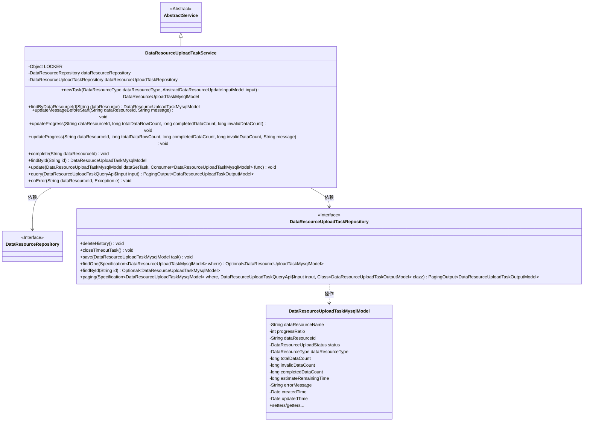
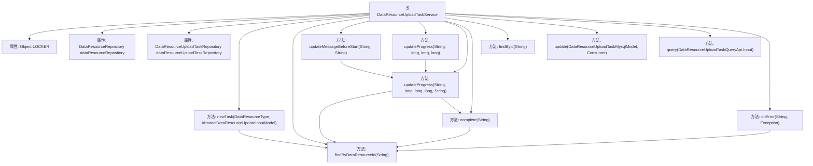
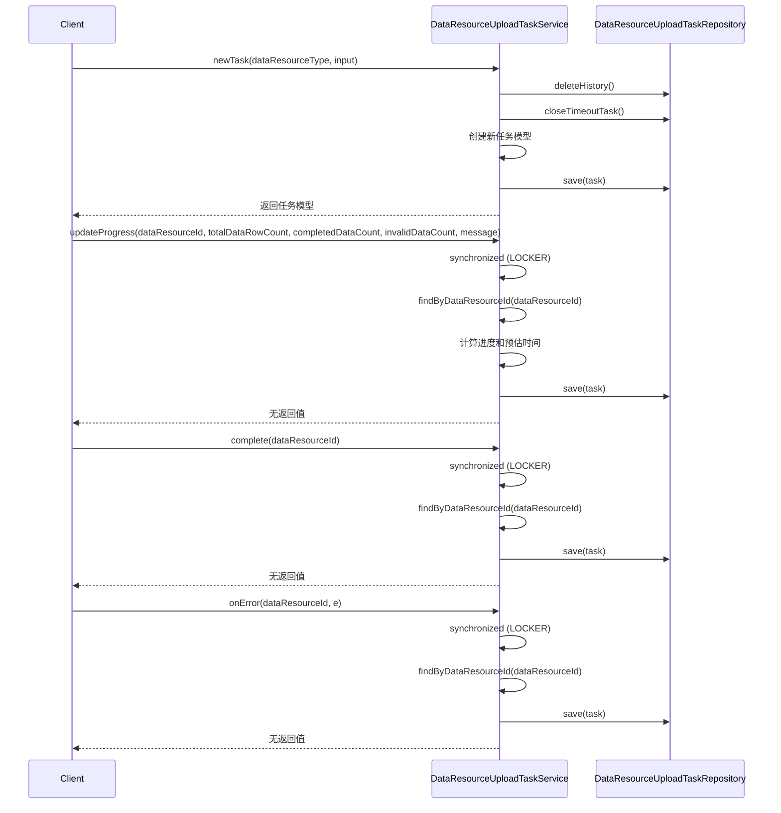

# 基础信息

|      |      |
|------|------|
| 名称 | DataResourceUploadTaskService |
| 编码语言 | .java |
| 代码路径 | WeFe/board/board-service/src/main/java/com/welab/wefe/board/service/service/data_resource/DataResourceUploadTaskService.java |
| 包名 | com.welab.wefe.board.service.service.data_resource |
| 依赖项 | ['com.welab.wefe.board.service.api.data_resource.upload_task.DataResourceUploadTaskQueryApi', 'com.welab.wefe.board.service.database.entity.data_resource.DataResourceMysqlModel', 'com.welab.wefe.board.service.database.entity.data_resource.DataResourceUploadTaskMysqlModel', 'com.welab.wefe.board.service.database.repository.data_resource.DataResourceRepository', 'com.welab.wefe.board.service.database.repository.data_resource.DataResourceUploadTaskRepository', 'com.welab.wefe.board.service.dto.base.PagingOutput', 'com.welab.wefe.board.service.dto.entity.data_resource.output.DataResourceUploadTaskOutputModel', 'com.welab.wefe.board.service.dto.vo.data_resource.AbstractDataResourceUpdateInputModel', 'com.welab.wefe.board.service.service.AbstractService', 'com.welab.wefe.common.Convert', 'com.welab.wefe.common.TimeSpan', 'com.welab.wefe.common.data.mysql.Where', 'com.welab.wefe.common.util.DateUtil', 'com.welab.wefe.common.wefe.enums.DataResourceType', 'com.welab.wefe.common.wefe.enums.DataResourceUploadStatus', 'org.springframework.beans.factory.annotation.Autowired', 'org.springframework.data.jpa.domain.Specification', 'org.springframework.stereotype.Service', 'java.util.Date', 'java.util.function.Consumer'] |
| 概述说明 | DataResourceUploadTaskService管理数据资源上传任务，包括创建、更新进度、完成和错误处理，使用锁确保并发安全，支持查询和状态管理。 |

# 说明

DataResourceUploadTaskService是一个用于管理数据资源上传任务的服务类，继承自AbstractService。它通过DataResourceUploadTaskRepository和DataResourceRepository与数据库交互，提供任务创建、进度更新、完成处理及错误处理等功能。关键操作包括：创建新任务时清理历史数据和超时任务；使用同步锁确保并发操作安全；计算并更新上传进度，包括数据行数、完成比例和预估剩余时间；标记任务完成或失败状态；支持通过ID或资源ID查询任务。服务还包含分页查询功能，用于获取最近更新的任务列表。

# 类列表 Class Summary

| 名称   | 类型  | 说明 |
|-------|------|-------------|
| DataResourceUploadTaskService | class | DataResourceUploadTaskService处理数据资源上传任务，包括创建任务、更新进度、完成和错误处理，使用锁确保并发安全。 |

## 类 DataResourceUploadTaskService

|      |      |
|------|------|
| 访问范围 | @Service;public |
| 类型 | class |
| 名称 | DataResourceUploadTaskService |
| 说明 | DataResourceUploadTaskService处理数据资源上传任务，包括创建任务、更新进度、完成和错误处理，使用锁确保并发安全。 |

### UML类图

这段代码展示了一个数据资源上传任务服务`DataResourceUploadTaskService`，它继承自`AbstractService`，并依赖两个仓库接口`DataResourceRepository`和`DataResourceUploadTaskRepository`。主要功能包括创建上传任务、查询任务、更新进度、完成任务和处理错误等。通过同步锁机制保证并发操作的安全性，使用`DataResourceUploadTaskMysqlModel`作为任务实体模型，包含任务状态、进度、错误信息等字段。服务提供了完整的任务生命周期管理功能，包括进度计算、时间预估和状态转换等。

### 内部方法调用关系图

这段代码实现了一个数据资源上传任务服务，主要功能包括创建新任务、更新任务进度、完成任务标记、错误处理等。流程图展示了类结构和内部方法调用关系，时序图则详细描述了核心方法的执行流程。所有涉及任务状态变更的操作都通过synchronized块保证线程安全，并通过统一的findByDataResourceId方法获取任务实体。进度更新逻辑包含多种边界条件处理，如防止除零错误、进度值强制修正等。

### 字段列表 Field List

| 名称  | 类型  | 说明 |
|-------|-------|------|
| dataResourceUploadTaskRepository | DataResourceUploadTaskRepository | 自动注入数据资源上传任务仓库实例。 |
| LOCKER = new Object() | Object | 定义静态不可变对象LOCKER作为同步锁。 |
| dataResourceRepository | DataResourceRepository | 自动注入DataResourceRepository实例。 |

### 方法列表

| 名称  | 类型  | 说明 |
|-------|-------|------|
| complete | void | 方法complete同步更新数据资源上传任务状态为已完成，设置完成数、剩余时间、进度比、更新时间及错误信息，并保存。 |
| updateProgress | void | 同步更新数据资源上传任务进度，包括计算进度比例、预估剩余时间，并确保线程安全及进度合理性。 |
| updateMessageBeforeStart | void | 更新数据资源启动前的进度信息，设置初始进度为0并附带消息。 |
| findByDataResourceId | DataResourceUploadTaskMysqlModel | 该方法通过数据资源ID查询数据库中的上传任务记录，使用条件构造器指定查询条件，返回匹配的记录或null。 |
| newTask | DataResourceUploadTaskMysqlModel | 创建新上传任务，删除旧数据并关闭超时任务，设置任务属性后保存并返回。 |
| updateProgress | void | 更新进度方法，接收数据资源ID、总行数、已完成数和无效数，调用重载方法处理。 |
| findById | DataResourceUploadTaskMysqlModel | 该方法通过ID查询数据资源上传任务，返回对应实体或null。 |
| update | void | 更新数据集任务：检查非空后执行回调，设置更新时间并保存。 |
| query | PagingOutput<DataResourceUploadTaskOutputModel> | 查询数据资源上传任务，筛选更新时间在最近10分钟内的记录，并返回分页结果。 |
| onError | void | 方法onError处理数据资源上传错误，同步更新数据库任务状态为失败，记录错误信息和时间。 |

