# 基础信息

|      |      |
|------|------|
| 名称 | data_resource |
| 编码语言 | .java |
| 代码路径 | WeFe/board/board-service/src/main/java/com/welab/wefe/board/service/service/data_resource |
| 包名 | docs.board.board-service.src.main.java.com.welab.wefe.board.service.service.data_resource |
| 概述说明 | TableDataSetService管理表格数据集，支持文件上传、删除、查询等功能。BloomFilter模块处理任务状态、数据存储及列配置。数据资源添加模块处理表格、图像等数据导入。图像数据集模块管理分类/检测任务数据。上传任务服务管理上传进度和状态。DataResourceService管理各类数据集的使用计数和查询。 |

# 说明

## 概述  
该模块是数据资源管理平台，核心职责是统一处理表格/图像/布隆过滤器等数据集的CRUD、解析及生命周期管理，类似企业级ETL中枢。TableDataSetService实现多源数据接入，BloomFilterTaskService管理任务状态，ImageDataSetParser处理图像标注，DataResourceService协调全局资源。  

接口规范包含批量导入（AbstractDataResourceAddService）、进度跟踪（DataResourceUploadTaskService）、联合查询（BloomFilterService）等。关键数据结构有DataResourceMysqlModel、BloomFilterColumnInputModel及图像标签映射表。外部依赖涉及PersistentStorage、RSA加密服务及各类Repository。例如TableDataSetAddService支持CSV/SQL解析，ImageDataSetParser生成PASCAL VOC格式文件。  

## 主要业务场景  
典型流程为数据上传→解析→存储→应用：用户上传CSV后，TableDataSetService解析并统计标签；图像数据通过ImageDataSetParser转换为训练格式；BloomFilterTaskService同步加密去重。全链路采用"读取-处理-存储"范式，类似微服务架构。  

功能完整性体现在多类型支持（如Excel/XML/tgz）、安全控制（CRT加密）、性能优化（分页/批量处理）。交互模式含服务调用（如DataResourceService更新项目计数）和异步任务（上传进度回调）。例如布隆过滤器生成时动态计算批次大小，图像导出时工厂模式创建解析器。

### 包内部结构视图

```mermaid
graph TD
    data_resource --> table_data_set
    data_resource --> bloom_filter
    data_resource --> add
    data_resource --> image_data_set
    data_resource --> DataResourceUploadTaskService.java
    data_resource --> AbstractDataResourceService.java
    data_resource --> DataResourceService.java
    table_data_set --> TableDataSetService.java
    bloom_filter --> BloomFilterTaskService.java
    bloom_filter --> BloomFilterStorageService.java
    bloom_filter --> BloomFilterService.java
    bloom_filter --> BloomFilterColumnService.java
    add --> BloomFilterAddServiceDataRowConsumer.java
    add --> TableDataSetAddServiceDataRowConsumer.java
    add --> ImageDataSetAddService.java
    add --> BloomFilterAddService.java
    add --> TableDataSetAddService.java
    add --> AbstractDataResourceAddService.java
    image_data_set --> data_set_parser
    image_data_set --> ImageDataSetSampleService.java
    image_data_set --> ImageDataSetService.java
    data_set_parser --> AbstractImageDataSetParser.java
    data_set_parser --> DetectionImageDataSetParser.java
    data_set_parser --> ClassifyImageDataSetParser.java
```

该流程图展示了WeFe项目中data_resource模块的完整层级结构，包含table_data_set、bloom_filter、add和image_data_set四个子模块及其对应的服务类文件。每个子模块下又细分了具体的服务实现类，特别是image_data_set模块还包含data_set_parser解析器子模块。顶层同时包含了三个直接隶属于data_resource的通用服务类文件。整个结构清晰地反映了数据资源管理服务的组织方式。

# 文件列表

| 名称   | 类型  | 说明 |
|-------|------|-------------|
| [table_data_set](table_data_set/_module.md) | package | TableDataSetService类提供数据集管理功能，包括获取文件、删除数据集、测试SQL查询、查询和保存数据集等操作。通过多个Repository和服务类实现数据集的增删改查及存储管理。 |
| [DataResourceUploadTaskService.java](DataResourceUploadTaskService.md) | file | DataResourceUploadTaskService管理数据资源上传任务，包括创建、更新进度、完成和错误处理，使用锁确保并发安全，支持查询和状态管理。 |
| [AbstractDataResourceService.java](AbstractDataResourceService.md) | file | 抽象类AbstractDataResourceService提供按ID查询数据资源和更新前处理的抽象方法。 |
| [DataResourceService.java](DataResourceService.md) | file | DataResourceService管理数据集资源，提供更新使用计数、查询项目使用情况、标准化标签、处理可见成员列表及数据增删改查功能。 |
| [image_data_set](image_data_set/_module.md) | package | 该模块提供统一图像数据集解析框架，支持分类和检测任务。包含数据集分割、版本控制、ZIP打包等功能，子类实现具体逻辑。服务类管理数据集样本，支持查询、更新、删除及统计功能，操作数据库并处理异常。 |
| [add](add/_module.md) | package | BloomFilterAddServiceDataRowConsumer处理数据行生成布隆过滤器，支持批量处理、去重和加密。TableDataSetAddServiceDataRowConsumer批量处理表格数据，支持去重和标签统计。ImageDataSetAddService处理图片数据集上传，解压文件并保存样本信息。BloomFilterAddService和TableDataSetAddService分别处理布隆过滤器和表格数据添加，支持多种数据源。AbstractDataResourceAddService是抽象基类，定义数据资源添加的通用逻辑。 |
| [bloom_filter](bloom_filter/_module.md) | package | BloomFilterTaskService管理布隆过滤器任务进度和异常处理，BloomFilterStorageService处理数据存储操作，BloomFilterService实现布隆过滤器功能，BloomFilterColumnService管理列数据查询和更新。 |

