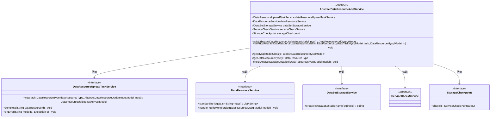
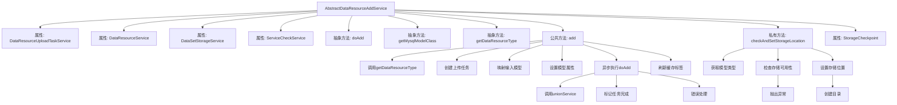
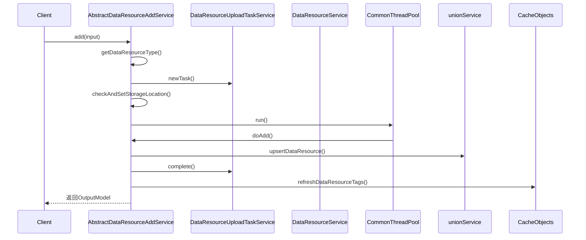

# 基础信息

|      |      |
|------|------|
| 名称 | AbstractDataResourceAddService |
| 编码语言 | .java |
| 代码路径 | WeFe/board/board-service/src/main/java/com/welab/wefe/board/service/service/data_resource/add/AbstractDataResourceAddService.java |
| 包名 | com.welab.wefe.board.service.service.data_resource.add |
| 依赖项 | ['com.welab.wefe.board.service.base.file_system.WeFeFileSystem', 'com.welab.wefe.board.service.database.entity.data_resource.BloomFilterMysqlModel', 'com.welab.wefe.board.service.database.entity.data_resource.DataResourceMysqlModel', 'com.welab.wefe.board.service.database.entity.data_resource.DataResourceUploadTaskMysqlModel', 'com.welab.wefe.board.service.database.entity.data_resource.TableDataSetMysqlModel', 'com.welab.wefe.board.service.dto.vo.data_resource.AbstractDataResourceUpdateInputModel', 'com.welab.wefe.board.service.dto.vo.data_resource.DataResourceAddOutputModel', 'com.welab.wefe.board.service.service.AbstractService', 'com.welab.wefe.board.service.service.CacheObjects', 'com.welab.wefe.board.service.service.DataSetStorageService', 'com.welab.wefe.board.service.service.ServiceCheckService', 'com.welab.wefe.board.service.service.checkpoint.StorageCheckpoint', 'com.welab.wefe.board.service.service.data_resource.DataResourceService', 'com.welab.wefe.board.service.service.data_resource.DataResourceUploadTaskService', 'com.welab.wefe.common.CommonThreadPool', 'com.welab.wefe.common.StatusCode', 'com.welab.wefe.common.exception.StatusCodeWithException', 'com.welab.wefe.common.util.FileUtil', 'com.welab.wefe.common.wefe.checkpoint.dto.ServiceCheckPointOutput', 'com.welab.wefe.common.wefe.enums.DataResourceStorageServiceType', 'com.welab.wefe.common.wefe.enums.DataResourceType', 'org.modelmapper.ModelMapper', 'org.springframework.beans.factory.annotation.Autowired'] |
| 概述说明 | 抽象类AbstractDataResourceAddService提供添加数据资源的公共方法，依赖多个服务类，包含抽象方法和资源存储位置检查逻辑，支持异步执行资源保存。 |

# 说明

这是一个抽象类AbstractDataResourceAddService，继承自AbstractService，用于处理数据资源的添加操作。该类包含四个自动装配的服务组件，并定义了三个抽象方法供子类实现。主要方法add实现了资源添加的公共逻辑，包括创建上传任务、映射输入模型、设置资源属性等，并通过异步线程执行具体的资源保存操作。私有方法checkAndSetStorageLocation负责根据资源类型检查和设置存储位置，支持表数据集、图像数据集和布隆过滤器等不同类型的存储配置。整个过程包含错误处理和缓存刷新机制。

# 类列表 Class Summary

| 名称   | 类型  | 说明 |
|-------|------|-------------|
| AbstractDataResourceAddService | class | 抽象类AbstractDataResourceAddService提供添加数据资源的公共方法，包含异步执行、存储位置检查等功能，需子类实现特定操作。 |

## 类 AbstractDataResourceAddService

|      |      |
|------|------|
| 访问范围 | public abstract |
| 类型 | class |
| 名称 | AbstractDataResourceAddService |
| 说明 | 抽象类AbstractDataResourceAddService提供添加数据资源的公共方法，包含异步执行、存储位置检查等功能，需子类实现特定操作。 |

### UML类图

这段代码展示了一个抽象服务类`AbstractDataResourceAddService`，它提供了数据资源添加的核心逻辑。该类通过依赖注入多个服务接口（如`DataResourceUploadTaskService`、`DataResourceService`等）来实现资源上传任务管理、数据存储位置检查等功能。核心方法`add()`实现了资源添加的主流程，包括任务创建、模型映射、存储位置设置等步骤，并通过线程池异步执行实际添加操作。抽象方法`doAdd()`和`getMysqlModelClass()`需要子类实现，体现了模板方法设计模式。该类支持多种数据资源类型（如表数据集、图像数据集等）的处理，具有完善的错误处理机制。

### 内部方法调用关系图

该流程图展示了AbstractDataResourceAddService的核心结构和调用关系。类包含4个自动注入的服务属性和3个抽象方法，主要业务逻辑集中在add()方法中，该方法通过异步线程调用抽象方法doAdd()完成资源添加，并包含存储位置检查和设置的私有方法。时序图详细描述了从客户端调用到异步任务完成的完整流程，涉及多个服务协作和数据持久化操作。

### 字段列表 Field List

| 名称  | 类型  | 说明 |
|-------|-------|------|
| dataResourceUploadTaskService | DataResourceUploadTaskService | 使用@Autowired自动注入DataResourceUploadTaskService服务实例。 |
| dataResourceService | DataResourceService | 自动注入DataResourceService服务实例。 |
| storageCheckpoint | StorageCheckpoint | 自动注入存储检查点实例。 |
| dataSetStorageService | DataSetStorageService | 使用@Autowired自动注入DataSetStorageService实例。 |
| serviceCheckService | ServiceCheckService | 自动注入ServiceCheckService实例。 |

### 方法列表

| 名称  | 类型  | 说明 |
|-------|-------|------|
| getDataResourceType | DataResourceType | 抽象方法，返回数据资源类型。 |
| doAdd | void | 抽象方法doAdd，接收输入模型、任务模型和数据模型参数，可能抛出异常。 |
| add | DataResourceAddOutputModel | 该方法用于添加数据资源，包括创建上传任务、映射输入模型、设置资源属性，并异步执行保存操作。完成后返回资源ID和任务ID。 |
| getMysqlModelClass | Class<? extends DataResourceMysqlModel> | 抽象方法，返回继承DataResourceMysqlModel的类类型。 |
| checkAndSetStorageLocation | void | 方法检查并设置数据存储位置。表数据集使用存储服务，设置服务类型和命名空间；其他类型使用本地文件系统，创建目录并设置路径。过滤器文件有统一名称。 |

