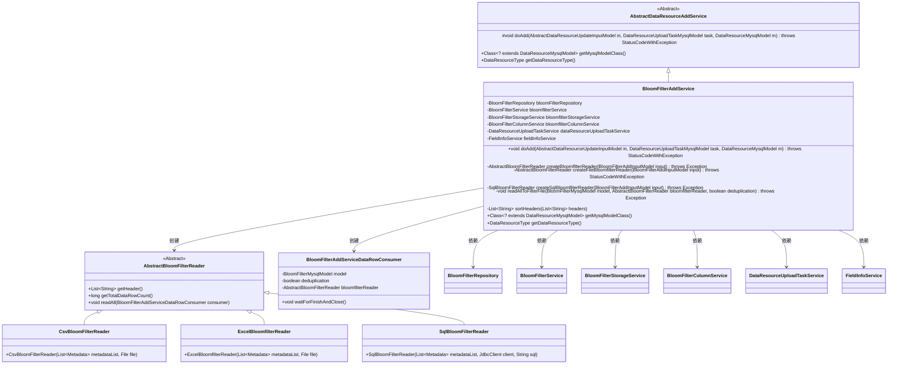
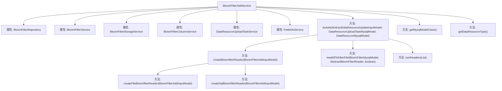
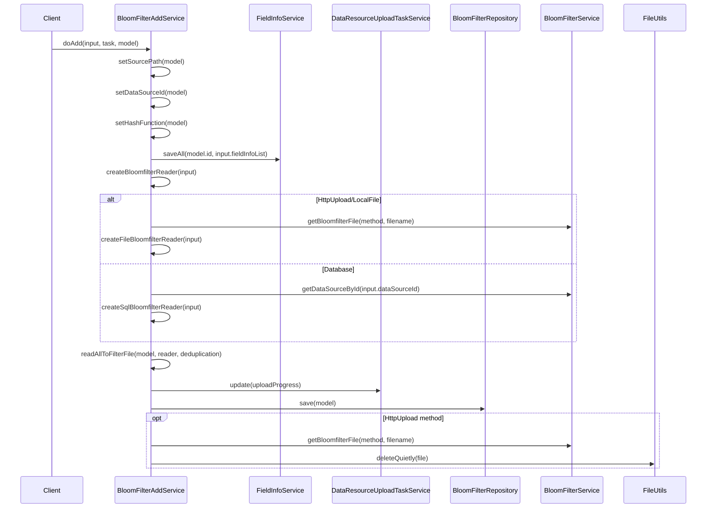

# 基础信息

|      |      |
|------|------|
| 名称 | BloomFilterAddService |
| 编码语言 | .java |
| 代码路径 | WeFe/board/board-service/src/main/java/com/welab/wefe/board/service/service/data_resource/add/BloomFilterAddService.java |
| 包名 | com.welab.wefe.board.service.service.data_resource.add |
| 依赖项 | ['com.welab.wefe.board.service.base.file_system.WeFeFileSystem', 'com.welab.wefe.board.service.constant.DataSetAddMethod', 'com.welab.wefe.board.service.database.entity.DataSourceMysqlModel', 'com.welab.wefe.board.service.database.entity.data_resource.BloomFilterMysqlModel', 'com.welab.wefe.board.service.database.entity.data_resource.DataResourceMysqlModel', 'com.welab.wefe.board.service.database.entity.data_resource.DataResourceUploadTaskMysqlModel', 'com.welab.wefe.board.service.database.repository.data_resource.BloomFilterRepository', 'com.welab.wefe.board.service.dto.vo.data_resource.AbstractDataResourceUpdateInputModel', 'com.welab.wefe.board.service.dto.vo.data_resource.BloomFilterAddInputModel', 'com.welab.wefe.board.service.service.data_resource.DataResourceUploadTaskService', 'com.welab.wefe.board.service.service.data_resource.bloom_filter.BloomFilterColumnService', 'com.welab.wefe.board.service.service.data_resource.bloom_filter.BloomFilterService', 'com.welab.wefe.board.service.service.data_resource.bloom_filter.BloomFilterStorageService', 'com.welab.wefe.board.service.service.fusion.FieldInfoService', 'com.welab.wefe.board.service.util.AbstractBloomFilterReader', 'com.welab.wefe.board.service.util.CsvBloomFilterReader', 'com.welab.wefe.board.service.util.ExcelBloomfilterReader', 'com.welab.wefe.board.service.util.SqlBloomFilterReader', 'com.welab.wefe.common.StatusCode', 'com.welab.wefe.common.exception.StatusCodeWithException', 'com.welab.wefe.common.jdbc.JdbcClient', 'com.welab.wefe.common.wefe.enums.DataResourceType', 'org.apache.commons.io.FileUtils', 'org.springframework.beans.factory.annotation.Autowired', 'org.springframework.stereotype.Service', 'java.io.File', 'java.io.IOException', 'java.util.ArrayList', 'java.util.Date', 'java.util.List'] |
| 概述说明 | BloomFilterAddService处理布隆过滤器数据添加，支持数据库、HTTP上传和本地文件方式，解析数据并保存到文件，包含去重和字段处理功能。 |

# 说明

BloomFilterAddService是一个继承自AbstractDataResourceAddService的服务类，用于处理布隆过滤器的添加操作。它通过注入多个相关服务（如BloomFilterRepository、BloomFilterService等）来实现功能。主要方法doAdd负责处理输入模型，包括设置文件路径、保存字段信息、解析原始数据并保存到过滤文件。支持多种数据来源方式（如数据库、HTTP上传、本地文件），并通过不同Reader类（如CsvBloomFilterReader、SqlBloomFilterReader）进行解析。还包含数据去重、文件删除等辅助功能，确保数据处理的完整性和效率。

# 类列表 Class Summary

| 名称   | 类型  | 说明 |
|-------|------|-------------|
| BloomFilterAddService | class | BloomFilterAddService继承AbstractDataResourceAddService，处理布隆过滤器数据添加，包括文件解析、数据库读取、数据去重及任务状态更新。 |

## 类 BloomFilterAddService

|      |      |
|------|------|
| 访问范围 | @Service;public |
| 类型 | class |
| 名称 | BloomFilterAddService |
| 说明 | BloomFilterAddService继承AbstractDataResourceAddService，处理布隆过滤器数据添加，包括文件解析、数据库读取、数据去重及任务状态更新。 |

### UML类图

这段代码展示了一个布隆过滤器添加服务(BloomFilterAddService)的实现，它继承自抽象的数据资源添加服务(AbstractDataResourceAddService)。该服务负责处理布隆过滤器的添加操作，包括从不同来源(数据库、HTTP上传、本地文件)读取数据，解析数据并保存到过滤器中。它依赖于多个服务类如BloomFilterRepository、BloomFilterService等来完成具体操作，并使用工厂方法模式创建不同类型的读取器(AbstractBloomFilterReader)来解析不同来源的数据。整个流程包括数据路径设置、字段信息保存、数据解析和清理等步骤，是一个典型的数据处理服务实现。

### 内部方法调用关系图

这段代码是BloomFilterAddService的实现，主要负责添加布隆过滤器数据资源。它继承自AbstractDataResourceAddService，通过多个服务协作完成数据解析、存储和清理工作。主要流程包括：初始化模型属性、保存字段信息、根据数据来源创建对应的读取器、解析数据到过滤器文件、更新任务状态、保存模型到数据库，并在HTTP上传模式下清理临时文件。整个过程包含异常处理和日志记录，支持数据库、HTTP上传和本地文件三种数据来源方式。

### 字段列表 Field List

| 名称  | 类型  | 说明 |
|-------|-------|------|
| dataResourceUploadTaskService | DataResourceUploadTaskService | 自动注入DataResourceUploadTaskService服务实例。 |
| fieldInfoService | FieldInfoService | 自动注入FieldInfoService服务实例。 |
| bloomFilterRepository | BloomFilterRepository | 自动注入布隆过滤器仓库实例。 |
| bloomfilterColumnService | BloomFilterColumnService | 自动注入布隆过滤器列服务实例。 |
| bloomfilterStorageService | BloomFilterStorageService | 自动注入布隆过滤器存储服务实例。 |
| bloomfilterService | BloomFilterService | 使用@Autowired自动注入BloomFilterService实例。 |

### 方法列表

| 名称  | 类型  | 说明 |
|-------|-------|------|
| createBloomfilterReader | AbstractBloomFilterReader | 方法根据输入类型创建布隆过滤器读取器：Database类型调用SQL读取器，HttpUpload或LocalFile调用文件读取器，否则抛出异常。 |
| getMysqlModelClass | Class<? extends DataResourceMysqlModel> | 重写方法，返回BloomFilterMysqlModel类作为数据资源模型类。 |
| sortHeaders | List<String> | 方法检查headers列表是否包含"y"，若无则直接返回原列表。否则创建新列表，跳过"y"后将其插入第二位。确保不修改原列表。 |
| doAdd | void | 该方法处理布隆过滤器资源的添加操作，包括设置文件路径、数据源ID和哈希函数，保存字段信息，读取数据到过滤器文件，更新模型并保存，最后删除HTTP上传的临时文件。异常时记录错误并终止任务。 |
| createSqlBloomfilterReader | SqlBloomFilterReader | 创建SqlBloomFilterReader，检查数据源有效性，通过JdbcClient连接数据库并返回读取器。 |
| createFileBloomfilterReader | AbstractBloomFilterReader | 创建布隆过滤器读取器，根据文件类型选择CSV或Excel读取器，处理异常情况。 |
| readAllToFilterFile | void | 解析过滤器数据，更新任务信息，读取头部和所有数据行，等待消费队列完成，记录耗时。 |
| getDataResourceType | DataResourceType | 方法重写，返回数据类型为布隆过滤器。 |

