# 基础信息

|      |      |
|------|------|
| 名称 | BloomFilterAddServiceDataRowConsumer |
| 编码语言 | .java |
| 代码路径 | WeFe/board/board-service/src/main/java/com/welab/wefe/board/service/service/data_resource/add/BloomFilterAddServiceDataRowConsumer.java |
| 包名 | com.welab.wefe.board.service.service.data_resource.add |
| 依赖项 | ['com.welab.wefe.board.service.constant.Config', 'com.welab.wefe.board.service.database.entity.data_resource.BloomFilterMysqlModel', 'com.welab.wefe.board.service.service.data_resource.DataResourceUploadTaskService', 'com.welab.wefe.board.service.service.data_resource.bloom_filter.BloomFilterStorageService', 'com.welab.wefe.board.service.service.fusion.FieldInfoService', 'com.welab.wefe.board.service.util.AbstractBloomFilterReader', 'com.welab.wefe.board.service.util.primarykey.FieldInfo', 'com.welab.wefe.board.service.util.primarykey.PrimaryKeyUtils', 'com.welab.wefe.board.service.util.unique.AbstractDataSetUniqueFilter', 'com.welab.wefe.board.service.util.unique.DataSetBloomUniqueFilter', 'com.welab.wefe.board.service.util.unique.DataSetMemoryUniqueFilter', 'com.welab.wefe.common.BatchConsumer', 'com.welab.wefe.common.exception.StatusCodeWithException', 'com.welab.wefe.common.util.JObject', 'com.welab.wefe.common.web.Launcher', 'com.welab.wefe.fusion.core.utils.CryptoUtils', 'com.welab.wefe.fusion.core.utils.PSIUtils', 'com.welab.wefe.fusion.core.utils.bf.BloomFilters', 'org.bouncycastle.crypto.AsymmetricCipherKeyPair', 'org.bouncycastle.crypto.params.RSAKeyParameters', 'org.bouncycastle.crypto.params.RSAPrivateCrtKeyParameters', 'org.slf4j.Logger', 'org.slf4j.LoggerFactory', 'java.io.File', 'java.io.FileOutputStream', 'java.io.IOException', 'java.math.BigInteger', 'java.util.LinkedHashMap', 'java.util.List', 'java.util.concurrent.atomic.LongAdder', 'java.util.function.Consumer'] |
| 概述说明 | BloomFilterAddServiceDataRowConsumer类实现Consumer接口，用于处理数据行并生成布隆过滤器。支持批量处理、去重和RSA加密优化，包含进度更新和错误处理功能。 |

# 说明

BloomFilterAddServiceDataRowConsumer是一个用于处理数据行并生成布隆过滤器的消费者类。它接收LinkedHashMap格式的数据行，通过批量处理机制提高写入效率。类中包含布隆过滤器ID、去重标志、RSA密钥对及相关参数，支持CRT优化加密。通过BatchConsumer实现批量处理，动态调整批次大小以优化性能。生成布隆过滤器时，使用主键生成唯一标识并进行加密处理，最终写入文件。支持去重功能，通过AbstractDataSetUniqueFilter判断数据是否重复。类中还包含进度更新、错误处理及等待队列完成的方法。

# 类列表 Class Summary

| 名称   | 类型  | 说明 |
|-------|------|-------------|
| BloomFilterAddServiceDataRowConsumer | class | BloomFilterAddServiceDataRowConsumer类用于处理数据行并生成布隆过滤器，支持去重和批量处理，使用RSA加密优化性能，包含进度更新和错误处理功能。 |


## 类 BloomFilterAddServiceDataRowConsumer

|      |      |
|------|------|
| 访问范围 | public |
| 类型 | class |
| 名称 | BloomFilterAddServiceDataRowConsumer |
| 说明 | BloomFilterAddServiceDataRowConsumer类用于处理数据行并生成布隆过滤器，支持去重和批量处理，使用RSA加密优化性能，包含进度更新和错误处理功能。 |


### UML类图

```mermaid
classDiagram
    class BloomFilterAddServiceDataRowConsumer {
        -Logger LOG
        -Config config
        -String bloomfilterId
        -boolean deduplication
        -AsymmetricCipherKeyPair keyPair
        -BloomFilters bf
        -RSAKeyParameters rsaPK
        -BigInteger rsaE
        -BigInteger rsaN
        -RSAPrivateCrtKeyParameters rsaSK
        -BigInteger rsaD
        -BigInteger rsaP
        -BigInteger rsaQ
        -BigInteger cp
        -BigInteger cq
        -List~FieldInfo~ fieldInfoList
        -Integer processCount
        -Integer totalDataCount
        -String bloomfilterPath
        -BatchConsumer~LinkedHashMap~String,Object~~ batchConsumer
        -int maxBatchSize
        -AbstractDataSetUniqueFilter uniqueFilter
        -BloomFilterStorageService bloomfilterStorageService
        -DataResourceUploadTaskService dataResourceUploadTaskService
        -AbstractBloomFilterReader bloomfilterReader
        -LongAdder repeatDataCount
        +BloomFilterAddServiceDataRowConsumer(BloomFilterMysqlModel model, boolean deduplication, AbstractBloomFilterReader bloomfilterReader) throws StatusCodeWithException
        +generateFilter(String bloomfilterId, List~LinkedHashMap~String,Object~~ rows) void
        +accept(LinkedHashMap~String,Object~ row) void
        +waitForFinishAndClose() void
        +getRepeatDataCount() long
        -saveRowWithDeduplication(List~Object~ row) void
        -createUniqueFilter(long totalDataRowCount) AbstractDataSetUniqueFilter
    }

    class BloomFilterMysqlModel {
        <<Model>>
    }

    class AbstractBloomFilterReader {
        <<Abstract>>
        +getTotalDataRowCount() long
        +getReadDataRows() long
    }

    class BatchConsumer~T~ {
        <<Generic>>
        +setMaxBatchSize(int size) void
        +add(T item) void
        +waitForFinishAndClose() void
    }

    class BloomFilters {
        +add(BigInteger item) void
        +writeTo(OutputStream out) void
    }

    class AbstractDataSetUniqueFilter {
        <<Abstract>>
        +contains(String id) ContainResult
    }

    class DataSetBloomUniqueFilter {
        +DataSetBloomUniqueFilter(long capacity)
    }

    class DataSetMemoryUniqueFilter {
        +DataSetMemoryUniqueFilter()
    }

    BloomFilterAddServiceDataRowConsumer --> BloomFilterMysqlModel : 构造依赖
    BloomFilterAddServiceDataRowConsumer --> AbstractBloomFilterReader : 依赖
    BloomFilterAddServiceDataRowConsumer --> BatchConsumer~LinkedHashMap~String,Object~~ : 组合
    BloomFilterAddServiceDataRowConsumer --> BloomFilters : 组合
    BloomFilterAddServiceDataRowConsumer --> AbstractDataSetUniqueFilter : 组合
    AbstractDataSetUniqueFilter <|-- DataSetBloomUniqueFilter : 实现
    AbstractDataSetUniqueFilter <|-- DataSetMemoryUniqueFilter : 实现
```

类图描述：该图展示了BloomFilterAddServiceDataRowConsumer类的完整结构，它是一个实现了Consumer接口的布隆过滤器服务数据行消费者。类中包含多个私有成员变量，如加密参数、批处理消费者和去重过滤器等。通过组合关系使用BloomFilters进行数据过滤，通过泛型BatchConsumer处理批量数据，并通过抽象工厂模式创建不同类型的去重过滤器（内存型或布隆型）。整体设计实现了高效的数据批处理和去重功能。


### 内部方法调用关系图

```mermaid
graph TD
    A["类BloomFilterAddServiceDataRowConsumer"]
    B["属性: Logger LOG"]
    C["属性: Config config"]
    D["属性: String bloomfilterId"]
    E["属性: boolean deduplication"]
    F["属性: AsymmetricCipherKeyPair keyPair"]
    G["属性: BloomFilters bf"]
    H["属性: RSAKeyParameters rsaPK"]
    I["属性: BigInteger rsaE"]
    J["属性: BigInteger rsaN"]
    K["属性: RSAPrivateCrtKeyParameters rsaSK"]
    L["属性: BigInteger rsaD"]
    M["属性: BigInteger rsaP"]
    N["属性: BigInteger rsaQ"]
    O["属性: BigInteger cp"]
    P["属性: BigInteger cq"]
    Q["属性: List<FieldInfo> fieldInfoList"]
    R["属性: Integer processCount"]
    S["属性: Integer totalDataCount"]
    T["属性: String bloomfilterPath"]
    U["属性: BatchConsumer batchConsumer"]
    V["属性: AbstractDataSetUniqueFilter uniqueFilter"]
    W["属性: BloomFilterStorageService bloomfilterStorageService"]
    X["属性: DataResourceUploadTaskService dataResourceUploadTaskService"]
    Y["属性: AbstractBloomFilterReader bloomfilterReader"]
    Z["属性: LongAdder repeatDataCount"]

    AA["构造方法: BloomFilterAddServiceDataRowConsumer"]
    AB["方法: generateFilter"]
    AC["方法: accept"]
    AD["方法: waitForFinishAndClose"]
    AE["方法: getRepeatDataCount"]
    AF["方法: saveRowWithDeduplication"]
    AG["方法: createUniqueFilter"]

    A --> B
    A --> C
    A --> D
    A --> E
    A --> F
    A --> G
    A --> H
    A --> I
    A --> J
    A --> K
    A --> L
    A --> M
    A --> N
    A --> O
    A --> P
    A --> Q
    A --> R
    A --> S
    A --> T
    A --> U
    A --> V
    A --> W
    A --> X
    A --> Y
    A --> Z
    A --> AA
    A --> AB
    A --> AC
    A --> AD
    A --> AE
    A --> AF
    A --> AG
```



该流程图展示了BloomFilterAddServiceDataRowConsumer类的完整结构，包含23个属性和7个主要方法。类核心功能包括布隆过滤器的生成、数据去重处理、批量消费模式以及RSA加密相关操作。构造方法负责初始化加密参数和去重过滤器，generateFilter实现布隆过滤器数据的生成和写入，accept方法处理数据接收和批量消费逻辑，waitForFinishAndClose确保消费队列完成。整体设计采用批量处理机制优化性能，支持大数据量下的高效去重操作。

### 字段列表 Field List

| 名称  | 类型  | 说明 |
|-------|-------|------|
| rsaP | BigInteger | 私有的大整数变量rsaP，用于RSA算法。 |
| bloomfilterStorageService | BloomFilterStorageService | 私有布隆过滤器存储服务实例。 |
| fieldInfoList | List<FieldInfo> | 声明一个名为fieldInfoList的公共列表变量，存储FieldInfo类型元素。 |
| rsaN | BigInteger | 定义了一个私有的大整数变量rsaN。 |
| dataResourceUploadTaskService | DataResourceUploadTaskService | 私有数据资源上传任务服务实例。 |
| deduplication | boolean | 布尔类型变量，用于控制去重功能。 |
| rsaE | BigInteger | RSA加密算法中的公钥指数e。 |
| rsaD | BigInteger | RSA私钥的指数部分d，用于解密和签名。 |
| totalDataCount = 0 | Integer | 私有整型变量totalDataCount初始化为0，用于记录数据总数。 |
| processCount = 0 | Integer | 变量processCount初始化为0，类型为Integer。 |
| rsaSK | RSAPrivateCrtKeyParameters | 私有RSA CRT私钥参数变量rsaSK。 |
| rsaPK | RSAKeyParameters | 私有RSA密钥参数变量rsaPK。 |
| config | Config | 受保护的配置对象config。 |
| maxBatchSize = 0 | int | 定义整型变量maxBatchSize，初始值为0。 |
| rsaQ | BigInteger | RSA算法中的私钥参数q。 |
| bf | BloomFilters | 私有布隆过滤器变量bf |
| cp | BigInteger | 私有的大整数变量cp。 |
| batchConsumer | BatchConsumer<LinkedHashMap<String, Object>> | 私有批处理消费者，处理LinkedHashMap类型数据，键为String，值为Object。 |
| bloomfilterPath | String | 声明一个私有字符串变量bloomfilterPath，用于存储布隆过滤器路径。 |
| bloomfilterReader | AbstractBloomFilterReader | 私有成员变量bloomfilterReader，类型为AbstractBloomFilterReader。 |
| LOG = LoggerFactory.getLogger(BloomFilterAddServiceDataRowConsumer.class) | Logger | BloomFilterAddServiceDataRowConsumer类中定义了一个私有不可变的日志记录器LOG。 |
| repeatDataCount = new LongAdder() | LongAdder | 声明一个不可变的长整型累加器repeatDataCount，用于线程安全的计数操作。 |
| keyPair | AsymmetricCipherKeyPair | 非对称加密密钥对变量keyPair。 |
| bloomfilterId | String | 私有字符串变量，用于存储布隆过滤器ID。 |
| cq | BigInteger | 私有的大整数变量cq。 |
| uniqueFilter | AbstractDataSetUniqueFilter | 私有唯一过滤器对象实例。 |

### 方法列表

| 名称  | 类型  | 说明 |
|-------|-------|------|
| generateFilter | void | 方法生成布隆过滤器，处理数据行并加密，使用CRT优化RSA计算，最后写入文件。 |
| accept | void | 方法根据已读数据行数动态调整批量处理大小：小于100行时设为50，小于1000行时设为100，超过则按列数计算合理批量大小。最后将数据行加入批量处理器。 |
| waitForFinishAndClose | void | 等待批处理完成并关闭消费者。 |
| getRepeatDataCount | long | 获取重复数据计数的长整型值。 |
| saveRowWithDeduplication | void | 方法saveRowWithDeduplication用于去重保存数据行。通过唯一过滤器检查ID是否存在：存在则丢弃重复数据；不存在则写入；不确定时等待队列写入完成后再查询确认。 |
| createUniqueFilter | AbstractDataSetUniqueFilter | 根据数据量选择过滤器：超过10万行用布隆过滤器，否则用内存过滤器。 |


