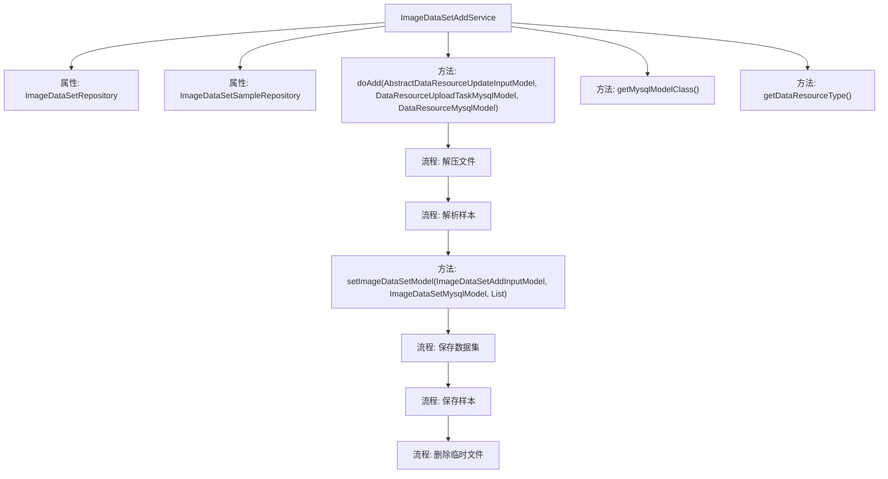

# 基础信息

|      |      |
|------|------|
| 名称 | ImageDataSetAddService |
| 编码语言 | .java |
| 代码路径 | WeFe/board/board-service/src/main/java/com/welab/wefe/board/service/service/data_resource/add/ImageDataSetAddService.java |
| 包名 | com.welab.wefe.board.service.service.data_resource.add |
| 依赖项 | ['com.welab.wefe.board.service.base.file_system.WeFeFileSystem', 'com.welab.wefe.board.service.database.entity.data_resource.DataResourceMysqlModel', 'com.welab.wefe.board.service.database.entity.data_resource.DataResourceUploadTaskMysqlModel', 'com.welab.wefe.board.service.database.entity.data_resource.ImageDataSetMysqlModel', 'com.welab.wefe.board.service.database.entity.data_set.ImageDataSetSampleMysqlModel', 'com.welab.wefe.board.service.database.repository.ImageDataSetSampleRepository', 'com.welab.wefe.board.service.database.repository.data_resource.ImageDataSetRepository', 'com.welab.wefe.board.service.dto.vo.data_resource.AbstractDataResourceUpdateInputModel', 'com.welab.wefe.board.service.dto.vo.data_resource.ImageDataSetAddInputModel', 'com.welab.wefe.board.service.service.data_resource.image_data_set.data_set_parser.AbstractImageDataSetParser', 'com.welab.wefe.common.StatusCode', 'com.welab.wefe.common.exception.StatusCodeWithException', 'com.welab.wefe.common.file.decompression.SuperDecompressor', 'com.welab.wefe.common.file.decompression.dto.DecompressionResult', 'com.welab.wefe.common.util.FileUtil', 'com.welab.wefe.common.util.ListUtil', 'com.welab.wefe.common.util.StringUtil', 'com.welab.wefe.common.wefe.enums.DataResourceType', 'org.springframework.beans.factory.annotation.Autowired', 'org.springframework.stereotype.Service', 'java.io.File', 'java.util.List', 'java.util.TreeSet', 'java.util.concurrent.atomic.AtomicInteger'] |
| 概述说明 | 图片数据集服务类，处理文件解压、样本解析、标签提取及数据库存储，完成后清理临时文件。 |

# 说明

ImageDataSetAddService是一个处理图片数据集上传的服务类，继承自AbstractDataResourceAddService。它通过ImageDataSetRepository和ImageDataSetSampleRepository操作数据库。主要功能包括解压上传的图片数据集文件，解析样本信息，保存数据集和样本信息到数据库，并清理临时文件。服务会更新任务进度，记录日志，处理异常，并设置数据集的元信息如标签列表、数据量等。最后删除原始文件和解压后的临时文件。

# 类列表 Class Summary

| 名称   | 类型  | 说明 |
|-------|------|-------------|
| ImageDataSetAddService | class | 图片数据集服务类，负责解压文件、解析样本、保存数据到数据库，并清理临时文件。包含样本统计和标签处理功能。 |

## 类 ImageDataSetAddService

|      |      |
|------|------|
| 访问范围 | @Service;public |
| 类型 | class |
| 名称 | ImageDataSetAddService |
| 说明 | 图片数据集服务类，负责解压文件、解析样本、保存数据到数据库，并清理临时文件。包含样本统计和标签处理功能。 |

### UML类图

```mermaid
classDiagram
    class AbstractDataResourceAddService {
        <<Abstract>>
        #void doAdd(AbstractDataResourceUpdateInputModel in, DataResourceUploadTaskMysqlModel task, DataResourceMysqlModel m) throws StatusCodeWithException
        +Class~? extends DataResourceMysqlModel~ getMysqlModelClass()
        +DataResourceType getDataResourceType()
    }

    class ImageDataSetAddService {
        -ImageDataSetRepository imageDataSetRepository
        -ImageDataSetSampleRepository imageDataSetSampleRepository
        +void doAdd(AbstractDataResourceUpdateInputModel in, DataResourceUploadTaskMysqlModel task, DataResourceMysqlModel m) throws StatusCodeWithException
        -void setImageDataSetModel(ImageDataSetAddInputModel input, ImageDataSetMysqlModel dataSet, List~ImageDataSetSampleMysqlModel~ sampleList)
        +Class~? extends DataResourceMysqlModel~ getMysqlModelClass()
        +DataResourceType getDataResourceType()
    }

    class ImageDataSetRepository {
        <<Repository>>
        +save(ImageDataSetMysqlModel model)
    }

    class ImageDataSetSampleRepository {
        <<Repository>>
        +save(ImageDataSetSampleMysqlModel sample)
    }

    class ImageDataSetAddInputModel {
        <<InputModel>>
        -String filename
        -String forJobType
        +String getFilename()
        +String getForJobType()
    }

    class ImageDataSetMysqlModel {
        <<Model>>
        -String forJobType
        -String labelList
        -int totalDataCount
        -long labeledCount
        -boolean labelCompleted
        -long filesSize
        +setter/getter methods
    }

    class ImageDataSetSampleMysqlModel {
        <<Model>>
        -boolean labeled
        -Set~String~ labelSet
        -long fileSize
        +isLabeled()
        +getLabelSet()
        +getFileSize()
    }

    class DataResourceUploadTaskService {
        <<Service>>
        +updateMessageBeforeStart(String id, String message)
        +updateProgress(String id, int total, int current, int stage, String message)
    }

    class SuperDecompressor {
        <<Utility>>
        +static DecompressionResult decompression(File file, boolean keepStructure)
    }

    class AbstractImageDataSetParser {
        <<Abstract>>
        +static AbstractImageDataSetParser getParser(String jobType)
        +List~ImageDataSetSampleMysqlModel~ parseFilesToSamples(ImageDataSetMysqlModel model, List~File~ files)
    }

    AbstractDataResourceAddService <|-- ImageDataSetAddService : 继承
    ImageDataSetAddService --> ImageDataSetRepository : 依赖
    ImageDataSetAddService --> ImageDataSetSampleRepository : 依赖
    ImageDataSetAddService --> ImageDataSetAddInputModel : 处理
    ImageDataSetAddService --> ImageDataSetMysqlModel : 操作
    ImageDataSetAddService --> ImageDataSetSampleMysqlModel : 操作
    ImageDataSetAddService --> DataResourceUploadTaskService : 调用
    ImageDataSetAddService --> SuperDecompressor : 调用
    ImageDataSetAddService --> AbstractImageDataSetParser : 调用
```

类图描述：该图展示了图片数据集添加服务(ImageDataSetAddService)的核心结构，它继承自抽象数据资源添加服务(AbstractDataResourceAddService)。服务类通过两个仓库(ImageDataSetRepository和ImageDataSetSampleRepository)进行数据持久化，处理图片数据集输入模型(ImageDataSetAddInputModel)并操作两种MySQL模型(ImageDataSetMysqlModel和ImageDataSetSampleMysqlModel)。同时依赖任务服务(DataResourceUploadTaskService)进行进度更新，使用SuperDecompressor进行文件解压，并通过抽象解析器(AbstractImageDataSetParser)将文件转换为样本模型。整个架构实现了图片数据集的解压、解析、标注处理和批量存储功能。

### 内部方法调用关系图

这段代码是图片数据集添加服务的实现，主要功能包括解压上传的文件、解析图片样本、保存数据集和样本信息到数据库，最后清理临时文件。服务继承自抽象数据资源添加服务，通过多线程并行处理样本数据，并实时更新任务进度。核心流程包含文件解压、样本解析、模型属性设置、数据库存储和资源清理五个阶段，同时维护了数据集标签统计和完成状态等元信息。

### 字段列表 Field List

| 名称  | 类型  | 说明 |
|-------|-------|------|
| imageDataSetRepository | ImageDataSetRepository | 使用@Autowired自动注入ImageDataSetRepository实例。 |
| imageDataSetSampleRepository | ImageDataSetSampleRepository | 使用@Autowired自动注入ImageDataSetSampleRepository实例。 |

### 方法列表

| 名称  | 类型  | 说明 |
|-------|-------|------|
| getMysqlModelClass | Class<? extends DataResourceMysqlModel> | 该方法重写父类方法，返回ImageDataSetMysqlModel类作为MySQL数据模型类。 |
| setImageDataSetModel | void | 方法设置图像数据集模型，更新数据集类型、标签列表、数据总数、已标记数量、标记完成状态及文件总大小。 |
| doAdd | void | 代码实现图片数据集处理流程：解压文件、解析样本、保存数据到数据库，最后清理临时文件。 |
| getDataResourceType | DataResourceType | 重写方法返回图像数据集资源类型。 |

