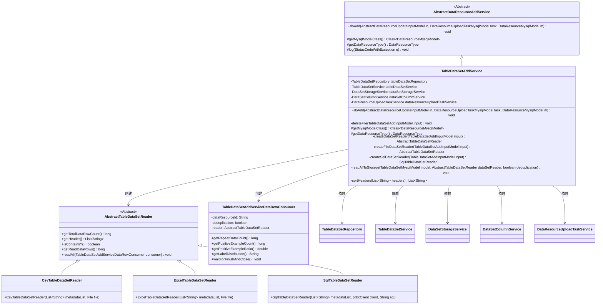
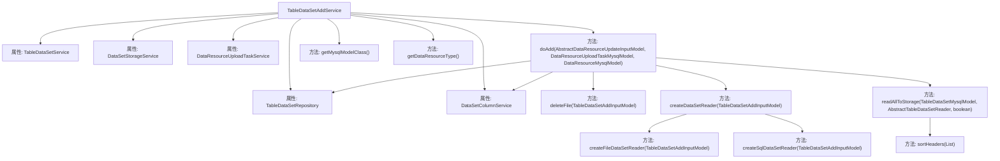
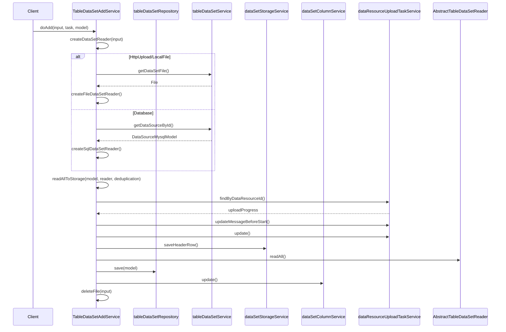

# 基础信息

|      |      |
|------|------|
| 名称 | TableDataSetAddService |
| 编码语言 | .java |
| 代码路径 | WeFe/board/board-service/src/main/java/com/welab/wefe/board/service/service/data_resource/add/TableDataSetAddService.java |
| 包名 | com.welab.wefe.board.service.service.data_resource.add |
| 依赖项 | ['com.welab.wefe.board.service.constant.DataSetAddMethod', 'com.welab.wefe.board.service.database.entity.DataSourceMysqlModel', 'com.welab.wefe.board.service.database.entity.data_resource.DataResourceMysqlModel', 'com.welab.wefe.board.service.database.entity.data_resource.DataResourceUploadTaskMysqlModel', 'com.welab.wefe.board.service.database.entity.data_resource.TableDataSetMysqlModel', 'com.welab.wefe.board.service.database.repository.data_resource.TableDataSetRepository', 'com.welab.wefe.board.service.dto.vo.data_resource.AbstractDataResourceUpdateInputModel', 'com.welab.wefe.board.service.dto.vo.data_resource.TableDataSetAddInputModel', 'com.welab.wefe.board.service.service.DataSetColumnService', 'com.welab.wefe.board.service.service.DataSetStorageService', 'com.welab.wefe.board.service.service.data_resource.DataResourceUploadTaskService', 'com.welab.wefe.board.service.service.data_resource.table_data_set.TableDataSetService', 'com.welab.wefe.board.service.util.AbstractTableDataSetReader', 'com.welab.wefe.board.service.util.CsvTableDataSetReader', 'com.welab.wefe.board.service.util.ExcelTableDataSetReader', 'com.welab.wefe.board.service.util.SqlTableDataSetReader', 'com.welab.wefe.common.StatusCode', 'com.welab.wefe.common.exception.StatusCodeWithException', 'com.welab.wefe.common.jdbc.JdbcClient', 'com.welab.wefe.common.util.StringUtil', 'com.welab.wefe.common.wefe.enums.DataResourceType', 'org.apache.commons.io.FileUtils', 'org.springframework.beans.factory.annotation.Autowired', 'org.springframework.stereotype.Service', 'java.io.File', 'java.io.IOException', 'java.util.ArrayList', 'java.util.List', 'java.util.stream.Collectors'] |
| 概述说明 | TableDataSetAddService是处理表格数据集添加的服务类，继承自AbstractDataResourceAddService。它通过不同方式（数据库、HTTP上传、本地文件）读取数据，解析并存储到数据库和存储系统，支持去重和列排序，最后清理上传文件。 |

# 说明

TableDataSetAddService是一个用于添加表格数据集的Spring服务类，继承自AbstractDataResourceAddService。它通过自动注入多个依赖服务（如数据存储、列信息处理等）实现核心功能。主要逻辑包括：解析输入模型并创建相应读取器（支持CSV/Excel/SQL三种数据源），将数据集保存到存储系统，处理元数据和列信息，并清理临时文件。服务包含异常处理机制，区分表单错误与系统错误，确保数据一致性。同时实现了数据去重、表头排序（y列置第二位）、统计信息计算（如正样本比例）等辅助功能，最后将完整数据集信息持久化到数据库。

# 类列表 Class Summary

| 名称   | 类型  | 说明 |
|-------|------|-------------|
| TableDataSetAddService | class | TableDataSetAddService处理表数据集添加，支持数据库、HTTP上传和本地文件方式。解析数据并存储到数据库和存储系统，包含去重、列排序和统计信息计算功能。 |

## 类 TableDataSetAddService

|      |      |
|------|------|
| 访问范围 | @Service;public |
| 类型 | class |
| 名称 | TableDataSetAddService |
| 说明 | TableDataSetAddService处理表数据集添加，支持数据库、HTTP上传和本地文件方式。解析数据并存储到数据库和存储系统，包含去重、列排序和统计信息计算功能。 |

### UML类图

该图展示了TableDataSetAddService的类结构及其关联关系。作为AbstractDataResourceAddService的子类，它通过5个依赖服务实现数据表添加功能，包含文件删除、数据集读取器创建（支持CSV/Excel/SQL三种方式）、数据存储等核心方法。通过AbstractTableDataSetReader的3个具体实现类处理不同数据源，使用TableDataSetAddServiceDataRowConsumer消费数据行。整体设计体现了策略模式和多态的应用。

### 内部方法调用关系图

这段代码是TableDataSetAddService的实现，主要负责处理表格数据集的添加操作。它继承自AbstractDataResourceAddService，通过依赖注入获取多个服务实例。主要功能包括：根据输入创建数据集读取器、解析并存储数据集、保存数据集信息到数据库、处理文件删除等。流程图中展示了类结构和方法调用关系，时序图则详细描述了doAdd方法的执行过程，包括根据不同的数据集添加方式创建对应的读取器，处理数据存储和数据库更新等步骤。

### 字段列表 Field List

| 名称  | 类型  | 说明 |
|-------|-------|------|
| dataResourceUploadTaskService | DataResourceUploadTaskService | 自动注入DataResourceUploadTaskService服务实例。 |
| dataSetColumnService | DataSetColumnService | 自动注入数据集列服务实例。 |
| dataSetStorageService | DataSetStorageService | 自动注入数据集存储服务实例。 |
| tableDataSetRepository | TableDataSetRepository | 自动注入TableDataSetRepository实例。 |
| tableDataSetService | TableDataSetService | 代码片段使用@Autowired注解自动注入TableDataSetService服务实例。 |

### 方法列表

| 名称  | 类型  | 说明 |
|-------|-------|------|
| doAdd | void | 方法doAdd处理数据资源添加：解析并保存原始数据集，若表单错误则无需重新上传文件；保存数据集及列信息到数据库；最后删除上传的文件。异常时根据错误类型决定是否删除文件。 |
| getDataResourceType | DataResourceType | 该方法重写父类方法，返回数据资源类型为表数据集。 |
| getMysqlModelClass | Class<? extends DataResourceMysqlModel> | 该方法重写父类方法，返回TableDataSetMysqlModel类作为MySQL数据模型类。 |
| deleteFile | void | 该方法用于删除通过HttpUpload上传的文件，检查输入方法是否为HttpUpload，获取对应文件并静默删除，异常时记录日志。 |
| readAllToStorage | void | 方法读取数据集到存储，包括更新任务状态、处理表头、读取数据行并统计信息，最后更新模型属性。 |
| createSqlDataSetReader | SqlTableDataSetReader | 创建SQL数据集读取器，检查数据源有效性后建立JDBC连接并返回读取器实例。 |
| createDataSetReader | AbstractTableDataSetReader | 根据输入的数据集添加方法创建对应的数据集读取器：Database类型调用SQL读取器，HttpUpload或LocalFile类型调用文件读取器，其他情况抛出异常。 |
| createFileDataSetReader | AbstractTableDataSetReader | 创建文件数据集读取器，根据文件类型返回CSV或Excel读取器，处理异常时抛出文件IO错误。 |
| sortHeaders | List<String> | 方法sortHeaders处理字符串列表headers：若无"y"直接返回；否则创建新列表，跳过原"y"元素，并在索引1处插入"y"后返回新列表。 |

