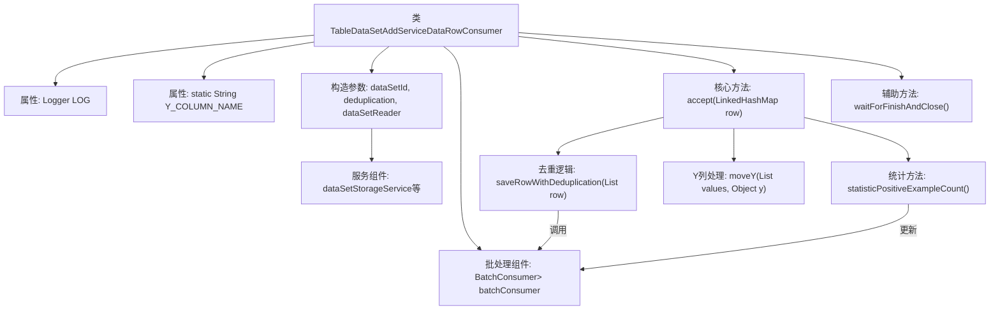

# 基础信息

|      |      |
|------|------|
| 名称 | TableDataSetAddServiceDataRowConsumer |
| 编码语言 | .java |
| 代码路径 | WeFe/board/board-service/src/main/java/com/welab/wefe/board/service/service/data_resource/add/TableDataSetAddServiceDataRowConsumer.java |
| 包名 | com.welab.wefe.board.service.service.data_resource.add |
| 依赖项 | ['com.welab.wefe.board.service.dto.vo.data_set.table_data_set.LabelDistribution', 'com.welab.wefe.board.service.service.DataSetStorageService', 'com.welab.wefe.board.service.service.data_resource.DataResourceUploadTaskService', 'com.welab.wefe.board.service.util.AbstractTableDataSetReader', 'com.welab.wefe.board.service.util.unique.AbstractDataSetUniqueFilter', 'com.welab.wefe.board.service.util.unique.ContainResult', 'com.welab.wefe.board.service.util.unique.DataSetBloomUniqueFilter', 'com.welab.wefe.board.service.util.unique.DataSetMemoryUniqueFilter', 'com.welab.wefe.common.BatchConsumer', 'com.welab.wefe.common.exception.StatusCodeWithException', 'com.welab.wefe.common.util.ListUtil', 'com.welab.wefe.common.web.Launcher', 'org.apache.commons.collections4.CollectionUtils', 'org.eclipse.jetty.util.ConcurrentHashSet', 'org.slf4j.Logger', 'org.slf4j.LoggerFactory', 'java.math.BigDecimal', 'java.math.RoundingMode', 'java.util', 'java.util.concurrent.ConcurrentHashMap', 'java.util.concurrent.atomic.AtomicLong', 'java.util.concurrent.atomic.LongAdder', 'java.util.function.Consumer'] |
| 概述说明 | 这是一个Java类，用于处理数据集行的添加，支持去重、批量处理和统计功能。包含数据存储、去重过滤、标签分布统计和正例比例计算等功能。 |

# 说明

这是一个用于处理数据集行添加的消费者类，主要功能包括批量处理数据行、去重、统计正例数量和标签分布。类通过构造函数接收数据集ID、去重标志和数据集读取器，初始化时设置批量处理器和去重过滤器。处理数据行时，会根据读取行数动态调整批量大小，支持将Y列移动到第二列，并统计标签分布。去重功能通过过滤器实现，支持内存和布隆过滤器两种方式。类还提供正例比例计算、重复数据计数和标签分布信息获取等功能，并通过服务保存数据行和更新上传进度。

# 类列表 Class Summary

| 名称   | 类型  | 说明 |
|-------|------|-------------|
| TableDataSetAddServiceDataRowConsumer | class | TableDataSetAddServiceDataRowConsumer类用于批量处理数据集行，支持去重、统计正例比例和标签分布，通过批处理提高写入效率。 |


## 类 TableDataSetAddServiceDataRowConsumer

|      |      |
|------|------|
| 访问范围 | public |
| 类型 | class |
| 名称 | TableDataSetAddServiceDataRowConsumer |
| 说明 | TableDataSetAddServiceDataRowConsumer类用于批量处理数据集行，支持去重、统计正例比例和标签分布，通过批处理提高写入效率。 |


### UML类图

```mermaid
classDiagram
    class TableDataSetAddServiceDataRowConsumer {
        -Logger LOG
        -static String Y_COLUMN_NAME
        -String dataSetId
        -boolean deduplication
        -BatchConsumer~List~Object~~ batchConsumer
        -int maxBatchSize
        -AbstractDataSetUniqueFilter uniqueFilter
        -DataSetStorageService dataSetStorageService
        -DataResourceUploadTaskService dataResourceUploadTaskService
        -AbstractTableDataSetReader dataSetReader
        -String firstColumnName
        -boolean containsY
        -int yIndex
        -AtomicLong yPositiveExampleCount
        -LongAdder repeatDataCount
        -Set~String~ labelSet
        -Map~String,Integer~ labelDistribution
        +TableDataSetAddServiceDataRowConsumer(String dataSetId, boolean deduplication, AbstractTableDataSetReader dataSetReader) throws StatusCodeWithException
        +accept(LinkedHashMap~String, Object~ row) void
        +waitForFinishAndClose() void
        +getRepeatDataCount() long
        +getPositiveExampleRatio() double
        +getPositiveExampleCount() long
        +getLabelDistribution() LabelDistribution
        -moveY(List~Object~ values, Object y) void
        -saveRowWithDeduplication(List~Object~ row) void
        -createUniqueFilter(long totalDataRowCount) AbstractDataSetUniqueFilter
        -statisticPositiveExampleCount(boolean containsY, int yIndex, List~List~Object~~ rows) void
    }

    class BatchConsumer~R~ {
        <<Interface>>
        +setMaxBatchSize(int maxBatchSize) void
        +add(R row) void
        +waitForFinishAndClose() void
        +waitForClean() void
    }

    class AbstractDataSetUniqueFilter {
        <<Interface>>
        +contains(String id) ContainResult
    }

    class DataSetBloomUniqueFilter {
        +DataSetBloomUniqueFilter(long totalDataRowCount)
    }

    class DataSetMemoryUniqueFilter {
        +DataSetMemoryUniqueFilter()
    }

    class DataSetStorageService {
        <<Interface>>
        +saveDataRows(String dataSetId, List~List~Object~~ rows) void
        +containsKey(String dataSetId, String id) boolean
        +getAddBatchSize(int columnCount) int
    }

    class DataResourceUploadTaskService {
        <<Interface>>
        +updateProgress(String dataSetId, long total, long read, long repeat) void
        +onError(String dataSetId, Exception e) void
    }

    class AbstractTableDataSetReader {
        <<Interface>>
        +getTotalDataRowCount() long
        +getReadDataRows() long
        +getHeader() List~String~
    }

    class LabelDistribution {
        +LabelDistribution(int labelCount, Map~String,Integer~ distribution)
    }

    enum ContainResult {
        In
        NotIn
        MaybeIn
    }

    TableDataSetAddServiceDataRowConsumer --> BatchConsumer~List~Object~~ : "使用"
    TableDataSetAddServiceDataRowConsumer --> AbstractDataSetUniqueFilter : "依赖"
    TableDataSetAddServiceDataRowConsumer --> DataSetStorageService : "依赖"
    TableDataSetAddServiceDataRowConsumer --> DataResourceUploadTaskService : "依赖"
    TableDataSetAddServiceDataRowConsumer --> AbstractTableDataSetReader : "依赖"
    AbstractDataSetUniqueFilter <|-- DataSetBloomUniqueFilter : "实现"
    AbstractDataSetUniqueFilter <|-- DataSetMemoryUniqueFilter : "实现"
```

类图描述：该图展示了TableDataSetAddServiceDataRowConsumer类的结构及其相关依赖。该类是一个数据行消费者，负责处理表格数据集的添加操作，包含去重、批量处理、进度更新等功能。它依赖于多个服务接口如BatchConsumer、DataSetStorageService等，并使用抽象工厂模式创建不同的去重过滤器。核心功能包括数据行处理、去重检查、批量存储和统计计算等。


### 内部方法调用关系图



该流程图展示了TableDataSetAddServiceDataRowConsumer类的核心结构和数据流转路径。类主要实现Consumer接口处理数据行，包含批处理、去重校验、Y列特殊处理等核心功能。通过BatchConsumer组件实现批量存储优化，根据数据量动态调整批次大小，同时维护标签分布统计和正例计数等业务指标。构造时注入存储服务和数据集读取器，accept方法实现主处理逻辑链，包含数据校验、列位置调整和去重判断等关键步骤。

### 字段列表 Field List

| 名称  | 类型  | 说明 |
|-------|-------|------|
| dataSetStorageService | DataSetStorageService | 私有不可变数据集存储服务实例。 |
| repeatDataCount = new LongAdder() | LongAdder | 声明一个不可变的长整型累加器repeatDataCount，用于线程安全的计数操作。 |
| yIndex | int | 私有整型常量yIndex。 |
| dataSetReader | AbstractTableDataSetReader | 私有不可变数据集读取器实例。 |
| firstColumnName | String | 私有不可变字符串变量，存储首列名称。 |
| Y_COLUMN_NAME = "y" | String | 定义静态常量字符串Y_COLUMN_NAME，值为"y"。 |
| labelSet = new ConcurrentHashSet<>() | Set<String> | 声明一个线程安全的字符串集合labelSet，使用ConcurrentHashSet实现。 |
| yPositiveExampleCount = new AtomicLong(0) | AtomicLong | 私有原子长整型变量yPositiveExampleCount，初始值为0，用于线程安全计数。 |
| deduplication | boolean | 私有不可变布尔值，用于去重控制。 |
| maxBatchSize = 0 | int | 私有整型变量maxBatchSize，初始值为0。 |
| containsY | boolean | 私有布尔变量，标识是否包含Y。 |
| LOG = LoggerFactory.getLogger(TableDataSetAddServiceDataRowConsumer.class) | Logger | 类TableDataSetAddServiceDataRowConsumer中定义了一个私有不可变的日志记录器LOG，用于记录日志信息。 |
| dataResourceUploadTaskService | DataResourceUploadTaskService | 私有不可变的文件资源上传任务服务实例。 |
| labelDistribution = new ConcurrentHashMap<>() | Map<String, Integer> | 定义线程安全的字符串到整数的映射变量labelDistribution，初始化为并发哈希表。 |
| batchConsumer | BatchConsumer<List<Object>> | 私有常量BatchConsumer，泛型类型为List<Object>。 |
| dataSetId | String | 私有不可变字符串变量dataSetId。 |
| uniqueFilter | AbstractDataSetUniqueFilter | 私有成员变量uniqueFilter，类型为AbstractDataSetUniqueFilter。 |

### 方法列表

| 名称  | 类型  | 说明 |
|-------|-------|------|
| getPositiveExampleCount | long | 获取正例计数值。 |
| getLabelDistribution | LabelDistribution | 方法返回包含标签集大小和分布的新LabelDistribution对象。 |
| statisticPositiveExampleCount | void | 统计正例数量：检查行数据中指定列（yIndex=1）的值，忽略空值和"0"，非零则递增计数器。前提：包含Y列、yIndex有效且数据非空。 |
| saveRowWithDeduplication | void | 方法saveRowWithDeduplication通过唯一性检查处理数据行：存在则丢弃，不存在则写入，不确定时等待队列写入后再次确认。 |
| accept | void | 方法根据读取行数动态调整批次大小，初始批次较小以快速启动进度条。处理列数据时，若包含Y列则调整其位置并统计分布（种类过多时停止）。最后根据去重设置保存数据行。 |
| getRepeatDataCount | long | 获取重复数据计数的长整型值。 |
| getPositiveExampleRatio | double | 该方法计算正例比例，总数据行数减去重复数据后若小于等于0则返回0，否则用正例数除以总数并保留4位小数。 |
| waitForFinishAndClose | void | 方法waitForFinishAndClose调用batchConsumer的相同方法，等待完成并关闭。 |
| createUniqueFilter | AbstractDataSetUniqueFilter | 根据数据量选择过滤器：超过10万行用布隆过滤器，否则用内存过滤器。 |
| moveY | void | 方法moveY将列表values中的元素y移动到指定位置，移除了对y必须为整数的校验，以适应深度学习回归场景的连续型数据需求。 |


