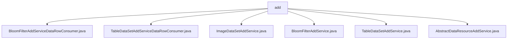

# 基础信息

|      |      |
|------|------|
| 名称 | add |
| 编码语言 | .java |
| 代码路径 | WeFe/board/board-service/src/main/java/com/welab/wefe/board/service/service/data_resource/add |
| 包名 | docs.board.board-service.src.main.java.com.welab.wefe.board.service.service.data_resource.add |
| 概述说明 | BloomFilterAddServiceDataRowConsumer处理数据行生成布隆过滤器，支持批量处理、去重和加密。TableDataSetAddServiceDataRowConsumer批量处理表格数据，支持去重和标签统计。ImageDataSetAddService处理图片数据集上传，解压文件并保存样本信息。BloomFilterAddService和TableDataSetAddService分别处理布隆过滤器和表格数据添加，支持多种数据源。AbstractDataResourceAddService是抽象基类，定义数据资源添加的通用逻辑。 |

# 说明

## 概述  
该模块核心职责是处理多种类型数据资源（表格、图像、布隆过滤器）的添加操作，实现数据解析、去重、存储及元信息管理。接口规范统一采用批量处理机制，支持动态调整批次大小，并集成CRT优化加密、RSA密钥对等安全特性。关键数据结构包括LinkedHashMap格式数据行、布隆过滤器ID、标签分布统计等。外部依赖涉及BloomFilterRepository、ImageDataSetRepository等存储组件及RSA加密服务。例如，TableDataSetAddService支持CSV/Excel/SQL三种数据源解析，而ImageDataSetAddService专攻图片解压与样本存储。

## 主要业务场景  
模块整合了表格数据批量导入、图像数据集解压入库、布隆过滤器生成三类典型流程，类似ETL管道模式。交互上均遵循"读取-处理-存储"范式，通过AbstractDataResourceAddService抽象类统一任务调度与异常处理。完整功能涵盖数据去重（内存/BloomFilter双模式）、标签分布统计、临时文件清理等。典型应用如：用户上传CSV文件后，服务自动解析并计算正样本比例，同时通过BloomFilterAddService实现加密去重。API集成案例包括异步任务提交、进度回调及多数据源适配器（如SqlBloomFilterReader）。

### 包内部结构视图

该流程图展示了WeFe项目中data_resource/add目录下的文件结构关系。add作为父节点，包含6个直接子文件节点，包括3个具体服务实现类（BloomFilterAddService.java、TableDataSetAddService.java、ImageDataSetAddService.java）、2个数据行消费者类（BloomFilterAddServiceDataRowConsumer.java、TableDataSetAddServiceDataRowConsumer.java）以及1个抽象基类（AbstractDataResourceAddService.java）。所有文件均位于同一层级，没有嵌套子目录。

# 文件列表

| 名称   | 类型  | 说明 |
|-------|------|-------------|
| [BloomFilterAddServiceDataRowConsumer.java](BloomFilterAddServiceDataRowConsumer.md) | file | BloomFilterAddServiceDataRowConsumer类实现Consumer接口，用于处理数据行并生成布隆过滤器。支持批量处理、去重和RSA加密优化，包含进度更新和错误处理功能。 |
| [TableDataSetAddServiceDataRowConsumer.java](TableDataSetAddServiceDataRowConsumer.md) | file | 这是一个Java类，用于处理数据集行的添加，支持去重、批量处理和统计功能。包含数据存储、去重过滤、标签分布统计和正例比例计算等功能。 |
| [ImageDataSetAddService.java](ImageDataSetAddService.md) | file | 图片数据集服务类，处理文件解压、样本解析、标签提取及数据库存储，完成后清理临时文件。 |
| [BloomFilterAddService.java](BloomFilterAddService.md) | file | BloomFilterAddService处理布隆过滤器数据添加，支持数据库、HTTP上传和本地文件方式，解析数据并保存到文件，包含去重和字段处理功能。 |
| [TableDataSetAddService.java](TableDataSetAddService.md) | file | TableDataSetAddService是处理表格数据集添加的服务类，继承自AbstractDataResourceAddService。它通过不同方式（数据库、HTTP上传、本地文件）读取数据，解析并存储到数据库和存储系统，支持去重和列排序，最后清理上传文件。 |
| [AbstractDataResourceAddService.java](AbstractDataResourceAddService.md) | file | 抽象类AbstractDataResourceAddService提供添加数据资源的公共方法，依赖多个服务类，包含抽象方法和资源存储位置检查逻辑，支持异步执行资源保存。 |

