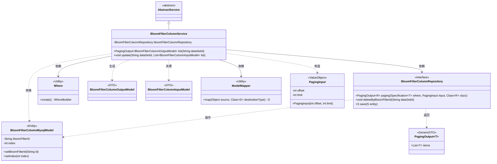
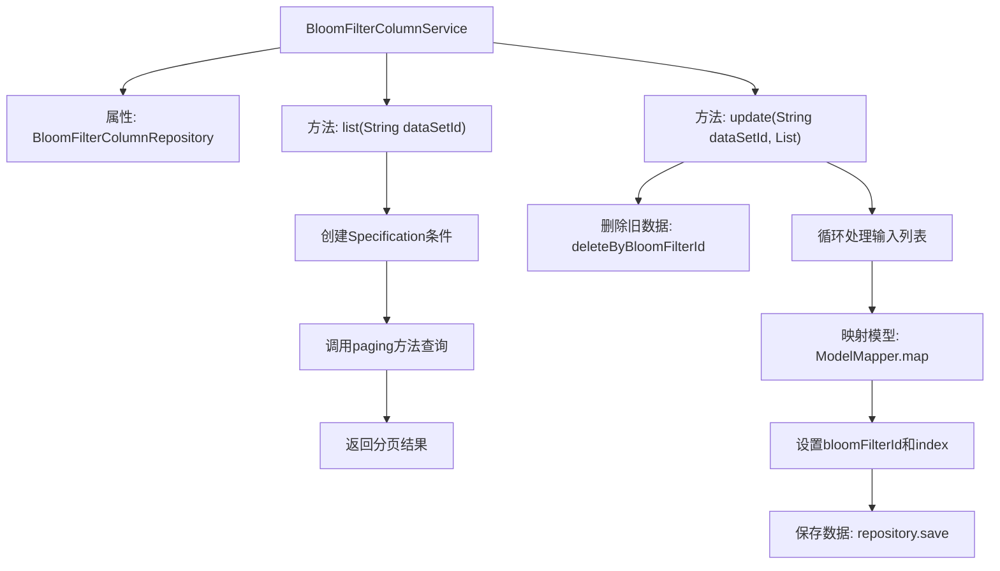

# 基础信息

|      |      |
|------|------|
| 名称 | BloomFilterColumnService |
| 编码语言 | .java |
| 代码路径 | WeFe/board/board-service/src/main/java/com/welab/wefe/board/service/service/data_resource/bloom_filter/BloomFilterColumnService.java |
| 包名 | com.welab.wefe.board.service.service.data_resource.bloom_filter |
| 依赖项 | ['com.welab.wefe.board.service.database.entity.fusion.bloomfilter.BloomFilterColumnMysqlModel', 'com.welab.wefe.board.service.database.repository.fusion.BloomFilterColumnRepository', 'com.welab.wefe.board.service.dto.base.PagingInput', 'com.welab.wefe.board.service.dto.base.PagingOutput', 'com.welab.wefe.board.service.dto.fusion.BloomFilterColumnInputModel', 'com.welab.wefe.board.service.dto.fusion.BloomFilterColumnOutputModel', 'com.welab.wefe.board.service.service.AbstractService', 'com.welab.wefe.common.data.mysql.Where', 'com.welab.wefe.common.data.mysql.enums.OrderBy', 'org.modelmapper.ModelMapper', 'org.springframework.beans.factory.annotation.Autowired', 'org.springframework.data.jpa.domain.Specification', 'org.springframework.stereotype.Service', 'java.util.List'] |
| 概述说明 | BloomFilterColumnService提供数据集字段的分页查询和批量更新功能，支持按索引排序和清空后重新保存操作。 |

# 说明

BloomFilterColumnService是一个服务类，继承自AbstractService，包含两个核心方法。list方法根据dataSetId查询BloomFilterColumnMysqlModel数据，按index升序排序，使用分页查询返回BloomFilterColumnOutputModel结果。update方法先根据dataSetId删除旧数据，再将输入的BloomFilterColumnInputModel列表按顺序映射为BloomFilterColumnMysqlModel并保存，设置bloomFilterId和index属性。通过bloomFilterColumnRepository实现数据操作。

# 类列表 Class Summary

| 名称   | 类型  | 说明 |
|-------|------|-------------|
| BloomFilterColumnService | class | BloomFilterColumnService提供数据集字段的分页查询和批量更新功能，查询支持排序，更新先删除旧数据再按索引保存新数据。 |

## 类 BloomFilterColumnService

|      |      |
|------|------|
| 访问范围 | @Service;public |
| 类型 | class |
| 名称 | BloomFilterColumnService |
| 说明 | BloomFilterColumnService提供数据集字段的分页查询和批量更新功能，查询支持排序，更新先删除旧数据再按索引保存新数据。 |

### UML类图

类图描述：该图展示了BloomFilterColumnService作为核心服务类，继承自AbstractService，通过BloomFilterColumnRepository接口操作数据库。服务类使用Where工具构建查询条件，通过ModelMapper实现DTO与实体类转换，处理分页查询(PagingInput/PagingOutput)和批量更新操作。涉及BloomFilterColumnInputModel/BloomFilterColumnOutputModel数据传输对象和BloomFilterColumnMysqlModel持久化实体，体现了从参数接收、业务处理到数据存储的完整流程。

### 内部方法调用关系图

这段代码展示了一个Spring服务类BloomFilterColumnService，主要提供布隆过滤器列的分页查询和批量更新功能。流程图清晰呈现了list()方法通过Specification构建查询条件并调用分页查询的过程，以及update()方法先删除旧数据再循环保存新数据的完整流程。特别注意update方法中包含了模型映射、字段设置和持久化操作的完整数据更新链条，而list方法则处理了前端无分页但后端预防性分页的特殊场景。

### 字段列表 Field List

| 名称  | 类型  | 说明 |
|-------|-------|------|
| bloomFilterColumnRepository | BloomFilterColumnRepository | 自动注入布隆过滤器列存储库实例。 |

### 方法列表

| 名称  | 类型  | 说明 |
|-------|-------|------|
| list | PagingOutput<BloomFilterColumnOutputModel> | 该方法查询指定数据集ID的布隆过滤器列，按索引升序排序。前端无需分页，但为防止字段过多，内部使用分页查询（每页10000条），返回分页结果。 |
| update | void | 该方法先删除指定数据集ID的所有列，然后遍历输入列表，将每个元素映射为数据库模型并设置数据集ID和索引，最后保存到数据库。 |

