# 基础信息

|      |      |
|------|------|
| 名称 | BloomFilterService |
| 编码语言 | .java |
| 代码路径 | WeFe/board/board-service/src/main/java/com/welab/wefe/board/service/service/data_resource/bloom_filter/BloomFilterService.java |
| 包名 | com.welab.wefe.board.service.service.data_resource.bloom_filter |
| 依赖项 | ['com.welab.wefe.board.service.api.data_resource.bloom_filter.BloomFilterDataResourceListApi', 'com.welab.wefe.board.service.api.data_resource.bloom_filter.BloomFilterDeleteApi', 'com.welab.wefe.board.service.base.file_system.WeFeFileSystem', 'com.welab.wefe.board.service.constant.BloomfilterAddMethod', 'com.welab.wefe.board.service.database.entity.DataSourceMysqlModel', 'com.welab.wefe.board.service.database.entity.data_resource.BloomFilterMysqlModel', 'com.welab.wefe.board.service.database.entity.job.ProjectMemberMySqlModel', 'com.welab.wefe.board.service.database.entity.job.ProjectMySqlModel', 'com.welab.wefe.board.service.database.repository.DataSourceRepository', 'com.welab.wefe.board.service.database.repository.JobMemberRepository', 'com.welab.wefe.board.service.database.repository.JobRepository', 'com.welab.wefe.board.service.database.repository.ProjectRepository', 'com.welab.wefe.board.service.database.repository.base.RepositoryManager', 'com.welab.wefe.board.service.database.repository.data_resource.BloomFilterRepository', 'com.welab.wefe.board.service.dto.entity.BloomFilterDataResourceListOutputModel', 'com.welab.wefe.board.service.dto.entity.data_resource.output.BloomFilterOutputModel', 'com.welab.wefe.board.service.dto.entity.project.ProjectDetailMemberOutputModel', 'com.welab.wefe.board.service.dto.entity.project.data_set.ProjectDataResourceOutputModel', 'com.welab.wefe.board.service.dto.vo.data_resource.BloomFilterUpdateInputModel', 'com.welab.wefe.board.service.onlinedemo.OnlineDemoBranchStrategy', 'com.welab.wefe.board.service.service.CacheObjects', 'com.welab.wefe.board.service.service.ProjectDataSetService', 'com.welab.wefe.board.service.service.ProjectMemberService', 'com.welab.wefe.board.service.service.data_resource.DataResourceService', 'com.welab.wefe.common.StatusCode', 'com.welab.wefe.common.exception.StatusCodeWithException', 'com.welab.wefe.common.jdbc.JdbcClient', 'com.welab.wefe.common.web.util.ModelMapper', 'com.welab.wefe.common.wefe.enums.DataResourcePublicLevel', 'com.welab.wefe.common.wefe.enums.DataResourceType', 'org.apache.commons.lang3.StringUtils', 'org.springframework.beans.factory.annotation.Autowired', 'org.springframework.stereotype.Service', 'java.io.File', 'java.util.List', 'java.util.stream.Collectors'] |
| 概述说明 | BloomFilterService提供布隆过滤器相关操作，包括查询、删除、更新、文件获取及SQL测试功能，依赖多个存储库和服务处理数据资源和项目成员权限。 |

# 说明

该代码定义了一个名为BloomFilterService的服务类，继承自DataResourceService。它通过多个自动装配的仓储接口（如BloomFilterRepository、JobRepository等）实现布隆过滤器相关功能。主要功能包括：查找本地或联合数据集、获取上传文件、删除布隆过滤器记录、处理可见成员列表、测试SQL查询、查询项目数据资源列表以及更新布隆过滤器信息。服务还涉及与联合服务的交互，如数据资源同步和删除操作。

# 类列表 Class Summary

| 名称   | 类型  | 说明 |
|-------|------|-------------|
| BloomFilterService | class | BloomFilterService类提供布隆过滤器相关操作，包括查找、删除、更新、文件处理和SQL测试等功能，涉及多个仓库和服务依赖。 |

## 类 BloomFilterService

|      |      |
|------|------|
| 访问范围 | @Service;public |
| 类型 | class |
| 名称 | BloomFilterService |
| 说明 | BloomFilterService类提供布隆过滤器相关操作，包括查找、删除、更新、文件处理和SQL测试等功能，涉及多个仓库和服务依赖。 |

### UML类图

```mermaid
classDiagram
    class BloomFilterService {
        -BloomFilterRepository repo
        -BloomFilterStorageService bloomfilterStorageService
        -JobRepository jobRepository
        -JobMemberRepository jobMemberRepository
        -JobRepository featureJobRepository
        -DataSourceRepository dataSourceRepo
        -ProjectRepository projectRepo
        -ProjectMemberService projectMemberService
        -ProjectDataSetService projectDataSetService
        +BloomFilterOutputModel findDataSetFromLocalOrUnion(String memberId, String dataSetId) throws StatusCodeWithException
        +File getBloomfilterFile(BloomfilterAddMethod method, String filename) throws StatusCodeWithException
        +void delete(BloomFilterDeleteApi.Input input) throws Exception
        +void delete(String bloomFilterId) throws Exception
        +void delete(BloomFilterMysqlModel model) throws Exception
        +void handlePublicMemberList(BloomFilterMysqlModel model)
        +DataSourceMysqlModel getDataSourceById(String dataSourceId)
        +BloomFilterMysqlModel findOne(String bloomFilterId)
        +String testSqlQuery(String dataSourceId, String sql) throws StatusCodeWithException
        +BloomFilterDataResourceListOutputModel query(BloomFilterDataResourceListApi.Input input) throws StatusCodeWithException
        +void update(BloomFilterUpdateInputModel input) throws StatusCodeWithException
    }

    class BloomFilterRepository {
        <<Interface>>
    }

    class BloomFilterStorageService {
        <<Interface>>
    }

    class JobRepository {
        <<Interface>>
    }

    class JobMemberRepository {
        <<Interface>>
    }

    class DataSourceRepository {
        <<Interface>>
    }

    class ProjectRepository {
        <<Interface>>
    }

    class ProjectMemberService {
        <<Interface>>
    }

    class ProjectDataSetService {
        <<Interface>>
    }

    class BloomFilterMysqlModel {
    }

    class DataSourceMysqlModel {
    }

    class ProjectMySqlModel {
    }

    class ProjectMemberMySqlModel {
    }

    class BloomFilterOutputModel {
    }

    class BloomFilterDataResourceListOutputModel {
    }

    class ProjectDetailMemberOutputModel {
    }

    class ProjectDataResourceOutputModel {
    }

    BloomFilterService --> BloomFilterRepository : 依赖
    BloomFilterService --> BloomFilterStorageService : 依赖
    BloomFilterService --> JobRepository : 依赖
    BloomFilterService --> JobMemberRepository : 依赖
    BloomFilterService --> DataSourceRepository : 依赖
    BloomFilterService --> ProjectRepository : 依赖
    BloomFilterService --> ProjectMemberService : 依赖
    BloomFilterService --> ProjectDataSetService : 依赖
    BloomFilterService --> BloomFilterMysqlModel : 操作
    BloomFilterService --> DataSourceMysqlModel : 查询
    BloomFilterService --> ProjectMySqlModel : 查询
    BloomFilterService --> ProjectMemberMySqlModel : 查询
    BloomFilterService --> BloomFilterOutputModel : 返回
    BloomFilterService --> BloomFilterDataResourceListOutputModel : 返回
    BloomFilterService --> ProjectDetailMemberOutputModel : 映射
    BloomFilterService --> ProjectDataResourceOutputModel : 操作
```

该类图展示了BloomFilterService的核心结构和依赖关系。BloomFilterService是一个服务类，继承自DataResourceService，主要负责处理布隆过滤器相关的业务逻辑，包括数据集的查找、文件获取、删除操作、成员列表处理、SQL测试查询以及数据更新等功能。它依赖于多个Repository和Service接口，如BloomFilterRepository、BloomFilterStorageService等，并与多个模型类如BloomFilterMysqlModel、DataSourceMysqlModel等进行交互。该类通过丰富的公有方法提供了完整的布隆过滤器管理能力，同时处理各种异常情况和数据验证逻辑。

### 内部方法调用关系图

```mermaid
graph TD
    A["BloomFilterService"]
    B["findDataSetFromLocalOrUnion"]
    C["getBloomfilterFile"]
    D["delete: Input版"]
    E["delete: ID版"]
    F["delete: Model版"]
    G["handlePublicMemberList"]
    H["getDataSourceById"]
    I["findOne"]
    J["testSqlQuery"]
    K["query"]
    L["update"]

    A --> B
    A --> C
    A --> D
    A --> E
    A --> F
    A --> G
    A --> H
    A --> I
    A --> J
    A --> K
    A --> L

    B -->|本地查询| I
    B -->|联合查询| 'unionService.getDataResourceDetail'
    C -->|文件处理| 'WeFeFileSystem.getFilePath'
    D --> F
    E --> F
    F -->|数据库操作| 'repo.deleteById'
    F -->|联合通知| 'unionService.deleteDataResource'
    F -->|缓存刷新| 'CacheObjects.refreshDataResourceTags'
    G -->|成员列表处理| 'CacheObjects.getMemberId'
    J -->|SQL测试| 'JdbcClient.create'
    K -->|项目查询| 'projectRepo.findOne'
    K -->|成员处理| 'projectMemberService.findOneByMemberId'
    K -->|数据集过滤| 'projectDataSetService.listRawDataSet'
    L -->|模型更新| 'RepositoryManager.save'
    L -->|联合更新| 'unionService.upsertDataResource'
    L --> G
```

该流程图展示了BloomFilterService类的主要方法调用关系。核心功能包括数据查询（本地/联合）、文件处理、删除操作（三种重载版本）、成员列表处理、数据源操作、SQL测试、项目查询和布隆过滤器更新。关键依赖包括unionService联合服务、各种Repository数据访问层以及缓存管理组件，体现了数据资源管理的完整生命周期。

### 字段列表 Field List

| 名称  | 类型  | 说明 |
|-------|-------|------|
| projectMemberService | ProjectMemberService | 使用@Autowired自动注入ProjectMemberService实例。 |
| featureJobRepository | JobRepository | 自动注入受保护的JobRepository实例featureJobRepository。 |
| jobRepository | JobRepository | 自动注入JobRepository实例，用于任务管理。 |
| projectRepo | ProjectRepository | 自动注入ProjectRepository实例到projectRepo变量。 |
| jobMemberRepository | JobMemberRepository | 自动注入JobMemberRepository实例。 |
| repo | BloomFilterRepository | 自动注入BloomFilterRepository实例到repo变量。 |
| bloomfilterStorageService | BloomFilterStorageService | 自动注入布隆过滤器存储服务实例。 |
| projectDataSetService | ProjectDataSetService | 使用@Autowired自动注入ProjectDataSetService实例。 |
| dataSourceRepo | DataSourceRepository | 自动注入数据源仓库实例。 |

### 方法列表

| 名称  | 类型  | 说明 |
|-------|-------|------|
| handlePublicMemberList | void | 处理公共成员列表：若公开级别为PublicWithMemberList且列表包含当前用户ID，则移除该ID并清理多余逗号。 |
| delete | void | 该方法删除布隆过滤器：1.从数据库删除记录；2.通知联盟停止发布；3.刷新标签缓存。注释显示无需处理存储服务。 |
| delete | void | 方法删除指定ID的布隆过滤器数据，若不存在则直接返回。删除前校验权限，确保只能删除自己添加的数据集。 |
| getBloomfilterFile | File | 该方法根据布隆过滤器添加方式获取文件对象，支持HTTP上传、本地文件和数据库方式。若文件不存在则抛出异常。 |
| query | BloomFilterDataResourceListOutputModel | 查询项目数据资源列表：检查项目是否存在，映射项目信息，获取成员数据资源列表并按名称过滤，返回结果。 |
| delete | void | 删除指定ID的布隆过滤器，若不存在则直接返回。 |
| testSqlQuery | String | 该方法通过dataSourceId获取数据库配置，验证数据源和SQL语句有效性后，创建JDBC客户端并执行SQL测试查询。若数据源不存在或SQL为空则抛出异常。 |
| findOne | BloomFilterMysqlModel | 该方法通过ID查询布隆过滤器模型，若不存在则返回null。 |
| getDataSourceById | DataSourceMysqlModel | 通过ID查询MySQL数据源，不存在则返回null。 |
| findDataSetFromLocalOrUnion | BloomFilterOutputModel | 方法根据memberId判断数据来源：本地数据库或联合服务。若memberId匹配缓存，则查询本地数据库并映射返回；否则调用联合服务获取数据。异常时抛出StatusCodeWithException。 |
| update | void | 更新布隆过滤器数据：检查ID存在后，修改名称、描述、公开成员列表、公开等级和标签，保存至数据库并更新缓存。 |

