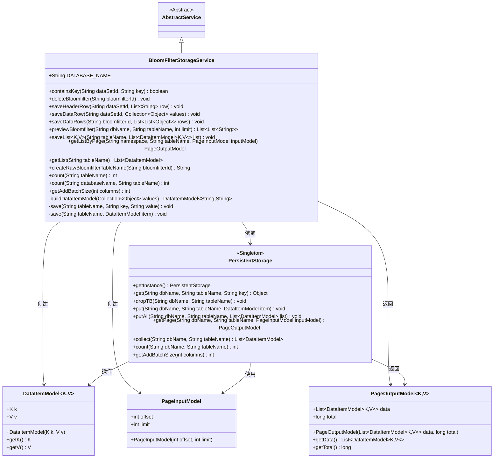

# 基础信息

|      |      |
|------|------|
| 名称 | BloomFilterStorageService |
| 编码语言 | .java |
| 代码路径 | WeFe/board/board-service/src/main/java/com/welab/wefe/board/service/service/data_resource/bloom_filter/BloomFilterStorageService.java |
| 包名 | com.welab.wefe.board.service.service.data_resource.bloom_filter |
| 依赖项 | ['com.alibaba.fastjson.JSON', 'com.welab.wefe.board.service.service.AbstractService', 'com.welab.wefe.common.data.storage.common.Constant', 'com.welab.wefe.common.data.storage.model.DataItemModel', 'com.welab.wefe.common.data.storage.model.PageInputModel', 'com.welab.wefe.common.data.storage.model.PageOutputModel', 'com.welab.wefe.common.data.storage.service.persistent.PersistentStorage', 'com.welab.wefe.common.util.StringUtil', 'org.springframework.stereotype.Service', 'java.util.ArrayList', 'java.util.Collection', 'java.util.List', 'java.util.stream.Collectors'] |
| 概述说明 | BloomFilterStorageService提供布隆过滤器数据存储功能，包含键值检查、删除、保存数据集头信息、数据行及分页查询等方法，使用持久化存储操作数据表。 |

# 说明

BloomFilterStorageService是一个继承自AbstractService的服务类，主要用于管理布隆过滤器数据的存储操作。它提供了多种功能，包括检查键是否存在、删除布隆过滤器表、保存数据集头信息和数据行、预览数据、分页读取数据、获取表记录数以及计算合适的批量大小。该类使用PersistentStorage实例进行数据操作，支持JSON格式转换和分页处理，并能动态生成布隆过滤器表名。所有操作均基于指定的数据库名称和表名进行，确保数据的高效存储和检索。

# 类列表 Class Summary

| 名称   | 类型  | 说明 |
|-------|------|-------------|
| BloomFilterStorageService | class | BloomFilterStorageService提供布隆过滤器数据存储操作，包含键存在检查、删除、保存数据集头信息、数据行及批量操作，支持分页查询和计数功能。 |

## 类 BloomFilterStorageService

|      |      |
|------|------|
| 访问范围 | @Service;public |
| 类型 | class |
| 名称 | BloomFilterStorageService |
| 说明 | BloomFilterStorageService提供布隆过滤器数据存储操作，包含键存在检查、删除、保存数据集头信息、数据行及批量操作，支持分页查询和计数功能。 |

### UML类图

这段代码展示了一个布隆过滤器存储服务(BloomFilterStorageService)，它继承自抽象服务类(AbstractService)，主要功能包括键值存在性检查、布隆过滤器数据删除、表头和数据行保存、数据预览等操作。该类通过单例的PersistentStorage类与底层数据库交互，使用DataItemModel作为数据存储模型，PageInputModel和PageOutputModel处理分页查询。服务提供了完整的CRUD操作和批量处理能力，支持JSON格式数据转换，并包含表名生成等实用方法。

### 内部方法调用关系图

```mermaid
graph TD
    A["类BloomFilterStorageService"]
    B["常量: DATABASE_NAME"]
    C["方法: containsKey(dataSetId, key)"]
    D["方法: deleteBloomfilter(bloomfilterId)"]
    E["方法: saveHeaderRow(dataSetId, row)"]
    F["方法: saveDataRow(dataSetId, values)"]
    G["方法: saveDataRows(bloomfilterId, rows)"]
    H["方法: buildDataItemModel(values)"]
    I["方法: previewBloomfilter(dbName, tableName, limit)"]
    J["方法: save(tableName, key, value)"]
    K["方法: save(tableName, item)"]
    L["方法: saveList(tableName, list)"]
    M["方法: getListByPage(namespace, tableName, inputModel)"]
    N["方法: getList(tableName)"]
    O["方法: createRawBloomfilterTableName(bloomfilterId)"]
    P["方法: count(tableName)"]
    Q["方法: count(databaseName, tableName)"]
    R["方法: getAddBatchSize(columns)"]

    A --> B
    A --> C
    A --> D
    A --> E
    A --> F
    A --> G
    A --> H
    A --> I
    A --> J
    A --> K
    A --> L
    A --> M
    A --> N
    A --> O
    A --> P
    A --> Q
    A --> R

    C --> J
    E --> J
    F --> K
    G --> L
    H --> K
    I --> M
    P --> Q
```

这段代码展示了一个BloomFilter存储服务类，主要功能包括键值存在性检查、布隆过滤器删除、数据行保存和读取等操作。类通过PersistentStorage与底层存储交互，提供了数据转换、分页查询和批量操作等功能。核心方法围绕布隆过滤器表的创建和操作展开，包含元数据保存、数据预览和计数等实用功能。

### 字段列表 Field List

| 名称  | 类型  | 说明 |
|-------|-------|------|
| DATABASE_NAME = Constant.DBName.WEFE_DATA | String | 定义静态常量DATABASE_NAME，值为Constant.DBName.WEFE_DATA，表示数据库名称。 |

### 方法列表

| 名称  | 类型  | 说明 |
|-------|-------|------|
| save | void | 保存数据到持久存储：指定表名、键和值，可能抛出异常。 |
| getList | List<DataItemModel> | 该方法通过PersistentStorage获取指定表的数据列表，返回DataItemModel集合，可能抛出异常。 |
| createRawBloomfilterTableName | String | 生成方法：根据bloomfilterId创建原始布隆过滤器表名，格式为"blommfilter_"+bloomfilterId。 |
| containsKey | boolean | 检查指定数据集和键是否存在：通过持久存储查询键值，返回是否存在结果。 |
| saveDataRows | void | 方法saveDataRows接收布隆过滤器ID和数据行列表，将每行转换为DataItemModel后存入指定名称的表中。 |
| deleteBloomfilter | void | 删除指定布隆过滤器表。方法通过ID生成表名并调用持久化存储接口删除对应数据库表。 |
| previewBloomfilter | List<List<String>> | 预览布隆过滤器数据：从指定数据库和表中获取分页数据，将键值对转换为字符串列表，键单独一项，值按逗号分割后追加。返回嵌套列表结构。 |
| save | void | 保存数据项到指定数据库表。调用持久化存储实例，将数据项存入指定数据库和表中。 |
| buildDataItemModel | DataItemModel<String, String> | 构建DataItemModel方法：遍历集合，首元素为key，其余转为逗号分隔字符串存入list，返回key与拼接字符串的DataItemModel对象。 |
| getListByPage | PageOutputModel | 分页查询方法，通过命名空间和表名获取分页数据，返回分页结果。 |
| saveHeaderRow | void | 方法saveHeaderRow处理数据集头行：提取首个元素为sid，其余为header，转为JSON格式后保存到表名.meta中。 |
| saveDataRow | void | 保存数据集行数据到指定表，参数为数据集ID和值集合，可能抛出异常。 |
| saveList | void | Java方法saveList将DataItemModel对象列表保存到指定数据库表中，调用PersistentStorage的putAll方法实现批量存储。 |
| count | int | 该方法用于统计指定数据库表的数据行数，调用持久化存储实例的count方法实现，需传入数据库名和表名参数，可能抛出异常。 |
| count | int | 该方法通过PersistentStorage实例统计指定数据库表的记录数，参数为数据库名和表名，可能抛出异常。 |
| getAddBatchSize | int | 该方法返回指定列数下的批量添加大小，通过调用PersistentStorage实例的getAddBatchSize方法实现。 |

