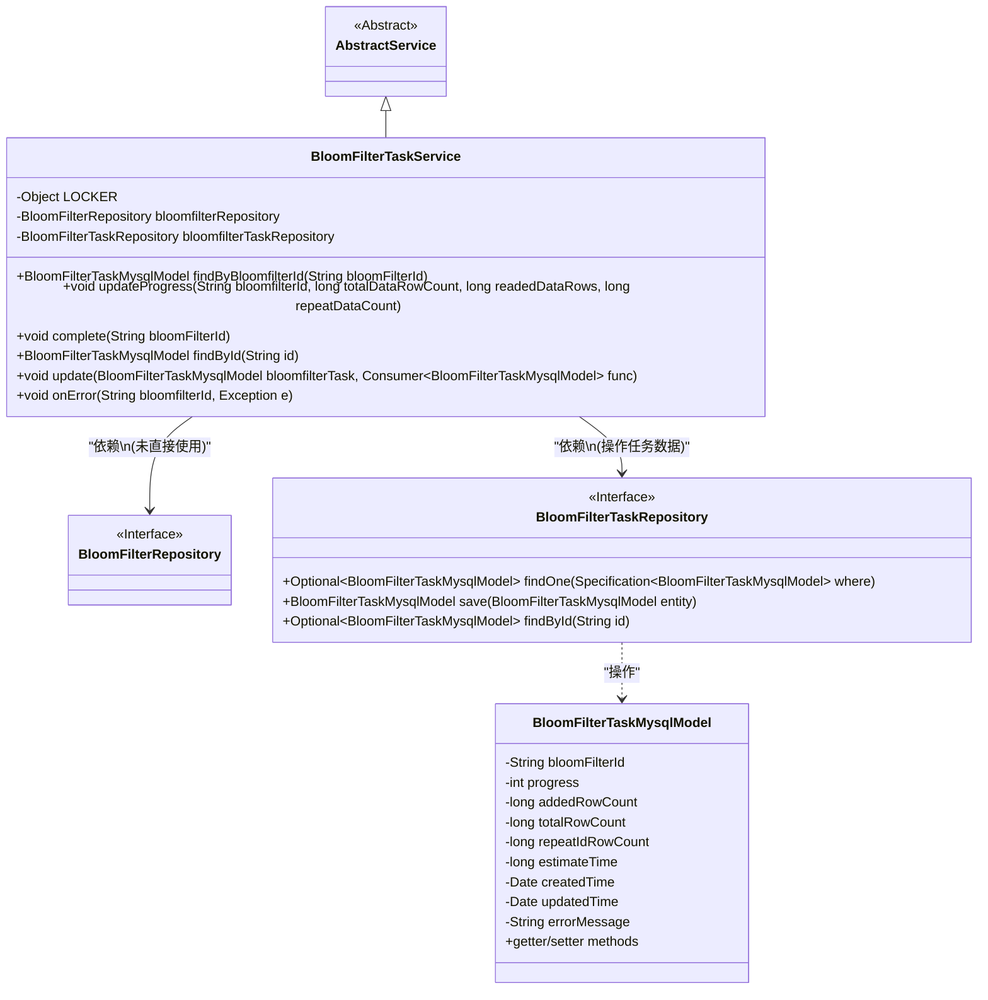
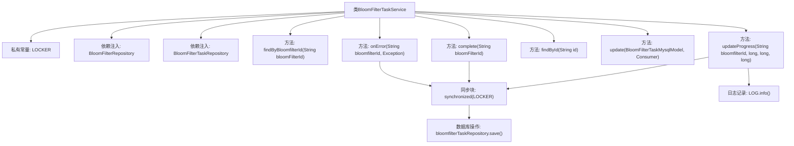

# 基础信息

|      |      |
|------|------|
| 名称 | BloomFilterTaskService |
| 编码语言 | .java |
| 代码路径 | WeFe/board/board-service/src/main/java/com/welab/wefe/board/service/service/data_resource/bloom_filter/BloomFilterTaskService.java |
| 包名 | com.welab.wefe.board.service.service.data_resource.bloom_filter |
| 依赖项 | ['com.welab.wefe.board.service.database.entity.fusion.bloomfilter.BloomFilterTaskMysqlModel', 'com.welab.wefe.board.service.database.repository.data_resource.BloomFilterRepository', 'com.welab.wefe.board.service.database.repository.fusion.BloomFilterTaskRepository', 'com.welab.wefe.board.service.service.AbstractService', 'com.welab.wefe.common.Convert', 'com.welab.wefe.common.data.mysql.Where', 'org.springframework.beans.factory.annotation.Autowired', 'org.springframework.data.jpa.domain.Specification', 'org.springframework.stereotype.Service', 'java.util.Date', 'java.util.function.Consumer'] |
| 概述说明 | BloomFilterTaskService类用于管理布隆过滤器任务进度，提供更新进度、完成、错误处理等功能，使用同步锁确保并发安全。 |

# 说明

该代码描述了一个名为BloomFilterTaskService的服务类，继承自AbstractService，主要用于管理布隆过滤器任务的上传进度、完成状态及异常处理。类中使用了同步锁LOCKER确保并发操作的安全性，包含以下核心功能：通过bloomfilterId查询任务记录；更新上传进度，计算进度百分比和预估时间，处理边界情况如进度为0或100时的特殊逻辑；标记任务完成，设置进度为100并清零预估时间；处理任务异常，记录错误信息；提供基础CRUD操作如按ID查询和更新任务记录。所有数据库操作通过BloomFilterTaskRepository实现，关键操作均记录日志。

# 类列表 Class Summary

| 名称   | 类型  | 说明 |
|-------|------|-------------|
| BloomFilterTaskService | class | BloomFilterTaskService提供布隆过滤器任务管理功能，包括进度更新、完成标记、异常处理和查询操作，使用同步锁确保并发安全。 |

## 类 BloomFilterTaskService

|      |      |
|------|------|
| 访问范围 | @Service;public |
| 类型 | class |
| 名称 | BloomFilterTaskService |
| 说明 | BloomFilterTaskService提供布隆过滤器任务管理功能，包括进度更新、完成标记、异常处理和查询操作，使用同步锁确保并发安全。 |

### UML类图

该类图展示了布隆过滤器任务服务的核心结构。BloomFilterTaskService继承自AbstractService，通过线程锁(LOCKER)保证并发安全，主要依赖BloomFilterTaskRepository操作BloomFilterTaskMysqlModel实体数据。服务提供进度更新、完成标记、异常处理等功能，其中BloomFilterTaskMysqlModel包含任务ID、进度值、行数统计等字段，并通过JPA接口与数据库交互。类图清晰地反映了服务层与持久化层的关系及核心业务逻辑的封装方式。

### 内部方法调用关系图

该流程图展示了BloomFilterTaskService类的主要结构和关键方法调用关系。类包含5个核心业务方法，其中updateProgress、complete和onError方法都使用了同步锁机制确保线程安全。所有数据库更新操作都通过bloomfilterTaskRepository.save()方法完成，updateProgress方法还包含进度计算逻辑和日志记录功能。流程图清晰呈现了类成员与方法的层级关系，特别突出了同步代码块在多线程环境中的保护作用。

### 字段列表 Field List

| 名称  | 类型  | 说明 |
|-------|-------|------|
| bloomfilterTaskRepository | BloomFilterTaskRepository | 代码片段使用Spring的@Autowired注解自动注入BloomFilterTaskRepository实例，用于操作布隆过滤器任务数据。 |
| bloomfilterRepository | BloomFilterRepository | 自动注入布隆过滤器存储库实例。 |
| LOCKER = new Object() | Object | 定义一个私有静态不可变对象LOCKER，用于同步锁。 |

### 方法列表

| 名称  | 类型  | 说明 |
|-------|-------|------|
| onError | void | 方法onError处理异常：根据bloomfilterId查找任务，若存在则更新错误信息和时间并保存，同步锁定确保线程安全。 |
| update | void | 更新布隆过滤器任务：检查任务非空后执行回调，设置更新时间并保存。 |
| updateProgress | void | 同步更新布隆过滤器任务进度，计算进度百分比，处理低速读取时的进度递增，避免除零错误，限制进度不超过99，估算剩余时间并保存更新。 |
| findByBloomfilterId | BloomFilterTaskMysqlModel | 该方法通过bloomFilterId查询数据库，返回匹配的BloomFilterTaskMysqlModel对象，若无结果则返回null。 |
| complete | void | 该方法用于标记布隆过滤器任务完成：同步锁定后，根据ID查询任务模型，更新已添加行数为总行数、预估时间为0、进度为100%及当前时间，最后保存更新。 |
| findById | BloomFilterTaskMysqlModel | 根据ID查询布隆过滤器任务，无结果返回null。 |

