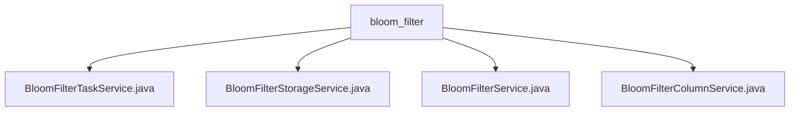

# 基础信息

|      |      |
|------|------|
| 名称 | bloom_filter |
| 编码语言 | .java |
| 代码路径 | WeFe/board/board-service/src/main/java/com/welab/wefe/board/service/service/data_resource/bloom_filter |
| 包名 | docs.board.board-service.src.main.java.com.welab.wefe.board.service.service.data_resource.bloom_filter |
| 概述说明 | BloomFilterTaskService管理布隆过滤器任务进度和异常处理，BloomFilterStorageService处理数据存储操作，BloomFilterService实现布隆过滤器功能，BloomFilterColumnService管理列数据查询和更新。 |

# 说明

## 概述  
该模块是布隆过滤器任务管理系统，核心职责是管理任务状态、数据存储及列配置，类似分布式任务调度器。BloomFilterTaskService处理任务进度跟踪与异常管理；BloomFilterStorageService负责数据存储操作；BloomFilterService协调跨服务交互；BloomFilterColumnService管理列属性配置。  

接口规范包括：进度百分比计算（BloomFilterTaskService）、数据分页读取（BloomFilterStorageService）、联合数据集查询（BloomFilterService）、列索引排序（BloomFilterColumnService）。关键数据结构含BloomFilterTaskMysqlModel、BloomFilterColumnInputModel等。  

外部依赖包括PersistentStorage、BloomFilterTaskRepository等数据库组件。例如BloomFilterTaskService使用同步锁确保线程安全，BloomFilterColumnService通过分页查询优化性能。  

## 主要业务场景  
典型场景是布隆过滤器全生命周期管理：用户上传数据时，BloomFilterTaskService记录进度；BloomFilterStorageService存储原始数据；BloomFilterService协调跨节点同步；BloomFilterColumnService配置字段映射。  

业务流程包含：任务创建→进度更新→数据持久化→联合查询。例如进度更新时计算预估时间，数据存储时动态生成表名。交互模式采用服务间调用，如BloomFilterService通过JobRepository获取任务上下文。  

功能完整性体现在CRUD操作（如列配置更新）、异常处理（如错误日志记录）、性能优化（如批量大小计算）。API类型涵盖状态查询（GET）、数据写入（POST）等，例如分页读取数据接口支持JSON格式转换。

### 包内部结构视图

该流程图展示了WeFe项目中bloom_filter目录下的服务类文件结构。bloom_filter作为父节点，包含四个子节点：BloomFilterTaskService.java、BloomFilterStorageService.java、BloomFilterService.java和BloomFilterColumnService.java，这些文件都属于布隆过滤器相关的服务实现类。

# 文件列表

| 名称   | 类型  | 说明 |
|-------|------|-------------|
| [BloomFilterTaskService.java](BloomFilterTaskService.md) | file | BloomFilterTaskService类用于管理布隆过滤器任务进度，提供更新进度、完成、错误处理等功能，使用同步锁确保并发安全。 |
| [BloomFilterStorageService.java](BloomFilterStorageService.md) | file | BloomFilterStorageService提供布隆过滤器数据存储功能，包含键值检查、删除、保存数据集头信息、数据行及分页查询等方法，使用持久化存储操作数据表。 |
| [BloomFilterService.java](BloomFilterService.md) | file | BloomFilterService提供布隆过滤器相关操作，包括查询、删除、更新、文件获取及SQL测试功能，依赖多个存储库和服务处理数据资源和项目成员权限。 |
| [BloomFilterColumnService.java](BloomFilterColumnService.md) | file | BloomFilterColumnService提供数据集字段的分页查询和批量更新功能，支持按索引排序和清空后重新保存操作。 |

