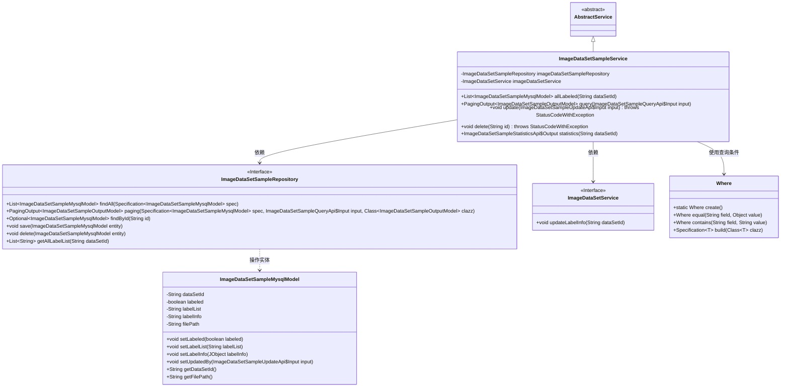
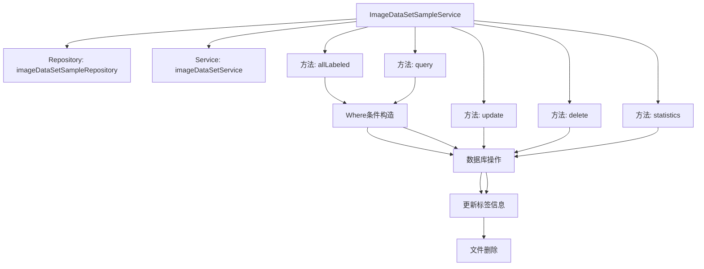
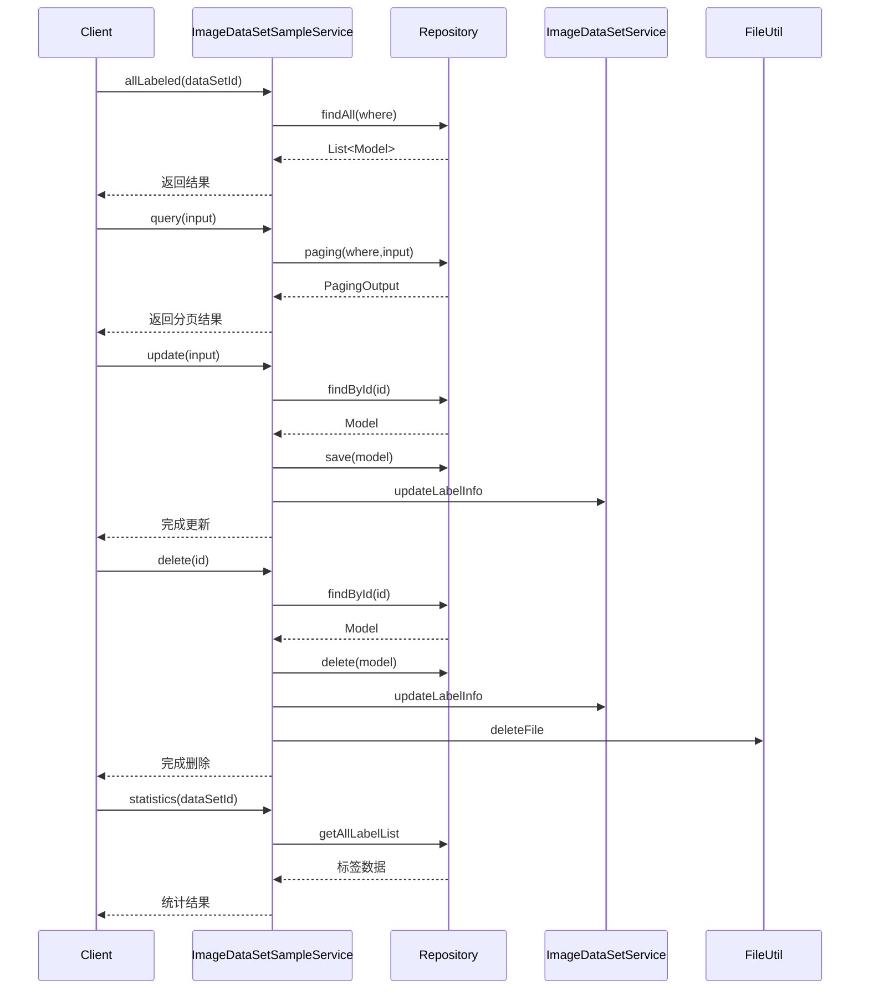

# 基础信息

|      |      |
|------|------|
| 名称 | ImageDataSetSampleService |
| 编码语言 | .java |
| 代码路径 | WeFe/board/board-service/src/main/java/com/welab/wefe/board/service/service/data_resource/image_data_set/ImageDataSetSampleService.java |
| 包名 | com.welab.wefe.board.service.service.data_resource.image_data_set |
| 依赖项 | ['com.welab.wefe.board.service.api.data_resource.image_data_set.sample.ImageDataSetSampleQueryApi', 'com.welab.wefe.board.service.api.data_resource.image_data_set.sample.ImageDataSetSampleStatisticsApi', 'com.welab.wefe.board.service.api.data_resource.image_data_set.sample.ImageDataSetSampleUpdateApi', 'com.welab.wefe.board.service.database.entity.data_set.ImageDataSetSampleMysqlModel', 'com.welab.wefe.board.service.database.repository.ImageDataSetSampleRepository', 'com.welab.wefe.board.service.dto.base.PagingOutput', 'com.welab.wefe.board.service.dto.entity.data_set.ImageDataSetSampleOutputModel', 'com.welab.wefe.board.service.service.AbstractService', 'com.welab.wefe.common.StatusCode', 'com.welab.wefe.common.data.mysql.Where', 'com.welab.wefe.common.exception.StatusCodeWithException', 'com.welab.wefe.common.util.FileUtil', 'com.welab.wefe.common.util.JObject', 'com.welab.wefe.common.util.MapUtil', 'com.welab.wefe.common.util.StringUtil', 'org.springframework.beans.factory.annotation.Autowired', 'org.springframework.data.jpa.domain.Specification', 'org.springframework.stereotype.Service', 'java.util.List', 'java.util.Map', 'java.util.TreeMap', 'java.util.stream.Collectors'] |
| 概述说明 | ImageDataSetSampleService提供图像数据集样本管理功能，包括查询标注样本、分页查询、更新删除样本及统计标签分布。通过Repository操作数据库，并与ImageDataSetService联动更新标签信息。 |

# 说明

该服务类负责图像数据集样本的管理，包含查询、更新、删除及统计功能。通过Repository操作数据库，支持按数据集ID和标注状态筛选样本，支持分页查询和标签匹配。更新操作会同步修改样本的标注状态、标签信息及关联数据集的统计。删除操作会移除样本文件并更新数据集统计。统计功能可计算标签分布和样本分布情况，返回按标签分类的计数结果。所有操作均包含参数校验和异常处理。

# 类列表 Class Summary

| 名称   | 类型  | 说明 |
|-------|------|-------------|
| ImageDataSetSampleService | class | ImageDataSetSampleService提供图像数据集样本管理功能，包括查询标注样本、分页查询、更新样本标签、删除样本及统计样本分布。通过Repository操作数据库，并联动更新数据集标签信息。 |

## 类 ImageDataSetSampleService

|      |      |
|------|------|
| 访问范围 | @Service;public |
| 类型 | class |
| 名称 | ImageDataSetSampleService |
| 说明 | ImageDataSetSampleService提供图像数据集样本管理功能，包括查询标注样本、分页查询、更新样本标签、删除样本及统计样本分布。通过Repository操作数据库，并联动更新数据集标签信息。 |

### UML类图

该图展示了图像数据集样本服务的核心类结构。ImageDataSetSampleService继承自AbstractService，依赖ImageDataSetSampleRepository和ImageDataSetService两个接口进行数据操作。服务类通过Where工具构建查询条件，主要操作ImageDataSetSampleMysqlModel实体类，提供样本查询、更新、删除及统计功能。其中Repository接口定义了CRUD操作，ImageDataSetService负责标签信息更新，体现了清晰的分层架构和职责划分。

### 内部方法调用关系图

这段代码实现了一个图像数据集样本服务，主要功能包括：查询已标注样本、分页查询样本、更新样本信息、删除样本及统计样本分布。服务通过Repository与数据库交互，并协同ImageDataSetService维护标签信息。核心流程包含条件构造、数据库操作、标签更新和文件清理，通过异常处理确保数据一致性。统计功能采用流式处理对标签进行聚合计算。

### 字段列表 Field List

| 名称  | 类型  | 说明 |
|-------|-------|------|
| imageDataSetService | ImageDataSetService | 自动注入ImageDataSetService实例。 |
| imageDataSetSampleRepository | ImageDataSetSampleRepository | 使用@Autowired自动注入ImageDataSetSampleRepository实例。 |

### 方法列表

| 名称  | 类型  | 说明 |
|-------|-------|------|
| query | PagingOutput<ImageDataSetSampleOutputModel> | 该方法根据输入条件查询图像数据集样本，支持按数据集ID、标注状态和标签过滤，返回分页结果。标签匹配可精确或模糊查询。 |
| allLabeled | List<ImageDataSetSampleMysqlModel> | 方法allLabeled根据dataSetId查询已标注的ImageDataSetSampleMysqlModel列表，使用条件构建器Where创建查询条件，通过repository获取结果并返回。 |
| update | void | 更新图像数据集样本信息：检查样本是否存在，更新标签状态、标签信息、标签列表及更新者，保存并同步更新数据集标签信息。 |
| delete | void | 删除指定ID的图片数据集样本。若样本不存在则报错，删除后更新标签信息并清理文件。 |
| statistics | ImageDataSetSampleStatisticsApi.Output | 该方法统计指定数据集ID的标签和样本数量。遍历数据集中的标签列表，分别计算每个标签的出现次数和包含该标签的样本数，最终返回统计结果。 |

