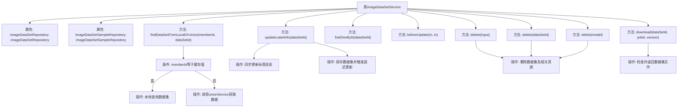

# 基础信息

|      |      |
|------|------|
| 名称 | ImageDataSetService |
| 编码语言 | .java |
| 代码路径 | WeFe/board/board-service/src/main/java/com/welab/wefe/board/service/service/data_resource/image_data_set/ImageDataSetService.java |
| 包名 | com.welab.wefe.board.service.service.data_resource.image_data_set |
| 依赖项 | ['com.welab.wefe.board.service.api.data_resource.image_data_set.ImageDataSetDeleteApi', 'com.welab.wefe.board.service.database.entity.data_resource.DataResourceMysqlModel', 'com.welab.wefe.board.service.database.entity.data_resource.ImageDataSetMysqlModel', 'com.welab.wefe.board.service.database.repository.ImageDataSetSampleRepository', 'com.welab.wefe.board.service.database.repository.data_resource.ImageDataSetRepository', 'com.welab.wefe.board.service.dto.entity.data_resource.output.ImageDataSetOutputModel', 'com.welab.wefe.board.service.dto.vo.data_resource.AbstractDataResourceUpdateInputModel', 'com.welab.wefe.board.service.dto.vo.data_resource.ImageDataSetUpdateInputModel', 'com.welab.wefe.board.service.onlinedemo.OnlineDemoBranchStrategy', 'com.welab.wefe.board.service.service.CacheObjects', 'com.welab.wefe.board.service.service.data_resource.DataResourceService', 'com.welab.wefe.board.service.service.data_resource.image_data_set.data_set_parser.AbstractImageDataSetParser', 'com.welab.wefe.common.StatusCode', 'com.welab.wefe.common.exception.StatusCodeWithException', 'com.welab.wefe.common.util.FileUtil', 'com.welab.wefe.common.util.StringUtil', 'com.welab.wefe.common.web.util.ModelMapper', 'org.springframework.beans.factory.annotation.Autowired', 'org.springframework.stereotype.Service', 'java.io.File', 'java.util.TreeSet'] |
| 概述说明 | ImageDataSetService提供图像数据集管理功能，包括查询本地/联合数据、更新标签信息、删除数据集及下载文件。支持成员ID验证、标签统计、存储清理及联合服务同步。 |

# 说明

ImageDataSetService是一个继承自DataResourceService的服务类，主要用于管理图像数据集。它通过ImageDataSetRepository和ImageDataSetSampleRepository与数据库交互。主要功能包括：根据成员ID和数据集ID从本地或联合服务获取数据集信息；同步更新数据集的标签信息，包括标签列表、数据总数和已标记数量；提供数据集的删除功能，包括删除数据库记录和相关文件；以及下载数据集文件的功能。该类还实现了父类的抽象方法，并在删除操作前进行权限检查。

# 类列表 Class Summary

| 名称   | 类型  | 说明 |
|-------|------|-------------|
| ImageDataSetService | class | ImageDataSetService提供图像数据集管理功能，包括查询本地或联合数据、更新标签信息、删除数据集及下载数据集文件。通过Repository操作数据库，支持标签统计和联合服务同步。 |


## 类 ImageDataSetService

|      |      |
|------|------|
| 访问范围 | @Service;public |
| 类型 | class |
| 名称 | ImageDataSetService |
| 说明 | ImageDataSetService提供图像数据集管理功能，包括查询本地或联合数据、更新标签信息、删除数据集及下载数据集文件。通过Repository操作数据库，支持标签统计和联合服务同步。 |


### UML类图

```mermaid
classDiagram
    class ImageDataSetService {
        -ImageDataSetRepository imageDataSetRepository
        -ImageDataSetSampleRepository imageDataSetSampleRepository
        +findDataSetFromLocalOrUnion(String memberId, String dataSetId) ImageDataSetOutputModel
        +updateLabelInfo(String dataSetId) void
        +findOneById(String dataSetId) ImageDataSetMysqlModel
        +beforeUpdate(DataResourceMysqlModel m, AbstractDataResourceUpdateInputModel in) void
        +delete(ImageDataSetDeleteApi$Input input) void
        +delete(String dataSetId) void
        +delete(ImageDataSetMysqlModel model) void
        +download(String dataSetId, String jobId, String version) File
    }

    class DataResourceService {
        <<Abstract>>
        +beforeUpdate(DataResourceMysqlModel m, AbstractDataResourceUpdateInputModel in) void
    }

    class ImageDataSetRepository {
        <<Interface>>
        +findById(String id) Optional~ImageDataSetMysqlModel~
        +save(ImageDataSetMysqlModel entity) ImageDataSetMysqlModel
        +deleteById(String id) void
    }

    class ImageDataSetSampleRepository {
        <<Interface>>
        +getAllDistinctLabelList(String dataSetId) List~String~
        +getSampleCount(String dataSetId) Integer
        +getLabeledCount(String dataSetId) Integer
        +deleteByDataSetId(String dataSetId) void
    }

    class ImageDataSetMysqlModel {
        +setLabelList(String labels) void
        +setTotalDataCount(Integer count) void
        +setLabeledCount(Integer count) void
        +setLabelCompleted(Boolean completed) void
        +getId() String
        +getStorageNamespace() String
        +getDataResourceType() String
    }

    class ImageDataSetOutputModel {
        <<DataTransferObject>>
    }

    class AbstractDataResourceUpdateInputModel {
        <<Abstract>>
    }

    class ImageDataSetUpdateInputModel {
    }

    class ImageDataSetDeleteApi$Input {
    }

    DataResourceService <|-- ImageDataSetService
    ImageDataSetService --> ImageDataSetRepository : 依赖
    ImageDataSetService --> ImageDataSetSampleRepository : 依赖
    ImageDataSetService --> ImageDataSetMysqlModel : 操作
    ImageDataSetService --> ImageDataSetOutputModel : 返回
    ImageDataSetService --> AbstractDataResourceUpdateInputModel : 参数
    ImageDataSetService --> ImageDataSetUpdateInputModel : 参数
    ImageDataSetService --> ImageDataSetDeleteApi$Input : 参数
```

这段代码描述了一个图像数据集服务类`ImageDataSetService`，它继承自抽象类`DataResourceService`，主要功能包括从本地或联合存储中查找数据集、更新标签信息、删除数据集以及下载数据集文件。该类通过`ImageDataSetRepository`和`ImageDataSetSampleRepository`接口与数据库交互，操作`ImageDataSetMysqlModel`实体类，并返回`ImageDataSetOutputModel`数据传输对象。服务还涉及多种输入模型类，如`ImageDataSetUpdateInputModel`和`ImageDataSetDeleteApi$Input`，用于处理不同业务场景的参数传递。整体设计体现了分层架构思想，将数据访问、业务逻辑和接口定义分离。


### 内部方法调用关系图



流程图描述：该流程图展示了ImageDataSetService类的主要功能结构，包含数据查询（本地/联合）、标签更新、删除操作和文件下载等核心方法。通过条件分支处理不同memberId的查询逻辑，同步机制保障标签更新的线程安全，删除操作级联清理存储资源和缓存，下载功能包含文件存在性校验。各方法通过箭头清晰展现了调用关系和数据处理流程。

### 字段列表 Field List

| 名称  | 类型  | 说明 |
|-------|-------|------|
| imageDataSetSampleRepository | ImageDataSetSampleRepository | 自动注入ImageDataSetSampleRepository实例。 |
| imageDataSetRepository | ImageDataSetRepository | 自动注入ImageDataSetRepository实例。 |

### 方法列表

| 名称  | 类型  | 说明 |
|-------|-------|------|
| updateLabelInfo | void | 同步方法更新数据集标签信息：查询数据集，提取并合并标签，统计样本和已标注数量，标记完成状态，保存并触发资源更新。 |
| delete | void | 该方法根据数据集ID删除记录，若不存在则直接返回。 |
| delete | void | 方法delete接收Input参数，检查ID对应数据集是否存在，不存在则返回。存在时验证删除权限（仅限自己添加的数据集），最后删除数据集。 |
| findOneById | ImageDataSetMysqlModel | 该方法通过ID查询图像数据集，若不存在则返回null。 |
| findDataSetFromLocalOrUnion | ImageDataSetOutputModel | 该方法根据memberId判断是否本地成员，是则从本地数据库查询并映射数据集，否则通过unionService获取联合数据资源详情。 |
| delete | void | 删除图像数据集：移除数据库记录、样本数据、存储文件，并刷新缓存及联合服务资源。 |
| beforeUpdate | void | 方法beforeUpdate接收DataResourceMysqlModel和AbstractDataResourceUpdateInputModel参数，并转换为ImageDataSetMysqlModel和ImageDataSetUpdateInputModel类型。 |
| download | File | 方法下载数据集文件，检查数据集ID和版本是否存在，若文件不存在则抛出异常。返回文件对象。 |


