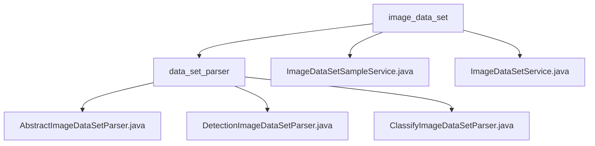

# 基础信息

|      |      |
|------|------|
| 名称 | image_data_set |
| 编码语言 | .java |
| 代码路径 | WeFe/board/board-service/src/main/java/com/welab/wefe/board/service/service/data_resource/image_data_set |
| 包名 | docs.board.board-service.src.main.java.com.welab.wefe.board.service.service.data_resource.image_data_set |
| 概述说明 | 该模块提供统一图像数据集解析框架，支持分类和检测任务。包含数据集分割、版本控制、ZIP打包等功能，子类实现具体逻辑。服务类管理数据集样本，支持查询、更新、删除及统计功能，操作数据库并处理异常。 |

# 说明

## 概述  
该模块是面向图像数据集的综合管理系统，核心职责包括统一解析框架实现（支持分类/检测任务）和全生命周期数据管理。通过AbstractImageDataSetParser抽象类定义基础规范，其子类分别实现PASCAL VOC格式（检测）和ImageFolder结构（分类）的解析逻辑。关键数据结构涵盖样本路径列表、标签映射表和XML标注对象，依赖文件系统操作、并发处理和数据库访问。例如检测任务会生成train.txt与XML文件对，分类任务则构建tgz压缩包和标签索引。

## 主要业务场景  
典型流程包含数据集导入导出、样本CRUD和统计分析。导出时工厂模式（getParser）按任务类型生成结构化文件，导入时反向解析并更新内存模型。数据管理服务通过Repository实现样本增删改查，支持标签分布统计和分页查询。例如检测任务会并发处理XML生成，分类服务通过正则校验文件一致性。集成案例可见于训练预处理流水线，采用类似微服务架构进行权限控制与联合查询。

### 包内部结构视图

该流程图展示了图像数据集服务的层级结构，顶层为image_data_set目录，包含两个服务类文件和data_set_parser子目录。parser子目录下包含三个具体的数据集解析器实现类，分别为抽象解析器和分类/检测两种具体类型的解析器实现，形成了清晰的继承关系和服务调用结构。

# 文件列表

| 名称   | 类型  | 说明 |
|-------|------|-------------|
| [ImageDataSetSampleService.java](ImageDataSetSampleService.md) | file | ImageDataSetSampleService提供图像数据集样本管理功能，包括查询标注样本、分页查询、更新删除样本及统计标签分布。通过Repository操作数据库，并与ImageDataSetService联动更新标签信息。 |
| [ImageDataSetService.java](ImageDataSetService.md) | file | ImageDataSetService提供图像数据集管理功能，包括查询本地/联合数据、更新标签信息、删除数据集及下载文件。支持成员ID验证、标签统计、存储清理及联合服务同步。 |
| [data_set_parser](data_set_parser/_module.md) | package | AbstractImageDataSetParser是图像数据集解析抽象类，支持分类和检测任务，提供样本解析、分割、打包功能。DetectionImageDataSetParser继承它，处理检测任务的数据导入导出。ClassifyImageDataSetParser继承它，处理分类任务的数据导入导出。 |

