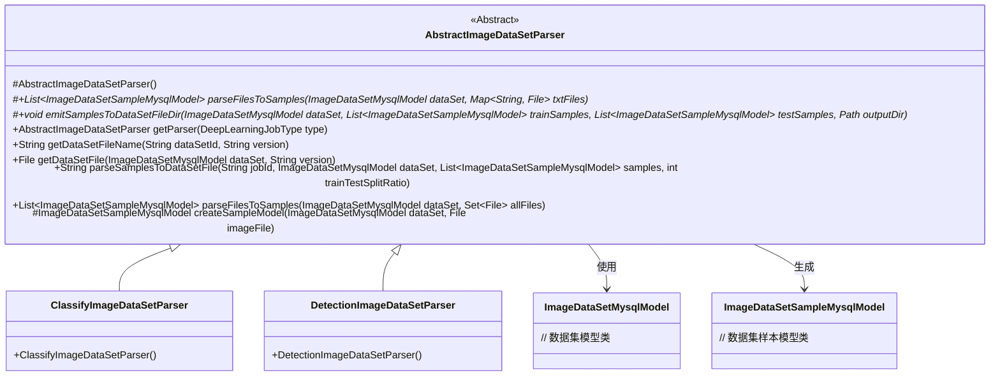
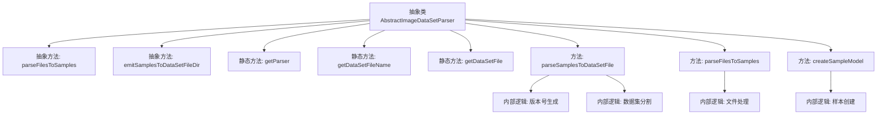

# 基础信息

|      |      |
|------|------|
| 名称 | AbstractImageDataSetParser |
| 编码语言 | .java |
| 代码路径 | WeFe/board/board-service/src/main/java/com/welab/wefe/board/service/service/data_resource/image_data_set/data_set_parser/AbstractImageDataSetParser.java |
| 包名 | com.welab.wefe.board.service.service.data_resource.image_data_set.data_set_parser |
| 依赖项 | ['com.welab.wefe.board.service.database.entity.data_resource.ImageDataSetMysqlModel', 'com.welab.wefe.board.service.database.entity.data_set.ImageDataSetSampleMysqlModel', 'com.welab.wefe.board.service.service.AbstractService', 'com.welab.wefe.common.Convert', 'com.welab.wefe.common.StatusCode', 'com.welab.wefe.common.exception.StatusCodeWithException', 'com.welab.wefe.common.file.compression.impl.Zip', 'com.welab.wefe.common.util.FileUtil', 'com.welab.wefe.common.web.util.CurrentAccountUtil', 'com.welab.wefe.common.wefe.enums.DeepLearningJobType', 'org.apache.commons.io.FileUtils', 'java.io.File', 'java.io.IOException', 'java.nio.file.Path', 'java.nio.file.Paths', 'java.util', 'java.util.stream.Collectors'] |
| 概述说明 | 抽象类AbstractImageDataSetParser提供图像数据集解析功能，包含样本解析、数据集打包及文件处理等方法，支持分类和检测任务。 |

# 说明

AbstractImageDataSetParser是一个抽象类，用于处理图像数据集的解析和打包。它提供了以下核心功能：根据文件类型（图像、XML、TXT）解析样本信息；将样本按比例分割为训练集和测试集；生成数据集文件版本号以避免重复生成；将样本打包为ZIP格式的数据集文件。该类支持分类和检测两种深度学习任务类型，通过工厂方法getParser获取具体实现。关键特性包括：自动过滤隐藏文件和临时文件、检查文件名重复、样本最后更新时间跟踪、训练测试集随机分割。数据集文件生成考虑三个因素：切割比例、样本数量和最后标注时间。

# 类列表 Class Summary

| 名称   | 类型  | 说明 |
|-------|------|-------------|
| AbstractImageDataSetParser | class | 抽象类AbstractImageDataSetParser提供图像数据集解析功能，包含样本解析、数据集打包及文件处理。支持分类和检测任务，根据切割比例生成训练集和测试集，避免重复生成相同数据集。 |

## 类 AbstractImageDataSetParser

|      |      |
|------|------|
| 访问范围 | public abstract |
| 类型 | class |
| 名称 | AbstractImageDataSetParser |
| 说明 | 抽象类AbstractImageDataSetParser提供图像数据集解析功能，包含样本解析、数据集打包及文件处理。支持分类和检测任务，根据切割比例生成训练集和测试集，避免重复生成相同数据集。 |

### UML类图

这段代码定义了一个抽象类 `AbstractImageDataSetParser`，用于处理图像数据集的解析和打包操作。该类提供了文件解析、样本分割、数据集打包等功能，并通过两个具体实现类 `ClassifyImageDataSetParser` 和 `DetectionImageDataSetParser` 来支持不同的深度学习任务类型。主要功能包括根据文件类型分类处理、样本随机分割、数据集版本控制以及压缩打包等操作，确保在数据或参数变化时能正确重新生成数据集文件。

### 内部方法调用关系图

这段代码定义了一个抽象类`AbstractImageDataSetParser`，主要用于处理图像数据集的解析和打包操作。流程图展示了类的主要结构，包括2个抽象方法（文件解析和样本输出）、3个静态工具方法（获取解析器、生成文件名、获取文件对象）和3个具体实现方法（数据集文件生成、文件解析、样本创建）。核心方法`parseSamplesToDataSetFile`包含版本号生成逻辑（基于样本数量和更新时间）和数据集分割逻辑（按比例划分训练集/测试集），通过文件操作最终生成压缩包格式的数据集文件。

### 字段列表 Field List

| 名称  | 类型  | 说明 |
|-------|-------|------|

### 方法列表

| 名称  | 类型  | 说明 |
|-------|-------|------|
| parseFilesToSamples | List<ImageDataSetSampleMysqlModel> | 抽象方法parseFilesToSamples，将图像、XML和TXT文件解析为样本列表，参数包括数据集模型和各类文件映射，可能抛出异常。 |
| getDataSetFile | File | 静态方法getDataSetFile根据数据集对象和版本号生成文件路径，组合存储命名空间、output目录及数据集文件名返回File对象。 |
| getDataSetFileName | String | 该方法根据数据集ID和版本号生成对应的压缩文件名，格式为"数据集ID_版本号.zip"。 |
| getParser | AbstractImageDataSetParser | 根据输入类型返回对应的图像数据集解析器，无匹配则返回null。 |
| parseSamplesToDataSetFile | String | 该方法根据样本数据生成数据集文件，包含版本号构建、训练测试集分割、文件生成与压缩。若文件存在则跳过生成。 |
| parseFilesToSamples | List<ImageDataSetSampleMysqlModel> | 该方法解析文件集合，过滤隐藏文件和临时文件，检查文件名重复，分类处理图片、XML和TXT文件，最终转换为样本模型列表。 |
| createSampleModel | ImageDataSetSampleMysqlModel | 创建图片数据集样本模型，设置ID、文件名、路径、大小和创建者，复制文件到目标路径并返回模型。 |
| emitSamplesToDataSetFileDir | void | 抽象方法：将训练和测试样本数据输出到指定目录，可能抛出异常。参数包括数据集模型、样本列表和输出路径。 |

