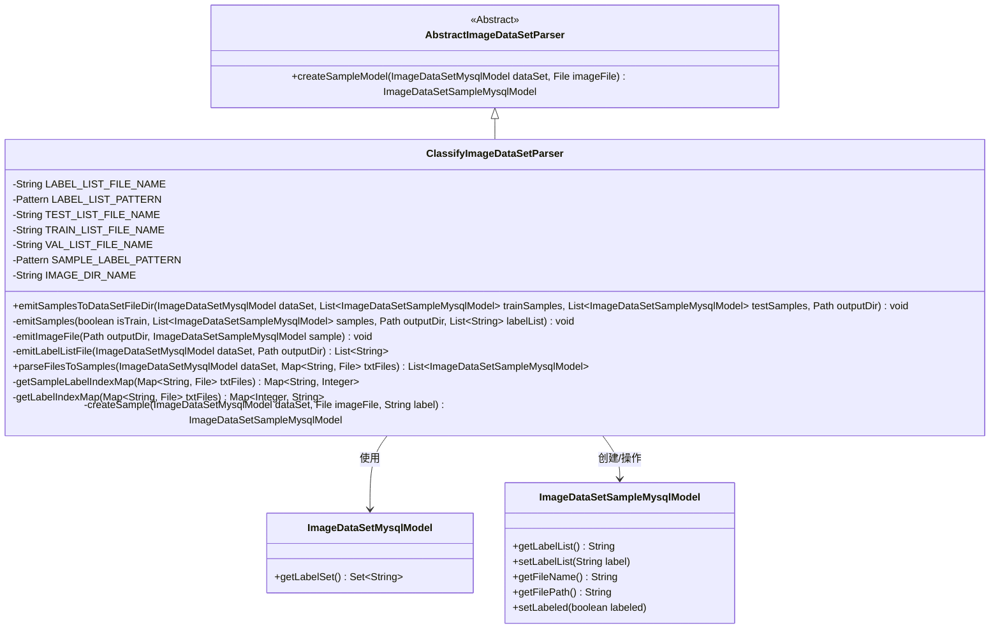
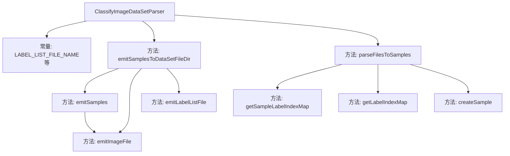

# 基础信息

|      |      |
|------|------|
| 名称 | ClassifyImageDataSetParser |
| 编码语言 | .java |
| 代码路径 | WeFe/board/board-service/src/main/java/com/welab/wefe/board/service/service/data_resource/image_data_set/data_set_parser/ClassifyImageDataSetParser.java |
| 包名 | com.welab.wefe.board.service.service.data_resource.image_data_set.data_set_parser |
| 依赖项 | ['com.welab.wefe.board.service.database.entity.data_resource.ImageDataSetMysqlModel', 'com.welab.wefe.board.service.database.entity.data_set.ImageDataSetSampleMysqlModel', 'com.welab.wefe.common.Convert', 'com.welab.wefe.common.exception.StatusCodeWithException', 'com.welab.wefe.common.file.compression.impl.Tgz', 'com.welab.wefe.common.util.FileUtil', 'com.welab.wefe.common.util.ListUtil', 'com.welab.wefe.common.util.StringUtil', 'java.io.File', 'java.io.IOException', 'java.nio.file.Files', 'java.nio.file.Path', 'java.nio.file.Paths', 'java.util', 'java.util.regex.Matcher', 'java.util.regex.Pattern'] |
| 概述说明 | ClassifyImageDataSetParser类处理图像数据集，支持导出和导入功能。导出时生成标签文件、训练/验证列表，压缩图片为tgz。导入时解析标签和样本映射，创建样本模型。 |

# 说明

ClassifyImageDataSetParser是一个图像数据集解析类，继承自AbstractImageDataSetParser。它负责处理图像数据集的导入导出，主要功能包括：导出时生成标签文件（label_list.txt）、训练集/验证集文件（train_list.txt/val_list.txt），并将图片压缩为image.tgz；导入时解析这些文件，建立图片与标签的映射关系。类中定义了多个常量用于文件名和正则表达式模式，实现了并发处理图片数据，并确保线程安全。

# 类列表 Class Summary

| 名称   | 类型  | 说明 |
|-------|------|-------------|
| ClassifyImageDataSetParser | class | ClassifyImageDataSetParser类处理图像数据集，支持导出和导入功能。导出时生成标签文件、训练集和验证集，并压缩图像目录。导入时解析标签和样本映射，创建样本模型。 |

## 类 ClassifyImageDataSetParser

|      |      |
|------|------|
| 访问范围 | public |
| 类型 | class |
| 名称 | ClassifyImageDataSetParser |
| 说明 | ClassifyImageDataSetParser类处理图像数据集，支持导出和导入功能。导出时生成标签文件、训练集和验证集，并压缩图像目录。导入时解析标签和样本映射，创建样本模型。 |

### UML类图

该类图展示了图像数据集解析器的继承结构和主要关系。ClassifyImageDataSetParser继承自抽象类AbstractImageDataSetParser，实现了图像数据集的导入导出功能。它通过操作ImageDataSetMysqlModel获取数据集元信息，并生成/解析ImageDataSetSampleMysqlModel样本对象。核心功能包括处理标签文件、样本文件映射关系，以及图片文件的压缩打包操作。类中使用了多个正则表达式模式来解析不同格式的文本文件，体现了对图像分类数据集特定格式的处理能力。

### 内部方法调用关系图

这段代码是用于处理图像数据集的解析和导出工具类。主要功能包括：1) 将数据集样本导出为特定目录结构并压缩；2) 从文件解析数据集样本。核心流程包含标签列表生成、样本文件拷贝、压缩打包等步骤，采用线程安全方式处理并发任务，支持训练集/测试集分离存储。

### 字段列表 Field List

| 名称  | 类型  | 说明 |
|-------|-------|------|
| TRAIN_LIST_FILE_NAME = "train_list.txt" | String | 定义常量字符串TRAIN_LIST_FILE_NAME，值为"train_list.txt"。 |
| LABEL_LIST_PATTERN = Pattern.compile("^\\s*(?<index>\\d+)\\s+(?<label>.+)\\s*$") | Pattern | Java静态正则表达式，匹配以数字开头后跟标签的字符串，捕获索引和标签分组。 |
| IMAGE_DIR_NAME = "jpg" | String | 定义常量字符串IMAGE_DIR_NAME，值为"jpg"，表示图片目录名称。 |
| TEST_LIST_FILE_NAME = "test_list.txt" | String | 定义常量字符串变量TEST_LIST_FILE_NAME，值为"test_list.txt"。 |
| LABEL_LIST_FILE_NAME = "label_list.txt" | String | 定义常量字符串变量LABEL_LIST_FILE_NAME，值为"label_list.txt"。 |
| SAMPLE_LABEL_PATTERN = Pattern.compile("^(?<sample>.+)\\s+(?<index>\\d+)\\s*$") | Pattern | 定义正则表达式模式，匹配以样本名和数字结尾的字符串，并分组捕获样本名和数字。 |
| VAL_LIST_FILE_NAME = "val_list.txt" | String | 定义常量VAL_LIST_FILE_NAME，值为"val_list.txt"。 |

### 方法列表

| 名称  | 类型  | 说明 |
|-------|-------|------|
| parseFilesToSamples | List<ImageDataSetSampleMysqlModel> | 该方法解析图像文件并生成样本列表。首先获取标签索引映射和样本标签索引映射，然后并发处理图像文件，创建样本对象并添加到线程安全的结果列表中。处理过程中捕获异常并抛出，最后返回结果列表。 |
| emitImageFile | void | 该方法将图片文件从原路径复制到指定输出目录的IMAGE_DIR_NAME子目录下，保持原文件名不变。 |
| emitSamplesToDataSetFileDir | void | 方法将训练和测试样本写入数据集目录，生成标签文件并压缩图片目录为image.tgz，最后删除原图片目录。 |
| getLabelIndexMap | Map<Integer, String> | 该方法从txtFiles中提取标签文件，解析每行内容匹配索引和标签，生成并返回索引到标签的映射。若文件不存在返回空映射。 |
| emitLabelListFile | List<String> | 该方法从数据集获取标签列表，生成格式为"序号 标签"的文本文件并保存到指定目录，最后返回标签列表。 |
| emitSamples | void | 方法emitSamples处理图像样本，将图片复制到输出目录并生成标注文件。标注文件包含文件名和对应标签索引，根据isTrain参数决定保存为训练或验证集文件。 |
| getSampleLabelIndexMap | Map<String, Integer> | 该方法从三个指定文件中读取样本标签和索引，构建并返回一个样本名到索引的映射表。处理时跳过空文件，使用正则提取样本名和索引，最终以样本名为键存储。 |
| createSample | ImageDataSetSampleMysqlModel | 创建图像数据集样本方法：接收数据集、图像文件和标签，生成样本模型并设置标签列表及标记状态。 |

