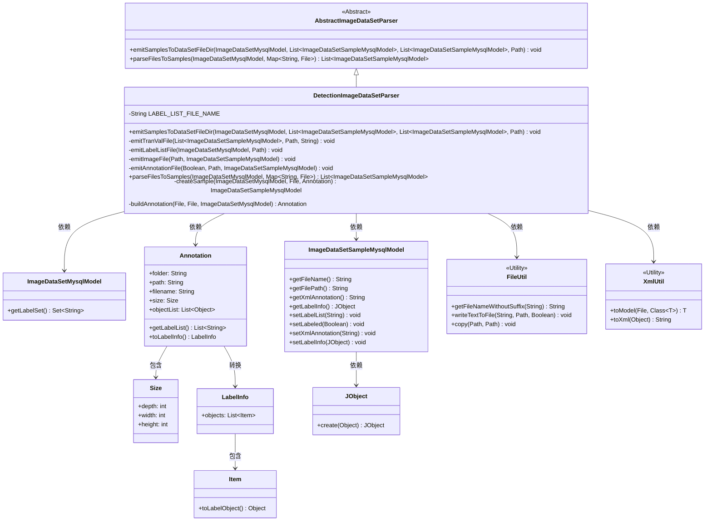

# 基础信息

|      |      |
|------|------|
| 名称 | DetectionImageDataSetParser |
| 编码语言 | .java |
| 代码路径 | WeFe/board/board-service/src/main/java/com/welab/wefe/board/service/service/data_resource/image_data_set/data_set_parser/DetectionImageDataSetParser.java |
| 包名 | com.welab.wefe.board.service.service.data_resource.image_data_set.data_set_parser |
| 依赖项 | ['com.thoughtworks.xstream.io.StreamException', 'com.welab.wefe.board.service.database.entity.data_resource.ImageDataSetMysqlModel', 'com.welab.wefe.board.service.database.entity.data_set.ImageDataSetSampleMysqlModel', 'com.welab.wefe.board.service.dto.vo.data_set.image_data_set.Annotation', 'com.welab.wefe.board.service.dto.vo.data_set.image_data_set.LabelInfo', 'com.welab.wefe.board.service.dto.vo.data_set.image_data_set.Size', 'com.welab.wefe.common.StatusCode', 'com.welab.wefe.common.exception.StatusCodeWithException', 'com.welab.wefe.common.util', 'org.apache.commons.collections4.CollectionUtils', 'javax.imageio.ImageIO', 'java.awt.image.BufferedImage', 'java.io.File', 'java.io.FileInputStream', 'java.io.IOException', 'java.nio.file.Path', 'java.nio.file.Paths', 'java.util.ArrayList', 'java.util.Collections', 'java.util.List', 'java.util.Map', 'java.util.stream.Collectors'] |
| 概述说明 | DetectionImageDataSetParser类处理图像数据集导入导出，包含标签列表、图片和XML注释文件，支持训练和验证集生成。 |

# 说明

DetectionImageDataSetParser类是一个用于处理图像数据集的解析器，继承自AbstractImageDataSetParser。主要功能包括导出和导入数据集。导出时，将训练和测试样本分别保存为图像和XML注释文件，并生成train.txt和val.txt文件记录样本路径，同时输出label_list.txt文件存储标签列表。导入时，解析图像和XML文件，构建样本模型并处理并发操作。类中定义了多个私有方法，如emitImageFile用于拷贝图片文件，emitAnnotationFile生成XML注释文件，emitLabelListFile输出标签列表文件。此外，还包含用于构建注释对象和创建样本模型的方法。

# 类列表 Class Summary

| 名称   | 类型  | 说明 |
|-------|------|-------------|
| DetectionImageDataSetParser | class | DetectionImageDataSetParser类用于处理图像数据集，包含导出和导入功能。导出时生成images、annotations目录及train.txt、val.txt、label_list.txt文件。导入时解析图像和XML文件，构建样本数据。支持并发处理，确保线程安全。 |

## 类 DetectionImageDataSetParser

|      |      |
|------|------|
| 访问范围 | public |
| 类型 | class |
| 名称 | DetectionImageDataSetParser |
| 说明 | DetectionImageDataSetParser类用于处理图像数据集，包含导出和导入功能。导出时生成images、annotations目录及train.txt、val.txt、label_list.txt文件。导入时解析图像和XML文件，构建样本数据。支持并发处理，确保线程安全。 |

### UML类图

该图展示了DetectionImageDataSetParser类及其相关依赖关系。DetectionImageDataSetParser继承自AbstractImageDataSetParser，负责处理图像数据集的导入导出。它使用FileUtil和XmlUtil工具类进行文件操作和XML处理，与ImageDataSetMysqlModel和ImageDataSetSampleMysqlModel交互管理数据集元数据，并通过Annotation类处理标注信息。图中清晰地呈现了类之间的继承、依赖和组合关系。

### 内部方法调用关系图

该流程图展示了DetectionImageDataSetParser类的主要结构和功能关系。作为图像数据集解析器，它继承自AbstractImageDataSetParser，核心功能分为数据集导出和导入两大模块。导出部分包含生成训练/验证文件、标签列表、图像文件和XML标注文件的方法；导入部分则通过解析图像和XML文件创建样本数据。关键方法如emitAnnotationFile会调用buildAnnotation进行XML处理，而createSample和parseFilesToSamples共同完成数据样本的构建流程。整个类通过文件操作和XML转换实现了完整的数据集处理闭环。

### 字段列表 Field List

| 名称  | 类型  | 说明 |
|-------|-------|------|
| LABEL_LIST_FILE_NAME = "label_list.txt" | String | 私有静态常量字符串，存储标签列表文件名"label_list.txt"。 |

### 方法列表

| 名称  | 类型  | 说明 |
|-------|-------|------|
| emitAnnotationFile | void | 该方法根据训练或测试状态生成标注文件，转换样本数据为XML格式并保存到指定目录。关键步骤包括设置文件夹类型、路径、处理标签信息及写入文件。 |
| createSample | ImageDataSetSampleMysqlModel | 创建图像数据集样本方法：接收数据集、图像文件和标注，生成样本模型并设置标签列表、标注状态、XML标注和标签信息。 |
| parseFilesToSamples | List<ImageDataSetSampleMysqlModel> | 方法解析文件生成样本列表，使用线程安全List存储结果，并行处理图片和XML文件构建标注信息，异常时抛出。 |
| emitSamplesToDataSetFileDir | void | 将训练和测试样本图像及标注文件输出到指定目录，生成训练集和验证集列表文件，最后生成标签列表文件。 |
| emitImageFile | void | 将图片文件从原路径复制到输出目录的images子目录下。 |
| emitLabelListFile | void | 该方法将数据集标签集写入指定目录的文件中，使用系统换行符连接标签，不追加写入。 |
| buildAnnotation | Annotation | 该方法从图像文件和XML文件构建Annotation对象。若XML存在则解析为Annotation，否则新建。读取图像尺寸信息填充Annotation的size属性，并设置文件名和路径。处理中可能抛出文件读取或解析异常。 |
| emitTranValFile | void | 该方法用于生成训练验证文件，遍历样本列表，将每个样本的图像和标注文件路径写入指定文件。若文件存在则先删除。 |

