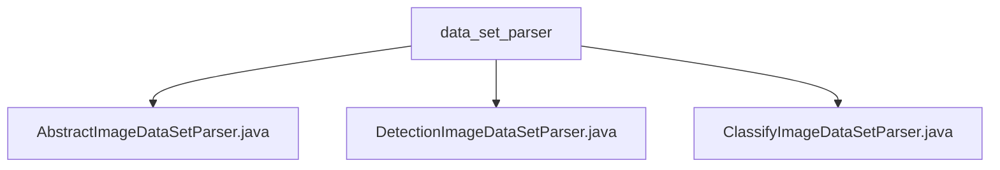

# 基础信息

|      |      |
|------|------|
| 名称 | data_set_parser |
| 编码语言 | .java |
| 代码路径 | WeFe/board/board-service/src/main/java/com/welab/wefe/board/service/service/data_resource/image_data_set/data_set_parser |
| 包名 | docs.board.board-service.src.main.java.com.welab.wefe.board.service.service.data_resource.image_data_set.data_set_parser |
| 概述说明 | AbstractImageDataSetParser是图像数据集解析抽象类，支持分类和检测任务，提供样本解析、分割、打包功能。DetectionImageDataSetParser继承它，处理检测任务的数据导入导出。ClassifyImageDataSetParser继承它，处理分类任务的数据导入导出。 |

# 说明

## 概述  
该模块核心职责是提供统一的图像数据集解析框架，支持分类和检测两种深度学习任务。通过抽象类AbstractImageDataSetParser定义基础功能（如数据集分割、版本控制、ZIP打包），子类DetectionImageDataSetParser和ClassifyImageDataSetParser分别实现目标检测（生成XML标注和路径列表）和图像分类（构建标签映射和压缩图片）的具体逻辑。  

关键数据结构包括样本路径列表（train.txt/val.txt）、标签文件（label_list.txt）和XML标注对象。依赖文件系统操作和并发处理机制，自动过滤临时文件并跟踪样本更新时间。例如检测任务会生成类似PASCAL VOC格式的XML文件，分类任务则采用类似ImageFolder的目录结构。  

## 主要业务场景  
典型应用包含数据集导出和导入流程：导出时根据任务类型生成结构化文件（如检测任务输出train.txt+XML，分类任务生成train_list.txt+image.tgz），导入时反向解析并构建内存模型。交互模式采用工厂方法（getParser）隔离具体实现，支持多线程处理。  

完整功能覆盖样本分割（随机比例）、版本控制（基于时间戳）和格式校验（如标签去重）。例如检测任务会并发处理图片拷贝和XML生成，分类任务通过正则匹配确保文件一致性。API类型包括文件解析器接口和数据集打包服务，集成案例可见于训练数据预处理流水线。

### 包内部结构视图

该流程图展示了图像数据集解析器的层级结构，根节点为data_set_parser文件夹，包含三个具体的解析器实现类：抽象解析器、检测图像解析器和分类图像解析器。这种结构体现了面向对象设计中抽象基类与具体实现类的关系，适用于不同场景的图像数据集处理需求。

# 文件列表

| 名称   | 类型  | 说明 |
|-------|------|-------------|
| [AbstractImageDataSetParser.java](AbstractImageDataSetParser.md) | file | 抽象类AbstractImageDataSetParser提供图像数据集解析功能，包含样本解析、数据集打包及文件处理等方法，支持分类和检测任务。 |
| [DetectionImageDataSetParser.java](DetectionImageDataSetParser.md) | file | DetectionImageDataSetParser类处理图像数据集导入导出，包含标签列表、图片和XML注释文件，支持训练和验证集生成。 |
| [ClassifyImageDataSetParser.java](ClassifyImageDataSetParser.md) | file | ClassifyImageDataSetParser类处理图像数据集，支持导出和导入功能。导出时生成标签文件、训练/验证列表，压缩图片为tgz。导入时解析标签和样本映射，创建样本模型。 |

