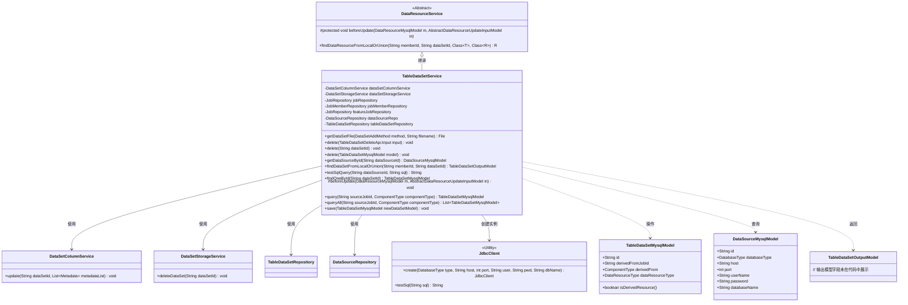
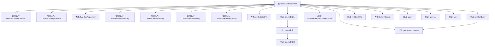

# 基础信息

|      |      |
|------|------|
| 名称 | TableDataSetService |
| 编码语言 | .java |
| 代码路径 | WeFe/board/board-service/src/main/java/com/welab/wefe/board/service/service/data_resource/table_data_set/TableDataSetService.java |
| 包名 | com.welab.wefe.board.service.service.data_resource.table_data_set |
| 依赖项 | ['com.welab.wefe.board.service.api.data_resource.table_data_set.TableDataSetDeleteApi', 'com.welab.wefe.board.service.base.file_system.WeFeFileSystem', 'com.welab.wefe.board.service.constant.DataSetAddMethod', 'com.welab.wefe.board.service.database.entity.DataSourceMysqlModel', 'com.welab.wefe.board.service.database.entity.data_resource.DataResourceMysqlModel', 'com.welab.wefe.board.service.database.entity.data_resource.TableDataSetMysqlModel', 'com.welab.wefe.board.service.database.repository.DataSourceRepository', 'com.welab.wefe.board.service.database.repository.JobMemberRepository', 'com.welab.wefe.board.service.database.repository.JobRepository', 'com.welab.wefe.board.service.database.repository.data_resource.TableDataSetRepository', 'com.welab.wefe.board.service.dto.entity.data_resource.output.TableDataSetOutputModel', 'com.welab.wefe.board.service.dto.vo.data_resource.AbstractDataResourceUpdateInputModel', 'com.welab.wefe.board.service.dto.vo.data_resource.TableDataSetUpdateInputModel', 'com.welab.wefe.board.service.onlinedemo.OnlineDemoBranchStrategy', 'com.welab.wefe.board.service.service.CacheObjects', 'com.welab.wefe.board.service.service.DataSetColumnService', 'com.welab.wefe.board.service.service.DataSetStorageService', 'com.welab.wefe.board.service.service.data_resource.DataResourceService', 'com.welab.wefe.common.StatusCode', 'com.welab.wefe.common.data.mysql.Where', 'com.welab.wefe.common.exception.StatusCodeWithException', 'com.welab.wefe.common.jdbc.JdbcClient', 'com.welab.wefe.common.wefe.enums.ComponentType', 'com.welab.wefe.common.wefe.enums.DataResourceType', 'org.apache.commons.lang3.StringUtils', 'org.springframework.beans.factory.annotation.Autowired', 'org.springframework.data.jpa.domain.Specification', 'org.springframework.stereotype.Service', 'java.io.File', 'java.util.List'] |
| 概述说明 | TableDataSetService类提供数据集管理功能，包括获取文件、删除数据集、测试SQL查询、查询和保存数据集等操作。通过多个Repository和服务类实现数据集的增删改查及存储管理。 |

# 说明

TableDataSetService是一个继承自DataResourceService的服务类，主要用于管理表格数据集。它通过注入多个依赖服务（如DataSetColumnService、DataSetStorageService等）和仓库（如tableDataSetRepository、dataSourceRepo等）来实现功能。主要功能包括：获取上传的文件（支持HTTP上传、本地文件和数据库三种方式）、删除数据集（支持通过ID或模型删除，并清理相关存储和缓存）、根据ID获取数据源、从本地或联合数据源中查询数据集信息、测试SQL查询语句的有效性、更新数据集列信息、查询和保存数据集模型等。该类还提供了对数据集的各种操作，如删除时检查权限、更新前保存列信息等。

# 类列表 Class Summary

| 名称   | 类型  | 说明 |
|-------|------|-------------|
| TableDataSetService | class | TableDataSetService提供数据集管理功能，包括获取文件、删除数据集、测试SQL查询、查询和保存数据集等操作。支持多种数据来源，如HTTP上传、本地文件和数据库。删除操作会同时清理数据库和存储中的数据。 |

## 类 TableDataSetService

|      |      |
|------|------|
| 访问范围 | @Service;public |
| 类型 | class |
| 名称 | TableDataSetService |
| 说明 | TableDataSetService提供数据集管理功能，包括获取文件、删除数据集、测试SQL查询、查询和保存数据集等操作。支持多种数据来源，如HTTP上传、本地文件和数据库。删除操作会同时清理数据库和存储中的数据。 |

### UML类图

这段代码展示了一个表数据集服务类(TableDataSetService)，它继承自DataResourceService，提供了数据集文件的获取、删除、查询和SQL测试等功能。该类通过多个仓储接口(如TableDataSetRepository)和辅助服务(如DataSetColumnService)协作完成数据集的CRUD操作，并处理与数据源相关的操作。类图中清晰地展示了服务间的依赖关系、继承层次以及核心模型类的交互方式，体现了模块化设计和职责分离的原则。

### 内部方法调用关系图

流程图描述：该流程图展示了TableDataSetService类的结构和主要方法调用关系。该类继承自DataResourceService，包含8个依赖注入对象和10个核心方法。其中delete方法有3个重载版本形成调用链，testSqlQuery方法会调用getDataSourceById。方法覆盖了数据集文件获取、删除操作、数据源查询、SQL测试等核心功能，体现了服务层对数据存储、列信息、任务管理的综合处理能力。

### 字段列表 Field List

| 名称  | 类型  | 说明 |
|-------|-------|------|
| featureJobRepository | JobRepository | 使用@Autowired自动注入受保护的JobRepository实例featureJobRepository。 |
| dataSourceRepo | DataSourceRepository | 自动注入数据源仓库实例。 |
| dataSetColumnService | DataSetColumnService | 自动注入数据集列服务实例。 |
| dataSetStorageService | DataSetStorageService | 自动注入数据集存储服务实例。 |
| jobRepository | JobRepository | 自动注入JobRepository实例。 |
| jobMemberRepository | JobMemberRepository | 自动注入JobMemberRepository实例。 |
| tableDataSetRepository | TableDataSetRepository | 自动注入TableDataSetRepository实例。 |

### 方法列表

| 名称  | 类型  | 说明 |
|-------|-------|------|
| findDataSetFromLocalOrUnion | TableDataSetOutputModel | 查找本地或联合数据集，返回指定成员ID和数据集ID对应的表数据集输出模型。 |
| testSqlQuery | String | 该方法根据dataSourceId获取数据库配置，验证参数后创建JDBC客户端并测试SQL查询。若数据源或SQL为空则抛出异常。 |
| getDataSourceById | DataSourceMysqlModel | 根据ID从数据源仓库获取MySQL数据源模型，若不存在则返回null。 |
| delete | void | 该方法根据输入ID删除数据集，若不存在则直接返回。删除前校验权限，确保只能删除自己添加的数据集。 |
| delete | void | 删除数据库和存储中的数据集，若非派生资源则刷新标签缓存并通知联合服务取消发布。 |
| delete | void | 该方法根据数据集ID删除记录，若记录不存在则直接返回，存在则调用内部删除方法处理。 |
| getDataSetFile | File | 方法根据数据集添加方式获取文件：HTTP上传时从指定路径获取，本地文件直接创建对象，数据库方式暂未实现。若文件不存在则抛出异常。 |
| findOneById | TableDataSetMysqlModel | 该方法通过ID查询MySQL表数据集，若不存在则返回null。 |
| beforeUpdate | void | 方法beforeUpdate在更新前保存数据集列信息到数据库，调用dataSetColumnService.update方法传入ID和元数据列表。 |
| query | TableDataSetMysqlModel | 查询方法：根据sourceJobId和componentType条件，从tableDataSetRepository中查找并返回匹配的TableDataSetMysqlModel记录，若无则返回null。 |
| queryAll | List<TableDataSetMysqlModel> | 该方法通过指定源任务ID和组件类型查询数据库，返回符合条件的表数据集列表。使用条件构造器构建查询条件，调用仓库接口获取结果。 |
| save | void | 保存MySQL表数据集模型到数据库。 |

