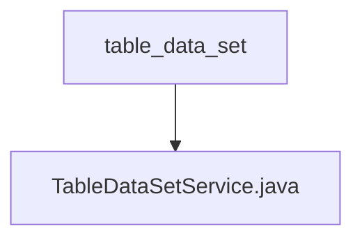

# 基础信息

|      |      |
|------|------|
| 名称 | table_data_set |
| 编码语言 | .java |
| 代码路径 | WeFe/board/board-service/src/main/java/com/welab/wefe/board/service/service/data_resource/table_data_set |
| 包名 | docs.board.board-service.src.main.java.com.welab.wefe.board.service.service.data_resource.table_data_set |
| 概述说明 | TableDataSetService类提供数据集管理功能，包括获取文件、删除数据集、测试SQL查询、查询和保存数据集等操作。通过多个Repository和服务类实现数据集的增删改查及存储管理。 |

# 说明

TableDataSetService是一个继承自DataResourceService的服务类，主要用于管理表格数据集。它通过注入多个依赖服务（如DataSetColumnService、DataSetStorageService等）和仓库（如tableDataSetRepository、dataSourceRepo等）来实现功能。主要功能包括：获取上传的文件（支持HTTP上传、本地文件和数据库三种方式）、删除数据集（支持通过ID或模型删除，并清理相关存储和缓存）、根据ID获取数据源、从本地或联合数据源中查询数据集信息、测试SQL查询语句的有效性、更新数据集列信息、查询和保存数据集模型等。该类还提供了对数据集的各种操作，如删除时检查权限、更新前保存列信息等。

### 包内部结构视图

该流程图展示了table_data_set目录与其包含的TableDataSetService.java文件之间的层级关系。table_data_set作为父级目录，TableDataSetService.java是其直接子文件，两者构成简单的单层文件结构关系。

# 文件列表

| 名称   | 类型  | 说明 |
|-------|------|-------------|
| [TableDataSetService.java](TableDataSetService.md) | file | TableDataSetService类提供数据集管理功能，包括获取文件、删除数据集、测试SQL查询、查询和保存数据集等操作。通过多个Repository和服务类实现数据集的增删改查及存储管理。 |

