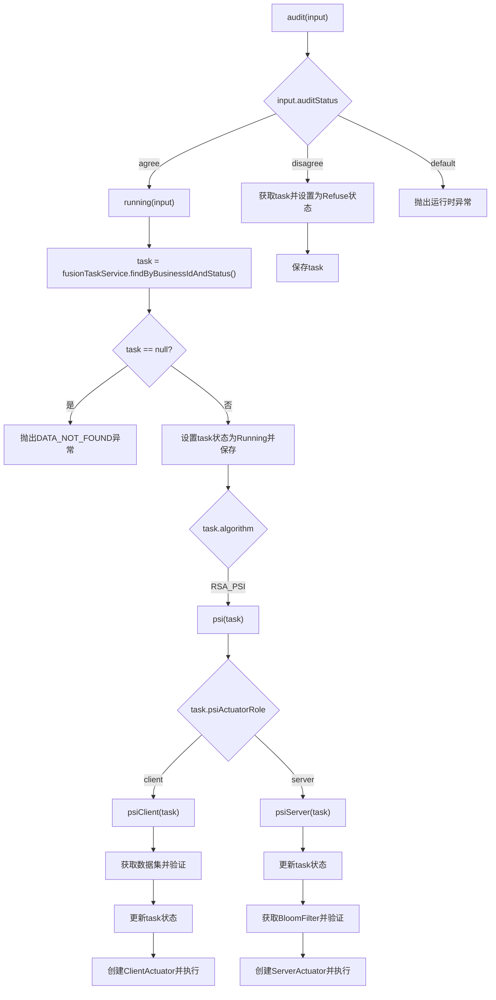
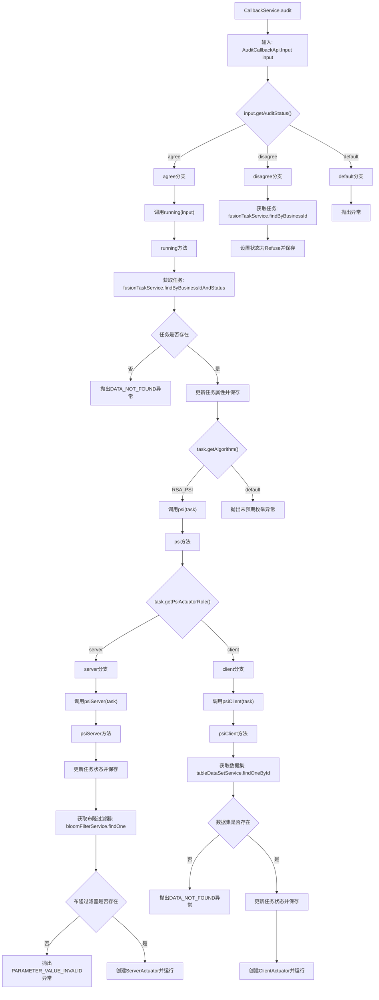

# 基础信息

|      |      |
|------|------|
| 名称 | CallbackService |
| 编码语言 | .java |
| 代码路径 | WeFe/board/board-service/src/main/java/com/welab/wefe/board/service/service/fusion/CallbackService.java |
| 包名 | com.welab.wefe.board.service.service.fusion |
| 依赖项 | ['com.welab.wefe.board.service.api.project.fusion.task.AuditCallbackApi', 'com.welab.wefe.board.service.database.entity.data_resource.BloomFilterMysqlModel', 'com.welab.wefe.board.service.database.entity.data_resource.TableDataSetMysqlModel', 'com.welab.wefe.board.service.database.entity.fusion.FusionTaskMySqlModel', 'com.welab.wefe.board.service.database.repository.fusion.FusionTaskRepository', 'com.welab.wefe.board.service.fusion.actuator.ClientActuator', 'com.welab.wefe.board.service.fusion.actuator.psi.ServerActuator', 'com.welab.wefe.board.service.service.data_resource.bloom_filter.BloomFilterService', 'com.welab.wefe.board.service.service.data_resource.table_data_set.TableDataSetService', 'com.welab.wefe.common.StatusCode', 'com.welab.wefe.common.exception.StatusCodeWithException', 'com.welab.wefe.common.util.StringUtil', 'com.welab.wefe.common.wefe.enums.DataResourceType', 'com.welab.wefe.fusion.core.enums.FusionTaskStatus', 'com.welab.wefe.fusion.core.utils.bf.BloomFilterUtils', 'org.springframework.beans.factory.annotation.Autowired', 'org.springframework.stereotype.Service', 'org.springframework.transaction.annotation.Transactional', 'java.math.BigInteger', 'java.nio.file.Paths', 'java.util.Date', 'com.welab.wefe.common.StatusCode.DATA_NOT_FOUND'] |
| 概述说明 | CallbackService处理审计回调，根据状态同意或拒绝更新任务状态。同意时启动RSA-PSI算法，客户端和服务端分别执行相应逻辑。 |

# 说明

CallbackService是一个处理回调逻辑的服务类，主要包含审计和RSA-PSI算法相关功能。审计方法根据输入状态决定执行操作：同意时调用running方法启动任务，拒绝时更新任务状态为拒绝并保存。running方法会检查任务状态，更新为运行中，并根据算法类型调用相应处理逻辑。RSA-PSI算法分为客户端和服务端两种角色：客户端处理数据集并启动ClientActuator，服务端处理布隆过滤器数据并启动ServerActuator。整个过程涉及任务状态更新、数据验证和算法执行。

# 类列表 Class Summary

| 名称   | 类型  | 说明 |
|-------|------|-------------|
| CallbackService | class | CallbackService处理审计回调，根据状态同意或拒绝更新任务状态。同意时启动RSA-PSI算法，客户端和服务端分别执行不同逻辑。 |

## 类 CallbackService

|      |      |
|------|------|
| 访问范围 | @Service;public |
| 类型 | class |
| 名称 | CallbackService |
| 说明 | CallbackService处理审计回调，根据状态同意或拒绝更新任务状态。同意时启动RSA-PSI算法，客户端和服务端分别执行不同逻辑。 |

### UML类图

```mermaid
classDiagram
    class CallbackService {
        -FusionTaskService fusionTaskService
        -FusionTaskRepository fusionTaskRepository
        -BloomFilterService bloomFilterService
        -TableDataSetService tableDataSetService
        +audit(AuditCallbackApi~Input~ input) void
        -running(AuditCallbackApi~Input~ input) void
        -psi(FusionTaskMySqlModel task) void
        -psiClient(FusionTaskMySqlModel task) void
        -psiServer(FusionTaskMySqlModel task) void
    }

    class FusionTaskService {
        +findByBusinessId(String businessId) FusionTaskMySqlModel
        +findByBusinessIdAndStatus(String businessId, FusionTaskStatus status) FusionTaskMySqlModel
    }

    class FusionTaskRepository {
        +save(FusionTaskMySqlModel entity) FusionTaskMySqlModel
    }

    class BloomFilterService {
        +findOne(String id) BloomFilterMysqlModel
    }

    class TableDataSetService {
        +findOneById(String id) TableDataSetMysqlModel
    }

    class AuditCallbackApi {
        <<Interface>>
    }

    class FusionTaskMySqlModel {
        -String businessId
        -FusionTaskStatus status
        -String comment
        -String partnerHashFunction
        -Algorithm algorithm
        -PsiActuatorRole psiActuatorRole
        -String dataResourceId
        -boolean trace
        -String traceColumn
        -String dstMemberId
        -DataResourceType dataResourceType
        -long rowCount
        -long partnerRowCount
        -Date updatedTime
        +setStatus(FusionTaskStatus status) void
        +setComment(String comment) void
        +setPartnerHashFunction(String function) void
        +setUpdatedTime(Date time) void
    }

    class BloomFilterMysqlModel {
        -String storageNamespace
        -String storageResourceName
        -String rsaN
        -String rsaE
        -String rsaD
        -String rsaP
        -String rsaQ
    }

    class TableDataSetMysqlModel {
        -String id
    }

    class ClientActuator {
        +ClientActuator(String businessId, String dataResourceId, boolean trace, String traceColumn, String dstMemberId, long rowCount)
        +run() void
    }

    class ServerActuator {
        +ServerActuator(String businessId, BloomFilter bloomFilter, BigInteger rsaN, BigInteger rsaE, BigInteger rsaD, BigInteger rsaP, BigInteger rsaQ, long rowCount)
        +run() void
    }

    CallbackService --> FusionTaskService : 依赖
    CallbackService --> FusionTaskRepository : 依赖
    CallbackService --> BloomFilterService : 依赖
    CallbackService --> TableDataSetService : 依赖
    CallbackService --> AuditCallbackApi : 依赖
    CallbackService --> ClientActuator : 创建
    CallbackService --> ServerActuator : 创建
    FusionTaskService --> FusionTaskMySqlModel : 返回
    BloomFilterService --> BloomFilterMysqlModel : 返回
    TableDataSetService --> TableDataSetMysqlModel : 返回
```

这段代码实现了一个回调服务(CallbackService)，主要处理审计回调逻辑。它通过依赖注入的方式使用多个服务(FusionTaskService、BloomFilterService等)，根据不同的审计状态(input.auditStatus)执行不同操作：同意时启动任务运行流程，拒绝时更新任务状态。在运行过程中会根据算法类型(RSA_PSI)和角色(server/client)创建不同的执行器(ClientActuator/ServerActuator)来处理具体业务逻辑。整个流程包含状态管理、数据验证和任务执行等多个环节，通过事务保证操作的原子性。

### 内部方法调用关系图

这段代码流程图展示了CallbackService类中审计回调处理的完整流程。从入口方法audit开始，根据审核状态(agree/disagree/default)分流处理，agree状态会触发running方法执行任务，disagree状态则更新任务状态为拒绝。running方法中会进一步根据算法类型(当前仅处理RSA_PSI)调用psi方法，psi方法再根据角色(server/client)分别执行psiServer或psiClient逻辑。两个角色方法都会更新任务状态，并最终创建对应的执行器(Actuator)运行实际业务逻辑。整个流程包含多层条件判断和异常处理，体现了完整的业务状态流转过程。

### 字段列表 Field List

| 名称  | 类型  | 说明 |
|-------|-------|------|
| bloomFilterService | BloomFilterService | 代码片段使用@Autowired注解自动注入BloomFilterService实例。 |
| fusionTaskRepository | FusionTaskRepository | 自动注入FusionTaskRepository实例。 |
| fusionTaskService | FusionTaskService | 代码片段使用@Autowired注解自动注入FusionTaskService实例。 |
| tableDataSetService | TableDataSetService | 自动注入TableDataSetService实例。 |

### 方法列表

| 名称  | 类型  | 说明 |
|-------|-------|------|
| psiServer | void | 该方法处理PSI服务器任务：更新任务状态为运行中并保存；检查布隆过滤器是否存在；使用布隆过滤器数据和RSA参数创建任务处理器并执行。 |
| audit | void | 该方法用于审核处理，根据审核状态执行不同操作：同意时调用running方法，拒绝时更新任务状态为Refuse并保存，其他情况抛出异常。 |
| psi | void | 根据任务角色执行PSI服务端或客户端逻辑，否则跳过。 |
| running | void | 方法running处理审计回调输入，检查任务状态并更新为运行中，根据算法类型执行相应操作（如RSA_PSI），否则抛出异常。 |
| psiClient | void | 方法psiClient处理任务：检查数据集是否存在，更新任务状态为运行中，最后启动ClientActuator执行任务。若数据集不存在则抛出异常。 |

