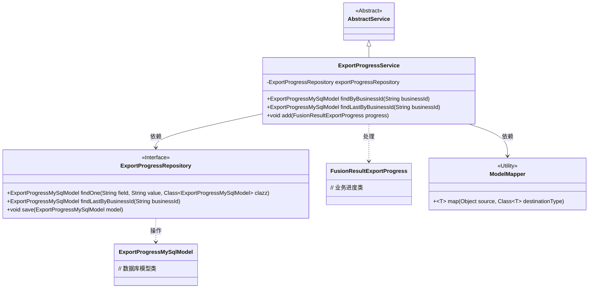
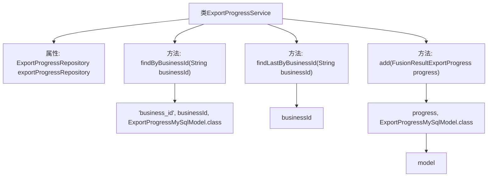

# 基础信息

|      |      |
|------|------|
| 名称 | ExportProgressService |
| 编码语言 | .java |
| 代码路径 | WeFe/board/board-service/src/main/java/com/welab/wefe/board/service/service/fusion/ExportProgressService.java |
| 包名 | com.welab.wefe.board.service.service.fusion |
| 依赖项 | ['com.welab.wefe.board.service.database.entity.fusion.ExportProgressMySqlModel', 'com.welab.wefe.board.service.database.repository.fusion.ExportProgressRepository', 'com.welab.wefe.board.service.dto.fusion.FusionResultExportProgress', 'com.welab.wefe.board.service.service.AbstractService', 'com.welab.wefe.common.web.util.ModelMapper', 'org.springframework.beans.factory.annotation.Autowired', 'org.springframework.stereotype.Service'] |
| 概述说明 | ExportProgressService是一个服务类，提供根据业务ID查询导出进度记录、查询最后一条记录及新增记录的功能，依赖ExportProgressRepository操作数据库。 |

# 说明

ExportProgressService是一个继承自AbstractService的服务类，用于管理导出进度。它通过自动注入的ExportProgressRepository与数据库交互。主要功能包括：根据业务ID查询单个导出进度记录，查询指定业务ID的最后一条记录，以及将FusionResultExportProgress对象映射为ExportProgressMySqlModel并保存到数据库。该类封装了导出进度相关的数据访问操作。

# 类列表 Class Summary

| 名称   | 类型  | 说明 |
|-------|------|-------------|
| ExportProgressService | class | ExportProgressService提供业务ID查询导出进度功能，支持查找最新记录和新增进度，使用ExportProgressRepository操作数据库。 |

## 类 ExportProgressService

|      |      |
|------|------|
| 访问范围 | @Service;public |
| 类型 | class |
| 名称 | ExportProgressService |
| 说明 | ExportProgressService提供业务ID查询导出进度功能，支持查找最新记录和新增进度，使用ExportProgressRepository操作数据库。 |

### UML类图

这段代码展示了一个导出进度服务(ExportProgressService)的实现，它继承自AbstractService，并依赖ExportProgressRepository进行数据库操作。服务提供了三个主要方法：通过业务ID查询进度记录、查询最后一条进度记录，以及添加新的进度记录。类图中清晰地展示了服务层与数据库层的交互关系，以及模型转换工具的使用。ExportProgressRepository作为接口定义了数据访问方法，ExportProgressMySqlModel和FusionResultExportProgress分别表示数据库实体和业务对象。

### 内部方法调用关系图

这段代码展示了一个Spring服务类ExportProgressService，主要用于处理导出进度相关的数据库操作。类中包含三个核心方法：通过业务ID查询记录(findByBusinessId)、查询最后一条业务ID记录(findLastByBusinessId)以及添加新进度记录(add)。每个方法都通过自动注入的ExportProgressRepository与数据库交互，其中add方法还涉及模型转换操作。整体结构清晰地展现了服务层与持久层的交互关系。

### 字段列表 Field List

| 名称  | 类型  | 说明 |
|-------|-------|------|
| exportProgressRepository | ExportProgressRepository | 自动注入导出进度仓库实例。 |

### 方法列表

| 名称  | 类型  | 说明 |
|-------|-------|------|
| findByBusinessId | ExportProgressMySqlModel | 根据业务ID查询导出进度，返回对应的MySQL模型对象。 |
| findLastByBusinessId | ExportProgressMySqlModel | 该方法通过businessId查询并返回最新的ExportProgressMySqlModel记录。 |
| add | void | 该方法将FusionResultExportProgress对象映射为ExportProgressMySqlModel并保存到数据库。 |

