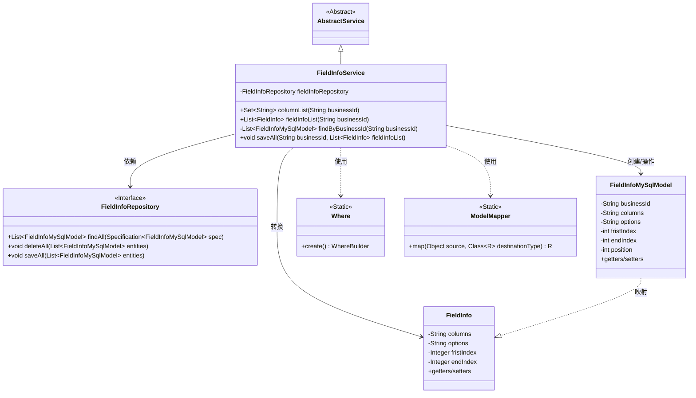
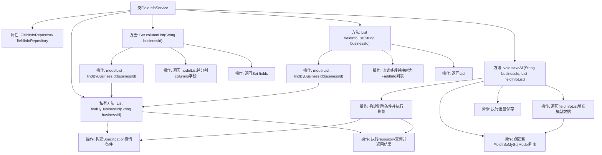

# 基础信息

|      |      |
|------|------|
| 名称 | FieldInfoService |
| 编码语言 | .java |
| 代码路径 | WeFe/board/board-service/src/main/java/com/welab/wefe/board/service/service/fusion/FieldInfoService.java |
| 包名 | com.welab.wefe.board.service.service.fusion |
| 依赖项 | ['com.welab.wefe.board.service.database.entity.fusion.FieldInfoMySqlModel', 'com.welab.wefe.board.service.database.repository.fusion.FieldInfoRepository', 'com.welab.wefe.board.service.service.AbstractService', 'com.welab.wefe.board.service.util.primarykey.FieldInfo', 'com.welab.wefe.common.data.mysql.Where', 'com.welab.wefe.common.data.mysql.enums.OrderBy', 'com.welab.wefe.common.web.util.ModelMapper', 'org.springframework.beans.factory.annotation.Autowired', 'org.springframework.data.jpa.domain.Specification', 'org.springframework.stereotype.Service', 'org.springframework.transaction.annotation.Transactional', 'java.util', 'java.util.stream.Collectors'] |
| 概述说明 | FieldInfoService提供字段信息管理功能，包括查询字段列表、字段信息列表及批量保存字段信息，支持按businessId操作，使用事务确保数据一致性。 |

# 说明

该代码定义了一个名为FieldInfoService的服务类，继承自AbstractService。它通过FieldInfoRepository与数据库交互，提供三个核心功能：columnList方法根据业务ID获取字段列名集合；fieldInfoList方法返回映射后的字段信息列表；saveAll方法以事务方式保存字段信息列表，先删除旧数据再插入新数据。私有方法findByBusinessId构建查询条件，按业务ID和位置排序获取数据。类使用Spring的依赖注入和事务管理注解。

# 类列表 Class Summary

| 名称   | 类型  | 说明 |
|-------|------|-------------|
| FieldInfoService | class | FieldInfoService类提供字段信息管理功能，包括查询字段列表、按业务ID获取字段信息及批量保存字段数据。通过Repository操作数据库，支持事务回滚。 |

## 类 FieldInfoService

|      |      |
|------|------|
| 访问范围 | @Service;public |
| 类型 | class |
| 名称 | FieldInfoService |
| 说明 | FieldInfoService类提供字段信息管理功能，包括查询字段列表、按业务ID获取字段信息及批量保存字段数据。通过Repository操作数据库，支持事务回滚。 |

### UML类图

该类图展示了FieldInfoService的核心结构及其关联关系。作为继承AbstractService的业务服务类，它通过FieldInfoRepository操作数据库，处理FieldInfoMySqlModel实体与FieldInfo数据传输对象之间的转换。借助Where构建查询条件，利用ModelMapper实现模型映射，主要提供字段列表查询、字段信息获取及批量保存功能，体现了典型的Spring数据访问层设计模式。

### 内部方法调用关系图

该流程图展示了FieldInfoService类的完整结构和方法调用关系。类包含核心的fieldInfoRepository属性和四个主要方法：columnList用于获取字段列集合，fieldInfoList用于获取字段信息列表，私有方法findByBusinessId实现公共查询逻辑，saveAll方法实现事务性的批量保存操作。流程清晰展示了各方法内部的处理步骤和相互调用关系，特别是saveAll方法包含删除旧数据和保存新数据的完整事务流程。所有方法都通过findByBusinessId方法复用查询逻辑，体现了良好的代码复用性。

### 字段列表 Field List

| 名称  | 类型  | 说明 |
|-------|-------|------|
| fieldInfoRepository | FieldInfoRepository | 自动注入FieldInfoRepository实例。 |

### 方法列表

| 名称  | 类型  | 说明 |
|-------|-------|------|
| columnList | Set<String> | 该方法根据业务ID查询字段信息，将每个模型的列名按逗号分割后合并到集合中，最终返回所有列名的唯一集合。 |
| findByBusinessId | List<FieldInfoMySqlModel> | 根据业务ID查询字段信息，按position升序排序并返回列表。 |
| saveAll | void | 事务方法saveAll：根据businessId删除旧数据，转换并保存新FieldInfo列表到数据库，异常时回滚。 |
| fieldInfoList | List<FieldInfo> | 该方法根据businessId查询FieldInfoMySqlModel列表，并通过流操作将其映射为FieldInfo列表后返回。 |

