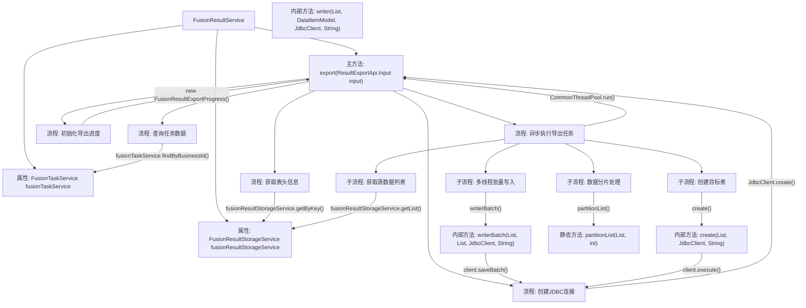

# 基础信息

|      |      |
|------|------|
| 名称 | FusionResultService |
| 编码语言 | .java |
| 代码路径 | WeFe/board/board-service/src/main/java/com/welab/wefe/board/service/service/fusion/FusionResultService.java |
| 包名 | com.welab.wefe.board.service.service.fusion |
| 依赖项 | ['java.util.ArrayList', 'java.util.Date', 'java.util.Iterator', 'java.util.List', 'java.util.concurrent.ExecutorService', 'java.util.concurrent.Executors', 'org.springframework.beans.factory.annotation.Autowired', 'org.springframework.stereotype.Service', 'com.google.common.collect.Lists', 'com.welab.wefe.board.service.api.project.fusion.result.ResultExportApi', 'com.welab.wefe.board.service.database.entity.fusion.FusionTaskMySqlModel', 'com.welab.wefe.board.service.dto.fusion.FusionResultExportProgress', 'com.welab.wefe.board.service.fusion.enums.ExportStatus', 'com.welab.wefe.board.service.fusion.manager.ExportManager', 'com.welab.wefe.board.service.service.AbstractService', 'com.welab.wefe.common.CommonThreadPool', 'com.welab.wefe.common.StatusCode', 'com.welab.wefe.common.data.storage.common.Constant', 'com.welab.wefe.common.data.storage.model.DataItemModel', 'com.welab.wefe.common.exception.StatusCodeWithException', 'com.welab.wefe.common.jdbc.JdbcClient', 'com.welab.wefe.common.util.DateUtil', 'com.welab.wefe.common.util.StringUtil'] |
| 概述说明 | FusionResultService处理数据导出任务，包括查询任务、创建表、分批写入数据到数据库，支持多线程并发处理。 |

# 说明

FusionResultService是一个Spring服务类，继承自AbstractService，提供数据导出功能。主要依赖FusionTaskService和FusionResultStorageService。export方法接收输入参数，验证业务ID有效性后，从存储服务获取表头信息，创建JDBC客户端连接目标数据库。通过多线程方式分批处理数据，将数据从源存储导出到目标数据库新建的表中，同时维护导出进度。包含创建表、单条写入、批量写入及列表分片等辅助方法，确保大数据量高效导出。整个过程记录日志并处理异常。

# 类列表 Class Summary

| 名称   | 类型  | 说明 |
|-------|------|-------------|
| FusionResultService | class | FusionResultService提供数据导出功能，通过JDBC创建表并批量写入数据。支持多线程分片处理，包含错误处理和进度跟踪。 |


## 类 FusionResultService

|      |      |
|------|------|
| 访问范围 | @Service;public |
| 类型 | class |
| 名称 | FusionResultService |
| 说明 | FusionResultService提供数据导出功能，通过JDBC创建表并批量写入数据。支持多线程分片处理，包含错误处理和进度跟踪。 |


### UML类图

```mermaid
classDiagram
    class AbstractService {
        <<Abstract>>
    }

    class FusionResultService {
        -FusionTaskService fusionTaskService
        -FusionResultStorageService fusionResultStorageService
        +export(ResultExportApi$Input input) String
        -create(List~String~ headers, JdbcClient client, String tableName) void
        -writer(List~String~ headers, DataItemModel model, JdbcClient client, String tableName) void
        -writerBatch(List~String~ headers, List~DataItemModel~ models, JdbcClient client, String tableName) void
        +partitionList~T~(List~T~ list, int numPartitions) List~List~T~~
    }

    class FusionTaskService {
        <<Service>>
        +findByBusinessId(String businessId) FusionTaskMySqlModel
    }

    class FusionResultStorageService {
        <<Service>>
        +getByKey(String dbName, String tableName, String key) DataItemModel
        +getList(String tableName) List~DataItemModel~
        +createRawDataSetTableName(String businessId) String
    }

    class JdbcClient {
        <<Utility>>
        +execute(String sql) void
        +saveBatch(String sql, List~DataItemModel~ models, Function~DataItemModel, Object[]~ mapper) void
    }

    class DataItemModel {
        -Object k
        -Object v
        +getK() Object
        +getV() Object
    }

    class ResultExportApi$Input {
        -String businessId
        -String databaseType
        -String host
        -int port
        -String userName
        -String password
        -String databaseName
        +getBusinessId() String
        // ...其他getter方法
    }

    AbstractService <|-- FusionResultService
    FusionResultService --> FusionTaskService : 依赖
    FusionResultService --> FusionResultStorageService : 依赖
    FusionResultService --> JdbcClient : 依赖
    FusionResultService --> DataItemModel : 使用
    FusionResultService --> ResultExportApi$Input : 使用
```

这段代码展示了一个数据导出服务`FusionResultService`，它继承自`AbstractService`，主要功能是将存储在ClickHouse中的融合结果数据导出到目标数据库。服务通过`FusionTaskService`验证业务ID有效性，使用`FusionResultStorageService`获取原始数据，并利用`JdbcClient`在目标数据库创建表结构并批量插入数据。整个过程采用多线程分片处理大数据量，并通过进度对象`FusionResultExportProgress`跟踪导出状态。类图清晰地展示了服务间的依赖关系和数据流转路径。


### 内部方法调用关系图



该流程图展示了FusionResultService的核心数据导出流程。服务首先验证业务ID有效性，然后获取表头信息并建立数据库连接。通过异步线程池执行多步骤导出操作：创建目标表结构、分批次获取源数据、对大数据集进行智能分片，最后通过多线程并行写入目标数据库。整个过程包含完善的进度跟踪机制，各步骤均具备异常处理能力，实现了高效稳定的海量数据迁移功能。

### 字段列表 Field List

| 名称  | 类型  | 说明 |
|-------|-------|------|
| fusionResultStorageService | FusionResultStorageService | 自动注入FusionResultStorageService服务实例。 |
| fusionTaskService | FusionTaskService | 使用@Autowired自动注入FusionTaskService服务实例。 |

### 方法列表

| 名称  | 类型  | 说明 |
|-------|-------|------|
| export | String | 该方法用于导出融合任务结果数据。首先检查任务是否存在，获取表头信息并连接数据库。创建临时表后，从存储服务分批读取数据，使用多线程写入数据库，同时更新导出进度。最后返回生成的表名。 |
| create | void | 方法创建表，接收表头列表、数据库客户端和表名，生成SQL语句并执行，出错抛出异常。 |
| writer | void | 该方法构建并执行SQL插入语句，将DataItemModel的数据插入指定表。拼接表头和数据值，最后通过JdbcClient执行SQL。 |
| writerBatch | void | 方法writerBatch生成批量插入SQL，拼接表名和字段，使用占位符，通过JdbcClient执行批量保存，转换数据模型为参数数组。 |
| partitionList | List<List<T>> | 将列表按指定分区数均匀分割，非空校验，分区数需大于0，返回分区后的列表集合。 |


