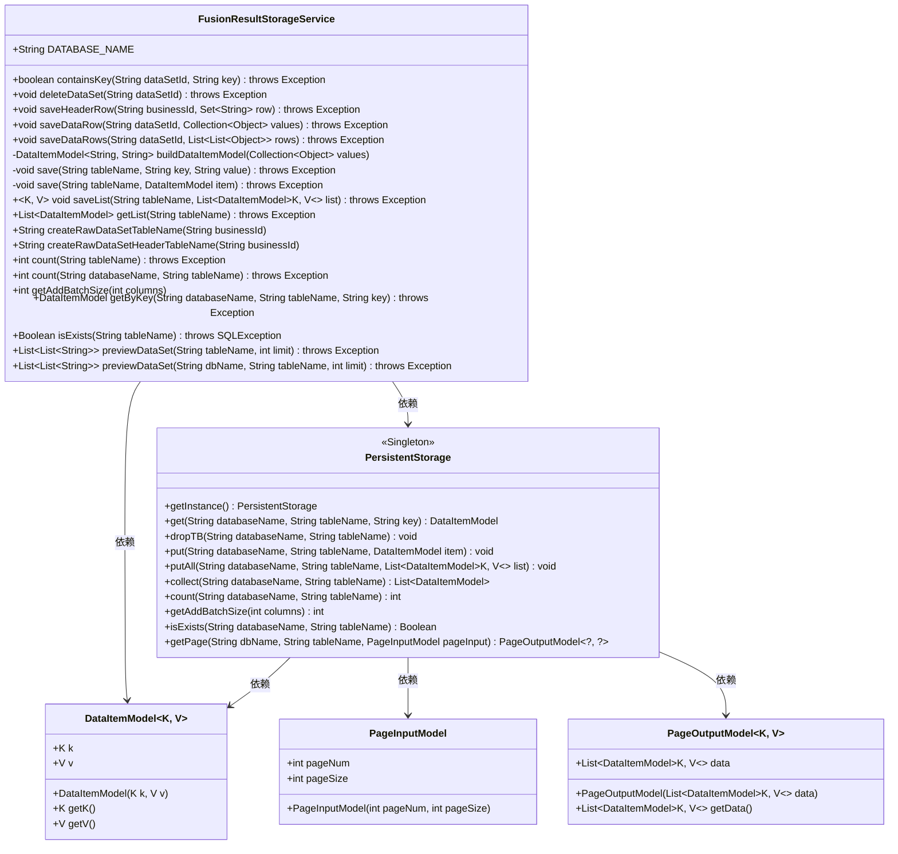

# 基础信息

|      |      |
|------|------|
| 名称 | FusionResultStorageService |
| 编码语言 | .java |
| 代码路径 | WeFe/board/board-service/src/main/java/com/welab/wefe/board/service/service/fusion/FusionResultStorageService.java |
| 包名 | com.welab.wefe.board.service.service.fusion |
| 依赖项 | ['java.sql.SQLException', 'java.util.ArrayList', 'java.util.Collection', 'java.util.List', 'java.util.Set', 'java.util.stream.Collectors', 'org.springframework.stereotype.Service', 'com.alibaba.fastjson.JSON', 'com.welab.wefe.board.service.service.AbstractService', 'com.welab.wefe.common.data.storage.common.Constant', 'com.welab.wefe.common.data.storage.model.DataItemModel', 'com.welab.wefe.common.data.storage.model.PageInputModel', 'com.welab.wefe.common.data.storage.model.PageOutputModel', 'com.welab.wefe.common.data.storage.service.persistent.PersistentStorage', 'com.welab.wefe.common.util.StringUtil'] |
| 概述说明 | FusionResultStorageService提供数据集存储管理功能，包括检查键存在、删除数据集、保存表头和数据行、批量操作及数据预览等。使用PersistentStorage进行持久化操作，支持表名生成和批量大小计算。 |

# 说明

FusionResultStorageService是一个继承自AbstractService的服务类，主要用于管理数据集的存储操作。它使用PersistentStorage实例进行数据库交互，数据库名称为WEFE_DATA。主要功能包括检查键是否存在、删除数据集、保存数据集头信息和数据行、批量保存数据行、读取记录、获取表行数、计算批量大小、预览数据集等。方法涉及创建表名、转换数据模型、处理JSON字符串等操作，支持单条和批量数据操作，并提供分页预览功能。

# 类列表 Class Summary

| 名称   | 类型  | 说明 |
|-------|------|-------------|
| FusionResultStorageService | class | FusionResultStorageService提供数据集存储管理功能，包括检查键存在、删除数据集、保存表头和数据行、批量操作、数据预览等，基于PersistentStorage实现持久化操作。 |

## 类 FusionResultStorageService

|      |      |
|------|------|
| 访问范围 | @Service;public |
| 类型 | class |
| 名称 | FusionResultStorageService |
| 说明 | FusionResultStorageService提供数据集存储管理功能，包括检查键存在、删除数据集、保存表头和数据行、批量操作、数据预览等，基于PersistentStorage实现持久化操作。 |

### UML类图

类图描述：
FusionResultStorageService是一个数据存储服务类，提供对数据集的增删改查操作，依赖于PersistentStorage单例类进行底层存储操作。核心功能包括检查键是否存在、删除数据集、保存表头和数据行、预览数据集等。DataItemModel用于封装键值对数据，PageInputModel和PageOutputModel用于分页查询。服务通过构建表名与存储系统交互，处理JSON序列化和字符串拼接等数据转换逻辑。

### 内部方法调用关系图

```mermaid
graph TD
    A["类FusionResultStorageService"]
    B["常量: DATABASE_NAME = Constant.DBName.WEFE_DATA"]
    C["方法: boolean containsKey(dataSetId, key)"]
    D["方法: void deleteDataSet(dataSetId)"]
    E["方法: void saveHeaderRow(businessId, row)"]
    F["方法: void saveDataRow(dataSetId, values)"]
    G["方法: void saveDataRows(dataSetId, rows)"]
    H["私有方法: DataItemModel buildDataItemModel(values)"]
    I["私有方法: void save(tableName, key, value)"]
    J["私有方法: void save(tableName, item)"]
    K["方法: void saveList(tableName, list)"]
    L["方法: List getList(tableName)"]
    M["方法: String createRawDataSetTableName(businessId)"]
    N["方法: String createRawDataSetHeaderTableName(businessId)"]
    O["方法: int count(tableName)"]
    P["方法: int count(databaseName, tableName)"]
    Q["方法: int getAddBatchSize(columns)"]
    R["方法: DataItemModel getByKey(databaseName, tableName, key)"]
    S["方法: Boolean isExists(tableName)"]
    T["方法: List previewDataSet(tableName, limit)"]
    U["方法: List previewDataSet(dbName, tableName, limit)"]

    A --> B
    A --> C
    A --> D
    A --> E
    A --> F
    A --> G
    A --> H
    A --> I
    A --> J
    A --> K
    A --> L
    A --> M
    A --> N
    A --> O
    A --> P
    A --> Q
    A --> R
    A --> S
    A --> T
    A --> U

    E --> H
    F --> H
    G --> H
    E --> I
    F --> J
    G --> K
    T --> U
```

该流程图展示了FusionResultStorageService类的完整结构，包含19个主要方法及其调用关系。核心功能围绕数据集的存储操作展开，包括数据存在性检查(containsKey)、删除(deleteDataSet)、多种保存方式(saveHeaderRow/saveDataRow/saveDataRows)、数据转换(buildDataItemModel)以及数据预览(previewDataSet)等。所有存储操作最终都通过PersistentStorage实例完成，体现了清晰的职责划分。私有方法被限制在类内部使用，公开方法提供完整的CRUD功能接口。

### 字段列表 Field List

| 名称  | 类型  | 说明 |
|-------|-------|------|
| DATABASE_NAME = Constant.DBName.WEFE_DATA | String | 静态常量DATABASE_NAME，值为WEFE_DATA，用于数据库名称定义。 |

### 方法列表

| 名称  | 类型  | 说明 |
|-------|-------|------|
| saveDataRows | void | Java方法：将二维数据列表转换为DataItemModel并保存到指定表。参数：数据集ID和行数据列表。异常可能抛出。 |
| saveDataRow | void | 保存数据集行数据到指定表，参数为数据集ID和值集合，可能抛出异常。 |
| save | void | 保存数据项到指定数据库表。 |
| isExists | Boolean | 检查指定表是否存在，调用持久化存储实例的isExists方法，传入数据库名和表名参数，返回布尔结果。 |
| containsKey | boolean | 检查指定数据集表中是否存在某键值。若存在返回true，否则false。异常时抛出Exception。 |
| deleteDataSet | void | 删除指定数据集，通过数据集ID生成表名并调用持久化存储删除对应数据库表。 |
| previewDataSet | List<List<String>> | 该方法预览数据集，从指定数据库和表获取分页数据，将键值对转换为字符串列表，键单独一项，值按逗号分割为多项，返回所有数据的列表。 |
| count | int | 该方法用于统计指定数据库表中记录数，调用持久化存储实例的count方法实现，需传入数据库名和表名参数，可能抛出异常。 |
| count | int | 该方法通过PersistentStorage实例统计指定数据库表的记录数，参数为数据库名和表名，可能抛出异常。 |
| getAddBatchSize | int | 该方法返回指定列数对应的批量添加大小，通过调用PersistentStorage的单例实例实现。 |
| saveHeaderRow | void | 方法saveHeaderRow接收业务ID和行数据集合，将行数据转为逗号分隔的JSON字符串并保存到以业务ID生成的表名.meta中，键为header。省略了sid相关处理。 |
| createRawDataSetHeaderTableName | String | 方法生成包含业务ID的原始数据集头表名，格式为"fusion_result_[业务ID].meta"。 |
| getList | List<DataItemModel> | 该方法通过持久化存储实例获取指定表的数据列表，返回DataItemModel集合。参数为表名，可能抛出异常。 |
| buildDataItemModel | DataItemModel<String, String> | 构建DataItemModel方法：遍历集合，首元素为key，其余转为逗号分隔的字符串列表。返回包含key和拼接字符串的DataItemModel对象。 |
| getByKey | DataItemModel | 该方法通过键值从指定数据库和表中获取数据项，调用持久化存储实例完成操作，可能抛出异常。 |
| save | void | 该方法用于保存数据，通过调用持久化存储实例将键值对存入指定数据库表。 |
| createRawDataSetTableName | String | 该方法根据业务ID生成原始数据集表名，格式为"fusion_result_"加业务ID。 |
| saveList | void | Java方法：保存数据列表到指定数据库表。参数：表名和数据项列表，泛型K和V。调用持久化存储的putAll方法。可能抛出异常。 |
| previewDataSet | List<List<String>> | 这是一个Java方法，用于预览指定表的数据集，返回字符串列表的列表。方法接受表名和行数限制参数，调用内部方法并可能抛出异常。 |

