# 基础信息

|      |      |
|------|------|
| 名称 | FusionTaskService |
| 编码语言 | .java |
| 代码路径 | WeFe/board/board-service/src/main/java/com/welab/wefe/board/service/service/fusion/FusionTaskService.java |
| 包名 | com.welab.wefe.board.service.service.fusion |
| 依赖项 | ['com.alibaba.fastjson.JSONObject', 'com.welab.wefe.board.service.api.project.fusion.task', 'com.welab.wefe.board.service.database.entity.data_resource.BloomFilterMysqlModel', 'com.welab.wefe.board.service.database.entity.data_resource.TableDataSetMysqlModel', 'com.welab.wefe.board.service.database.entity.fusion.FusionTaskMySqlModel', 'com.welab.wefe.board.service.database.entity.job.ProjectMySqlModel', 'com.welab.wefe.board.service.database.repository.fusion.FusionTaskRepository', 'com.welab.wefe.board.service.dto.base.PagingOutput', 'com.welab.wefe.board.service.dto.fusion.FusionMemberInfo', 'com.welab.wefe.board.service.dto.fusion.FusionResultExportProgress', 'com.welab.wefe.board.service.dto.fusion.FusionTaskOutput', 'com.welab.wefe.board.service.fusion.actuator.ClientActuator', 'com.welab.wefe.board.service.fusion.actuator.psi.ServerActuator', 'com.welab.wefe.board.service.fusion.manager.ActuatorManager', 'com.welab.wefe.board.service.fusion.manager.ExportManager', 'com.welab.wefe.board.service.onlinedemo.OnlineDemoBranchStrategy', 'com.welab.wefe.board.service.service.AbstractService', 'com.welab.wefe.board.service.service.CacheObjects', 'com.welab.wefe.board.service.service.ProjectService', 'com.welab.wefe.board.service.service.TaskResultService', 'com.welab.wefe.board.service.service.data_resource.DataResourceService', 'com.welab.wefe.board.service.service.data_resource.bloom_filter.BloomFilterService', 'com.welab.wefe.board.service.service.data_resource.table_data_set.TableDataSetService', 'com.welab.wefe.board.service.util.primarykey.PrimaryKeyUtils', 'com.welab.wefe.common.StatusCode', 'com.welab.wefe.common.data.mysql.Where', 'com.welab.wefe.common.exception.StatusCodeWithException', 'com.welab.wefe.common.web.util.CurrentAccountUtil', 'com.welab.wefe.common.web.util.ModelMapper', 'com.welab.wefe.common.wefe.enums.AuditStatus', 'com.welab.wefe.common.wefe.enums.DataResourceType', 'com.welab.wefe.common.wefe.enums.JobMemberRole', 'com.welab.wefe.fusion.core.enums.AlgorithmType', 'com.welab.wefe.fusion.core.enums.FusionTaskStatus', 'com.welab.wefe.fusion.core.enums.PSIActuatorRole', 'com.welab.wefe.fusion.core.utils.bf.BloomFilterUtils', 'org.springframework.beans.factory.annotation.Autowired', 'org.springframework.data.jpa.domain.Specification', 'org.springframework.stereotype.Service', 'org.springframework.transaction.annotation.Transactional', 'java.math.BigInteger', 'java.nio.file.Paths', 'java.util.Date', 'java.util.List', 'java.util.UUID', 'java.util.stream.Collectors', 'com.welab.wefe.common.StatusCode.DATA_NOT_FOUND'] |
| 概述说明 | FusionTaskService是一个服务类，负责管理融合任务，包括任务创建、查询、更新、删除及处理。它依赖多个服务如数据资源、布隆过滤器等，支持RSA_PSI算法，处理任务状态变更和回调。 |

# 说明

FusionTaskService是一个用于管理融合任务的服务类，继承自AbstractService。它通过多个自动注入的服务（如FusionTaskRepository、TableDataSetService等）实现任务增删改查、状态更新、数据资源处理等功能。主要方法包括：根据ID或业务ID查询任务、更新任务状态和错误信息、添加新任务（支持RSA_PSI算法）、处理任务审核（同意或拒绝）、重启任务、处理PSI算法任务（客户端和服务端逻辑）、接收合作伙伴的对齐请求、分页查询任务详情、删除任务及回调处理。服务还涉及数据资源类型（如BloomFilter、TableDataSet）的处理和角色权限校验（如发起方才能创建任务）。

# 类列表 Class Summary

| 名称   | 类型  | 说明 |
|-------|------|-------------|
| FusionTaskService | class | FusionTaskService是一个服务类，用于管理融合任务。它提供任务查询、更新、添加、处理、删除等功能，支持RSA_PSI算法，处理任务状态变更，并与第三方服务交互。 |

## 类 FusionTaskService

|      |      |
|------|------|
| 访问范围 | @Service;public |
| 类型 | class |
| 名称 | FusionTaskService |
| 说明 | FusionTaskService是一个服务类，用于管理融合任务。它提供任务查询、更新、添加、处理、删除等功能，支持RSA_PSI算法，处理任务状态变更，并与第三方服务交互。 |

### UML类图

```mermaid
classDiagram
    class FusionTaskService {
        -FusionTaskRepository fusionTaskRepository
        -TableDataSetService tableDataSetService
        -DataResourceService dataResourceService
        -ThirdPartyService thirdPartyService
        -BloomFilterService bloomFilterService
        -TaskResultService taskResultService
        -FieldInfoService fieldInfoService
        -ProjectService projectService
        +find(String id) FusionTaskMySqlModel
        +findByBusinessId(String businessId) FusionTaskMySqlModel
        +findByBusinessIdAndStatus(String businessId, FusionTaskStatus status) FusionTaskMySqlModel
        +updateErrorByBusinessId(String businessId, FusionTaskStatus status, Long dataCount, Long fusionCount, Long processedCount, long spend, String error) void
        +updateByBusinessId(String businessId, FusionTaskStatus status, Long dataCount, Long fusionCount, Long processedCount, long spend) void
        +add(AddApi.Input input) void
        +update(UpdateApi.Input input) void
        +handle(AuditApi.Input input) void
        +restart(AuditApi.Input input) void
        +alignByPartner(ReceiveApi.Input input) void
        +paging(PagingApi.Input input) PagingOutput~FusionTaskOutput~
        +detail(String taskId) FusionTaskOutput
        +delete(DeleteApi.Input input) void
        +deleteCallback(DeleteCallbackApi.Input input) void
        -AddPsiTask(AddApi.Input input, String businessId) void
        -disAgree(FusionTaskMySqlModel task, AuditApi.Input input) void
        -psi(AuditApi.Input input, FusionTaskMySqlModel task) void
        -psiClient(AuditApi.Input input, FusionTaskMySqlModel task) void
        -psiServer(FusionTaskMySqlModel task) void
        -setMemberInfo(FusionTaskOutput model) void
    }

    class FusionTaskRepository {
        +findOne(String field, String value, Class~T~ clazz) T
        +findOne(Specification~T~ where) Optional~T~
        +save(T entity) T
        +paging(Specification~T~ where, PagingApi.Input input) PagingOutput~T~
    }

    class TableDataSetService {
        +findOneById(String id) TableDataSetMysqlModel
    }

    class DataResourceService {
        +usageCountInJobIncrement(String resourceId) void
    }

    class ThirdPartyService {
        +alignApply(FusionTaskMySqlModel task) void
        +callback(String memberId, String businessId, AuditStatus status, String comment) void
        +delete(FusionTaskMySqlModel task) void
    }

    class BloomFilterService {
        +findOne(String id) BloomFilterMysqlModel
    }

    class FieldInfoService {
        +saveAll(String businessId, List~FieldInfo~ fieldInfoList) void
        +fieldInfoList(String businessId) List~FieldInfo~
    }

    class ProjectService {
        +findByProjectId(String projectId) ProjectMySqlModel
    }

    class FusionTaskMySqlModel {
        -String id
        -String businessId
        -FusionTaskStatus status
        -Date updatedTime
        -Long fusionCount
        -Long dataCount
        -Long processedCount
        -long spend
        -String error
        -String name
        -String dataResourceId
        -DataResourceType dataResourceType
        -String dstMemberId
        -PSIActuatorRole psiActuatorRole
        -Long rowCount
        -String hashFunction
        -String partnerHashFunction
        -Long partnerRowCount
        -String partnerDataResourceId
        -DataResourceType partnerDataResourceType
        -JobMemberRole myRole
        -String createdBy
        -boolean deleted
        +setStatus(FusionTaskStatus status) void
        +setUpdatedTime(Date date) void
        +setFusionCount(Long count) void
        +setDataCount(Long count) void
        +setProcessedCount(Long count) void
        +setSpend(long spend) void
        +setError(String error) void
        +setName(String name) void
        +setDataResourceId(String id) void
        +setDataResourceType(DataResourceType type) void
        +setDstMemberId(String id) void
        +setPsiActuatorRole(PSIActuatorRole role) void
        +setRowCount(Long count) void
        +setHashFunction(String function) void
        +setPartnerHashFunction(String function) void
        +setPartnerRowCount(Long count) void
        +setPartnerDataResourceId(String id) void
        +setPartnerDataResourceType(DataResourceType type) void
        +setMyRole(JobMemberRole role) void
        +setDeleted(boolean deleted) void
        +setUpdatedBy(DeleteApi.Input input) void
    }

    class FusionTaskOutput {
        -String id
        -String businessId
        -FusionTaskStatus status
        -String name
        -String dataResourceId
        -DataResourceType dataResourceType
        -String dstMemberId
        -PSIActuatorRole psiActuatorRole
        -Long rowCount
        -String hashFunction
        -String partnerHashFunction
        -Long partnerRowCount
        -String partnerDataResourceId
        -DataResourceType partnerDataResourceType
        -JobMemberRole myRole
        -ExportStatus exportStatus
        -FusionMemberInfo promoter
        -FusionMemberInfo provider
        +setExportStatus(ExportStatus status) void
        +setPromoter(FusionMemberInfo info) void
        +setProvider(FusionMemberInfo info) void
    }

    class FusionMemberInfo {
        -String memberId
        -String memberName
        -JobMemberRole role
        -String hashFunction
        -String dataResourceId
        -DataResourceType dataResourceType
        -String dataResourceName
        -Long rowCount
        -List~String~ columnNameList
        -List~FieldInfo~ fieldInfoList
    }

    class BloomFilterMysqlModel {
        -String id
        -String storageNamespace
        -String storageResourceName
        -String hashFunction
        -Long totalDataCount
        -String rsaN
        -String rsaE
        -String rsaD
        -String rsaP
        -String rsaQ
        -String name
        +getHashFunction() String
        +getTotalDataCount() Long
        +getStorageNamespace() String
        +getStorageResourceName() String
        +getRsaN() String
        +getRsaE() String
        +getRsaD() String
        +getRsaP() String
        +getRsaQ() String
        +getName() String
    }

    class TableDataSetMysqlModel {
        -String id
        -String name
        -Long totalDataCount
        -List~String~ featureNameList
        +getTotalDataCount() Long
        +getName() String
        +getFeatureNameList() List~String~
    }

    class ProjectMySqlModel {
        -String projectId
        -JobMemberRole myRole
        +getMyRole() JobMemberRole
    }

    FusionTaskService --> FusionTaskRepository : 依赖
    FusionTaskService --> TableDataSetService : 依赖
    FusionTaskService --> DataResourceService : 依赖
    FusionTaskService --> ThirdPartyService : 依赖
    FusionTaskService --> BloomFilterService : 依赖
    FusionTaskService --> FieldInfoService : 依赖
    FusionTaskService --> ProjectService : 依赖
    FusionTaskService --> FusionTaskMySqlModel : 依赖
    FusionTaskService --> FusionTaskOutput : 依赖
    FusionTaskService --> FusionMemberInfo : 依赖
    FusionTaskService --> BloomFilterMysqlModel : 依赖
    FusionTaskService --> TableDataSetMysqlModel : 依赖
    FusionTaskService --> ProjectMySqlModel : 依赖
```

该类图展示了FusionTaskService及其相关依赖的类结构。FusionTaskService是一个核心服务类，负责处理融合任务的创建、更新、查询和删除等操作。它依赖于多个服务类（如FusionTaskRepository、TableDataSetService等）和数据模型类（如FusionTaskMySqlModel、FusionTaskOutput等）。类图清晰地展示了这些类之间的关系和主要方法，帮助理解系统的整体架构和功能模块。

### 内部方法调用关系图

```mermaid
graph TD
    A["类FusionTaskService"]
    B["属性: FusionTaskRepository fusionTaskRepository"]
    C["属性: TableDataSetService tableDataSetService"]
    D["属性: DataResourceService dataResourceService"]
    E["属性: ThirdPartyService thirdPartyService"]
    F["属性: BloomFilterService bloomFilterService"]
    G["属性: TaskResultService taskResultService"]
    H["属性: FieldInfoService fieldInfoService"]
    I["属性: ProjectService projectService"]
    J["方法: find(String id)"]
    K["方法: findByBusinessId(String businessId)"]
    L["方法: findByBusinessIdAndStatus(String businessId, FusionTaskStatus status)"]
    M["方法: updateErrorByBusinessId(...)"]
    N["方法: updateByBusinessId(...)"]
    O["方法: add(AddApi.Input input)"]
    P["方法: AddPsiTask(AddApi.Input input, String businessId)"]
    Q["方法: update(UpdateApi.Input input)"]
    R["方法: handle(AuditApi.Input input)"]
    S["方法: disAgree(FusionTaskMySqlModel task, AuditApi.Input input)"]
    T["方法: restart(AuditApi.Input input)"]
    U["方法: psi(AuditApi.Input input, FusionTaskMySqlModel task)"]
    V["方法: psiClient(AuditApi.Input input, FusionTaskMySqlModel task)"]
    W["方法: psiServer(FusionTaskMySqlModel task)"]
    X["方法: alignByPartner(ReceiveApi.Input input)"]
    Y["方法: paging(PagingApi.Input input)"]
    Z["方法: detail(String taskId)"]
    AA["方法: setMemberInfo(FusionTaskOutput model)"]
    AB["方法: delete(DeleteApi.Input input)"]
    AC["方法: deleteCallback(DeleteCallbackApi.Input input)"]

    A --> B
    A --> C
    A --> D
    A --> E
    A --> F
    A --> G
    A --> H
    A --> I
    A --> J
    A --> K
    A --> L
    A --> M
    A --> N
    A --> O
    O --> P
    A --> Q
    A --> R
    R --> S
    A --> T
    T --> U
    U --> V
    U --> W
    A --> X
    A --> Y
    A --> Z
    Z --> AA
    A --> AB
    A --> AC
```

这段代码是一个名为`FusionTaskService`的服务类，主要负责处理数据融合任务的相关操作。该类继承自`AbstractService`，并通过多个自动注入的服务类（如`FusionTaskRepository`、`TableDataSetService`等）来实现各种功能。主要功能包括任务的增删改查、状态更新、任务处理（如PSI算法处理）、任务审核、任务重启等。代码中还包含了对不同数据资源类型（如`BloomFilter`和`TableDataSet`）的处理逻辑，以及任务的分页查询和详情查询等功能。整体设计复杂，涉及多个服务之间的协作，适合处理大规模数据融合任务的管理和执行。

### 字段列表 Field List

| 名称  | 类型  | 说明 |
|-------|-------|------|
| dataResourceService | DataResourceService | 自动注入DataResourceService服务实例。 |
| bloomFilterService | BloomFilterService | 自动注入布隆过滤器服务实例。 |
| fieldInfoService | FieldInfoService | 使用@Autowired自动注入FieldInfoService实例。 |
| tableDataSetService | TableDataSetService | 使用@Autowired自动注入TableDataSetService实例。 |
| fusionTaskRepository | FusionTaskRepository | 使用@Autowired自动注入FusionTaskRepository实例。 |
| taskResultService | TaskResultService | 自动注入TaskResultService服务实例。 |
| thirdPartyService | ThirdPartyService | 自动注入第三方服务实例。 |
| projectService | ProjectService | 使用@Autowired自动注入ProjectService实例。 |

### 方法列表

| 名称  | 类型  | 说明 |
|-------|-------|------|
| delete | void | 事务方法删除流程，校验权限和状态，标记删除并调用第三方服务。 |
| disAgree | void | 该方法使用事务注解确保异常时回滚，更新任务状态为拒绝并保存，最后调用第三方服务回调。 |
| findByBusinessIdAndStatus | FusionTaskMySqlModel | 根据业务ID和状态查询FusionTaskMySqlModel，返回匹配记录或null。 |
| update | void | 使用事务注解的方法更新任务数据，检查任务是否存在并设置相关属性，根据算法类型处理PSI执行角色，最后保存更新。 |
| handle | void | 处理审计输入，检查任务状态，拒绝则调用disAgree，同意则根据算法类型执行对应操作（如RSA_PSI），否则报错。 |
| find | FusionTaskMySqlModel | 查找指定ID的FusionTaskMySqlModel记录，若不存在则抛出异常。 |
| AddPsiTask | void | 方法AddPsiTask用于添加任务，根据输入数据类型处理不同逻辑。若为BloomFilter类型，检查数据存在性后设置任务属性并保存；否则检查数据集后设置相关属性并保存。两种情况下均会更新数据资源使用计数并调用第三方服务。异常时抛出状态码错误。 |
| psiServer | void | 方法psiServer处理FusionTaskMySqlModel任务：设置任务状态为运行中并保存；检查业务ID是否存在；查找布隆过滤器，不存在则报错；新建线程执行ServerActuator任务，使用布隆过滤器数据和RSA参数。 |
| add | void | 方法`add`用于创建融合任务，仅发起方可操作。检查项目角色后生成业务ID，保存字段信息并根据算法类型处理任务（如RSA_PSI时调用`AddPsiTask`）。异常时回滚。 |
| updateByBusinessId | void | 更新任务状态方法，根据业务ID更新任务状态、数据计数、处理计数及耗时，无错误信息时调用内部方法。 |
| alignByPartner | void | 方法alignByPartner用于发起融合任务，仅限发起方操作。校验项目角色后创建任务，根据数据类型设置行数并保存，最后增加资源使用计数。异常时回滚。 |
| psi | void | 私有方法psi根据任务角色执行psiServer或psiClient操作，完成后调用第三方服务回调，传递任务状态、注释及哈希处理后的字段信息（若数据类型非BloomFilter）。 |
| paging | PagingOutput<FusionTaskOutput> | 该方法根据输入条件分页查询任务数据，通过条件构建查询对象，调用仓储分页方法获取结果，转换模型后返回分页输出。 |
| findByBusinessId | FusionTaskMySqlModel | 根据业务ID查询FusionTaskMySqlModel，若不存在则抛出异常。 |
| setMemberInfo | void | 方法setMemberInfo设置成员信息，包括ID、名称、角色、哈希函数等。根据数据类型处理表数据集或布隆过滤器，并设置合作伙伴信息。最后根据角色分配发起者或提供者。 |
| detail | FusionTaskOutput | 方法根据taskId查询融合任务详情，若不存在则抛异常。映射模型为输出对象，设置成员信息，并检查导出状态后返回结果。 |
| psiClient | void | 方法psiClient处理输入和任务数据，保存字段信息，更新任务状态和属性，最后执行ClientActuator运行任务。 |
| restart | void | 事务方法restart处理审核输入：检查任务是否存在，非同意状态则拒绝并回调；同意则根据算法类型执行操作（如RSA_PSI），完成后回调第三方服务。异常时回滚。 |
| deleteCallback | void | 带有事务的删除回调方法：根据业务ID查找任务，若存在则标记为删除并更新修改时间，异常时回滚。 |
| updateErrorByBusinessId | void | 根据业务ID更新任务错误信息，包括状态、数据量、耗时和错误详情，若任务不存在则抛出异常。 |

