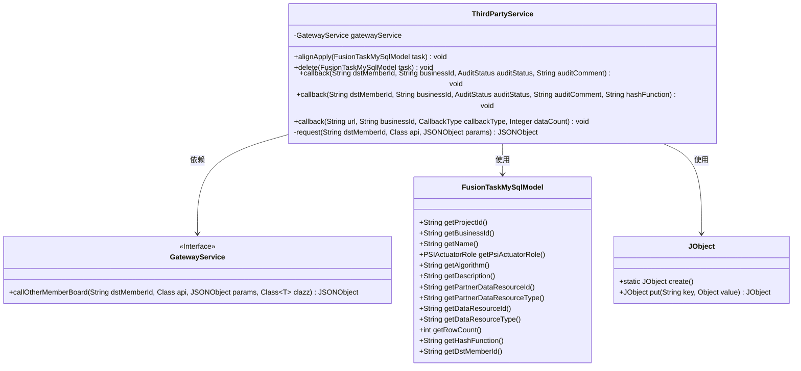
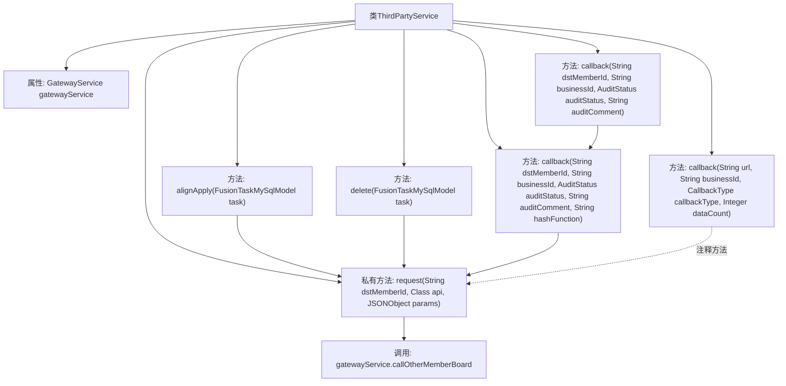
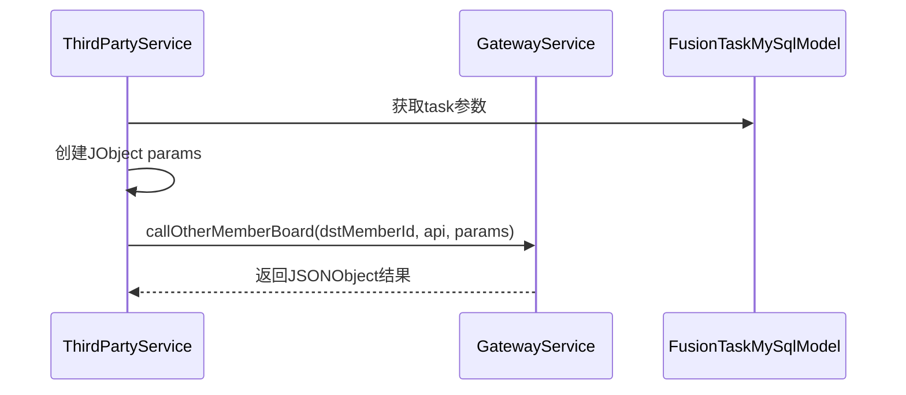

# 基础信息

|      |      |
|------|------|
| 名称 | ThirdPartyService |
| 编码语言 | .java |
| 代码路径 | WeFe/board/board-service/src/main/java/com/welab/wefe/board/service/service/fusion/ThirdPartyService.java |
| 包名 | com.welab.wefe.board.service.service.fusion |
| 依赖项 | ['com.alibaba.fastjson.JSONObject', 'com.welab.wefe.board.service.api.project.fusion.task.AuditCallbackApi', 'com.welab.wefe.board.service.api.project.fusion.task.DeleteCallbackApi', 'com.welab.wefe.board.service.api.project.fusion.task.ReceiveApi', 'com.welab.wefe.board.service.database.entity.fusion.FusionTaskMySqlModel', 'com.welab.wefe.board.service.service.CacheObjects', 'com.welab.wefe.board.service.service.GatewayService', 'com.welab.wefe.common.exception.StatusCodeWithException', 'com.welab.wefe.common.util.JObject', 'com.welab.wefe.common.wefe.enums.AuditStatus', 'com.welab.wefe.fusion.core.enums.CallbackType', 'com.welab.wefe.fusion.core.enums.PSIActuatorRole', 'org.springframework.beans.factory.annotation.Autowired', 'org.springframework.stereotype.Service'] |
| 概述说明 | ThirdPartyService类提供对齐请求、删除任务及回调功能，通过gatewayService调用其他成员接口，处理任务参数和状态。 |

# 说明

ThirdPartyService是一个服务类，通过GatewayService与其他成员板交互。主要功能包括alignApply方法，用于对齐请求，构建包含项目ID、成员ID、业务ID、名称、PSI执行角色、算法、描述、数据资源信息等参数的JSON对象并发送请求。delete方法用于删除任务，构建包含业务ID的JSON对象并发送请求。callback方法有三个重载版本，用于处理回调请求，参数包括目标成员ID、业务ID、审核状态、审核评论、哈希函数、URL、回调类型和数据计数等，构建相应JSON对象并发送请求。内部request方法封装了调用其他成员板的逻辑，确保参数顺序一致以避免校验失败。

# 类列表 Class Summary

| 名称   | 类型  | 说明 |
|-------|------|-------------|
| ThirdPartyService | class | ThirdPartyService类提供对齐请求和回调功能，包括alignApply、delete和多个callback方法，通过gatewayService调用其他成员接口，处理任务参数和状态。 |

## 类 ThirdPartyService

|      |      |
|------|------|
| 访问范围 | @Service;public |
| 类型 | class |
| 名称 | ThirdPartyService |
| 说明 | ThirdPartyService类提供对齐请求和回调功能，包括alignApply、delete和多个callback方法，通过gatewayService调用其他成员接口，处理任务参数和状态。 |

### UML类图

这段代码描述了一个第三方服务类`ThirdPartyService`，它通过`GatewayService`接口与外部系统交互，主要处理三种类型的回调操作：对齐申请(`alignApply`)、删除任务(`delete`)和状态回调(`callback`)。该类使用`FusionTaskMySqlModel`作为数据模型，通过`JObject`构建请求参数。核心私有方法`request`统一处理网关调用，确保参数有序性。整体设计体现了对PSI(Private Set Intersection)协议相关业务逻辑的封装，通过方法重载提供灵活的回调接口。

### 内部方法调用关系图

该流程图展示了ThirdPartyService类的结构和方法调用关系，包含6个公共方法和1个私有方法。核心私有方法request()被alignApply()、delete()和callback()重载方法调用，最终通过gatewayService.callOtherMemberBoard实现跨成员通信。时序图则具体描述了alignApply()方法的执行流程：从任务对象获取参数、构建请求参数对象、通过网关服务发起远程调用并返回结果。类设计采用门面模式封装了第三方服务的各种回调操作。

### 字段列表 Field List

| 名称  | 类型  | 说明 |
|-------|-------|------|
| gatewayService | GatewayService | 自动注入GatewayService实例。 |

### 方法列表

| 名称  | 类型  | 说明 |
|-------|-------|------|
| callback | void | 方法实现审核回调功能，接收目标成员ID、业务ID、审核状态、审核意见和哈希函数参数，构建JSON请求并调用审核回调API。 |
| callback | void | Java方法回调函数，接受目标成员ID、业务ID、审核状态和审核意见参数，可抛出异常，内部调用重载方法并传递空值。 |
| callback | void | 定义回调方法，接收URL、业务ID、回调类型和数据量参数，构建JSON对象并注释了请求第三方回调的代码。 |
| request | JSONObject | 私有方法request通过gatewayService调用其他成员板，传入目标成员ID、API类和有序参数，返回JSONObject，可能抛出StatusCodeWithException异常。 |
| alignApply | void | 该方法用于处理任务对齐申请，构建包含项目ID、成员ID、业务ID等参数的JSON对象，并根据任务角色调整PSI执行角色，最后向目标成员发送请求。 |
| delete | void | 该方法删除指定任务，通过业务ID构建参数，向目标成员ID发送删除回调请求。 |

