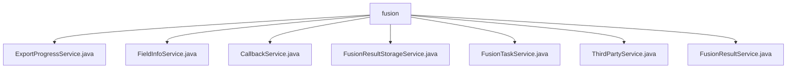

# 基础信息

|      |      |
|------|------|
| 名称 | fusion |
| 编码语言 | .java |
| 代码路径 | WeFe/board/board-service/src/main/java/com/welab/wefe/board/service/service/fusion |
| 包名 | docs.board.board-service.src.main.java.com.welab.wefe.board.service.service.fusion |
| 概述说明 | ExportProgressService管理导出进度，与数据库交互。FieldInfoService处理字段信息，提供查询和保存功能。CallbackService处理回调逻辑，支持审计和RSA-PSI算法。FusionResultStorageService管理数据集存储，支持增删查改。FusionTaskService管理融合任务，处理状态更新和算法逻辑。ThirdPartyService通过网关与其他成员交互。FusionResultService提供数据导出功能，支持多线程处理。 |

# 说明

## 概述  
该模块是数据融合处理平台的核心服务组件，主要职责是管理融合任务全生命周期（创建、审核、执行、回调）和结果数据存储/导出。采用类似工作流引擎模式，通过多服务协同实现RSA-PSI算法任务调度和跨节点通信。关键接口包括任务状态更新（如`running`/`callback`）、数据资源操作（如`saveAll`/`export`）和第三方对齐请求（如`alignApply`）。  

核心数据结构包含`FusionResultExportProgress`进度模型、`TableDataSet`数据资源对象和`BloomFilter`算法中间数据。依赖Spring事务管理、GatewayService跨节点通信、JDBC数据导出和PersistentStorage持久化组件。例如`ExportProgressService`映射进度对象到MySQL，`FusionResultStorageService`使用WEFE_DATA库管理数据集。  

## 主要业务场景  
典型场景为多方安全计算任务处理：1）发起方通过`FusionTaskService`创建RSA_PSI任务并提交审核；2）`CallbackService`处理审核结果，触发算法执行（客户端生成布隆过滤器，服务端对齐数据）；3）`ThirdPartyService`通过Gateway协调成员节点数据对齐；4）结果数据由`FusionResultStorageService`分片存储，最终通过`FusionResultService`多线程导出。  

模块支持完整任务管控链，例如`FieldInfoService`维护字段元数据，`FusionTaskService`提供任务重启能力。集成模式包含API调用（如`delete`任务）和异步回调（如`callback`状态通知）。所有操作均遵循业务ID关联原则，确保数据一致性。

### 包内部结构视图

该流程图展示了WeFe项目中board-service模块下fusion服务的文件结构。根节点为fusion目录，包含7个服务类文件：ExportProgressService、FieldInfoService等，这些类均直接隶属于fusion服务层，用于处理数据融合相关的业务逻辑，包括任务管理、结果存储和第三方交互等功能。

# 文件列表

| 名称   | 类型  | 说明 |
|-------|------|-------------|
| [ExportProgressService.java](ExportProgressService.md) | file | ExportProgressService是一个服务类，提供根据业务ID查询导出进度记录、查询最后一条记录及新增记录的功能，依赖ExportProgressRepository操作数据库。 |
| [FieldInfoService.java](FieldInfoService.md) | file | FieldInfoService提供字段信息管理功能，包括查询字段列表、字段信息列表及批量保存字段信息，支持按businessId操作，使用事务确保数据一致性。 |
| [CallbackService.java](CallbackService.md) | file | CallbackService处理审计回调，根据状态同意或拒绝更新任务状态。同意时启动RSA-PSI算法，客户端和服务端分别执行相应逻辑。 |
| [FusionResultStorageService.java](FusionResultStorageService.md) | file | FusionResultStorageService提供数据集存储管理功能，包括检查键存在、删除数据集、保存表头和数据行、批量操作及数据预览等。使用PersistentStorage进行持久化操作，支持表名生成和批量大小计算。 |
| [FusionTaskService.java](FusionTaskService.md) | file | FusionTaskService是一个服务类，负责管理融合任务，包括任务创建、查询、更新、删除及处理。它依赖多个服务如数据资源、布隆过滤器等，支持RSA_PSI算法，处理任务状态变更和回调。 |
| [ThirdPartyService.java](ThirdPartyService.md) | file | ThirdPartyService类提供对齐请求、删除任务及回调功能，通过gatewayService调用其他成员接口，处理任务参数和状态。 |
| [FusionResultService.java](FusionResultService.md) | file | FusionResultService处理数据导出任务，包括查询任务、创建表、分批写入数据到数据库，支持多线程并发处理。 |

