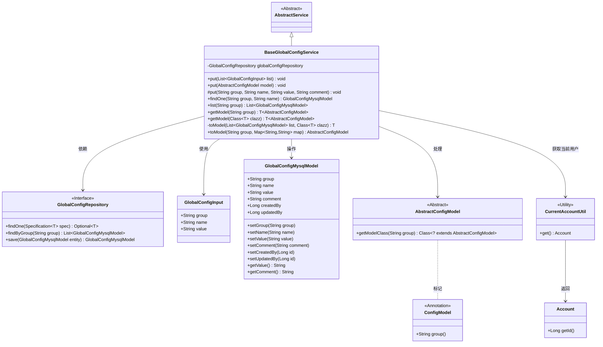
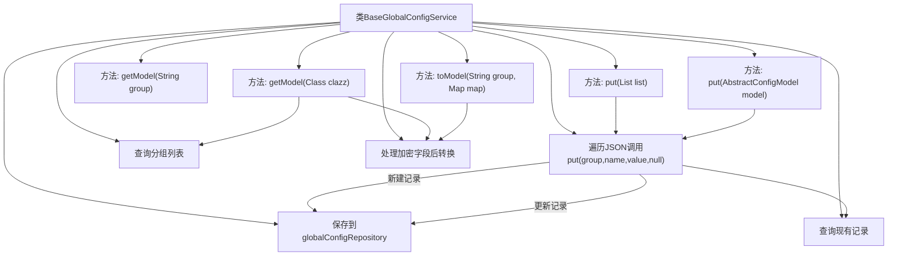

# 基础信息

|      |      |
|------|------|
| 名称 | BaseGlobalConfigService |
| 编码语言 | .java |
| 代码路径 | WeFe/board/board-service/src/main/java/com/welab/wefe/board/service/service/globalconfig/BaseGlobalConfigService.java |
| 包名 | com.welab.wefe.board.service.service.globalconfig |
| 依赖项 | ['com.alibaba.fastjson.JSON', 'com.alibaba.fastjson.JSONObject', 'com.alibaba.fastjson.PropertyNamingStrategy', 'com.alibaba.fastjson.serializer.SerializeConfig', 'com.alibaba.fastjson.serializer.SerializerFeature', 'com.welab.wefe.board.service.database.entity.GlobalConfigMysqlModel', 'com.welab.wefe.board.service.database.repository.GlobalConfigRepository', 'com.welab.wefe.board.service.service.AbstractService', 'com.welab.wefe.common.StatusCode', 'com.welab.wefe.common.data.mysql.Where', 'com.welab.wefe.common.exception.StatusCodeWithException', 'com.welab.wefe.common.fieldvalidate.secret.Secret', 'com.welab.wefe.common.fieldvalidate.secret.SecretUtil', 'com.welab.wefe.common.util.JObject', 'com.welab.wefe.common.util.StringUtil', 'com.welab.wefe.common.web.TempRsaCache', 'com.welab.wefe.common.web.util.CurrentAccountUtil', 'com.welab.wefe.common.wefe.dto.global_config.base.AbstractConfigModel', 'com.welab.wefe.common.wefe.dto.global_config.base.ConfigModel', 'com.welab.wefe.common.wefe.dto.global_config.base.GlobalConfigInput', 'org.springframework.beans.factory.annotation.Autowired', 'org.springframework.data.jpa.domain.Specification', 'java.util.List', 'java.util.Map', 'java.util.Objects'] |
| 概述说明 | BaseGlobalConfigService类提供全局配置管理功能，支持增删改查操作，包括批量处理、模型转换及加密字段解密。 |

# 说明

BaseGlobalConfigService是一个继承自AbstractService的配置管理服务类，主要用于全局配置的增删改查操作。它通过GlobalConfigRepository与数据库交互，提供多种配置操作方法：支持批量添加或更新配置记录（通过列表或AbstractConfigModel对象）、单条记录的添加或更新（支持组、名称、值和注释）、按组查询配置列表、将配置列表转换为指定类型的实体对象。特别处理了字段名的下划线转换、空值跳过、非空值覆盖保护等逻辑，并支持对带有@Secret注解的字段进行自动解密。所有更新操作会记录当前用户ID，确保操作可追溯。

# 类列表 Class Summary

| 名称   | 类型  | 说明 |
|-------|------|-------------|
| BaseGlobalConfigService | class | BaseGlobalConfigService类提供全局配置管理功能，支持批量增改配置项、单条记录操作、按组查询及模型转换。包含数据校验、空值处理和字段加密解密逻辑。 |

## 类 BaseGlobalConfigService

|      |      |
|------|------|
| 访问范围 | public |
| 类型 | class |
| 名称 | BaseGlobalConfigService |
| 说明 | BaseGlobalConfigService类提供全局配置管理功能，支持批量增改配置项、单条记录操作、按组查询及模型转换。包含数据校验、空值处理和字段加密解密逻辑。 |

### UML类图

该类图展示了BaseGlobalConfigService作为核心配置服务，继承自AbstractService，通过GlobalConfigRepository操作数据库。它提供了多种配置操作方法，包括批量更新、模型转换和加密字段处理，同时依赖工具类CurrentAccountUtil获取当前用户信息。GlobalConfigMysqlModel表示数据库实体，AbstractConfigModel作为配置模型的基类，通过ConfigModel注解标记分组信息。整体结构清晰地展现了配置管理的分层架构和关键交互关系。

### 内部方法调用关系图

流程图描述：该流程图展示了BaseGlobalConfigService类的核心方法调用关系。类通过globalConfigRepository与数据库交互，提供配置项的增删改查功能。主要包含三类操作：批量处理配置（put方法链式调用）、模型转换（getModel/toModel方法组合）以及加密数据处理（带@Secret注解字段解密）。所有写操作最终通过synchronized的put方法保证线程安全，并统一调用Repository保存数据。查询操作支持单条记录、分组列表和模型化返回。

### 字段列表 Field List

| 名称  | 类型  | 说明 |
|-------|-------|------|
| globalConfigRepository | GlobalConfigRepository | 自动注入全局配置仓库实例。 |

### 方法列表

| 名称  | 类型  | 说明 |
|-------|-------|------|
| toModel | T | 将MySQL配置列表转换为指定类型的模型对象。若列表为空返回null，否则将键值对转为JSON对象并转换为目标类实例。 |
| put | void | 该方法将配置模型存入数据库，统一使用下划线命名，保留null值字段，并跳过前端未指定的null值字段。 |
| getModel | T | 该方法通过注解获取配置组信息，查询数据库列表并转换为指定类型的配置模型。 |
| findOne | GlobalConfigMysqlModel | 查找指定分组和名称的全局配置，若无结果返回null。 |
| put | void | 同步方法put用于更新或创建配置项。检查是否存在同名配置，若存在则验证更新值非空且与原值不同才更新，否则创建新项。最后保存配置，记录操作者ID。异常时抛出状态码错误。 |
| put | void | Java方法：遍历配置列表，逐个调用put方法存储分组、名称和值，忽略第四个参数。异常可能抛出。 |
| list | List<GlobalConfigMysqlModel> | 该方法通过全局配置仓库按组名查询并返回对应的全局配置MySQL模型列表。 |
| getModel | T | Java方法：根据组名获取配置模型实例，未找到时抛出异常。 |
| toModel | AbstractConfigModel | 将Map转换为指定组的AbstractConfigModel对象，处理加密字段解密后通过JObject映射为模型实例。 |

