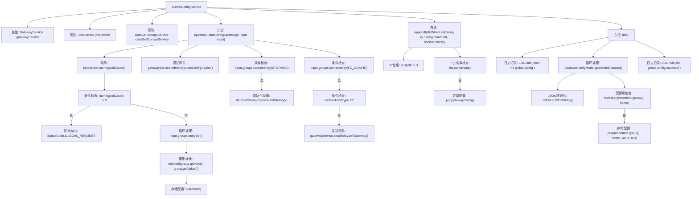

# 基础信息

|      |      |
|------|------|
| 名称 | GlobalConfigService |
| 编码语言 | .java |
| 代码路径 | WeFe/board/board-service/src/main/java/com/welab/wefe/board/service/service/globalconfig/GlobalConfigService.java |
| 包名 | com.welab.wefe.board.service.service.globalconfig |
| 依赖项 | ['com.alibaba.fastjson.JSON', 'com.alibaba.fastjson.JSONObject', 'com.alibaba.fastjson.PropertyNamingStrategy', 'com.alibaba.fastjson.serializer.SerializeConfig', 'com.alibaba.fastjson.serializer.SerializerFeature', 'com.welab.wefe.board.service.api.global_config.GlobalConfigUpdateApi', 'com.welab.wefe.board.service.dto.kernel.machine_learning.Env', 'com.welab.wefe.board.service.service.DataSetStorageService', 'com.welab.wefe.board.service.service.GatewayService', 'com.welab.wefe.board.service.service.JobService', 'com.welab.wefe.common.StatusCode', 'com.welab.wefe.common.exception.StatusCodeWithException', 'com.welab.wefe.common.util.IpAddressUtil', 'com.welab.wefe.common.util.StringUtil', 'com.welab.wefe.common.wefe.dto.global_config.GatewayConfigModel', 'com.welab.wefe.common.wefe.dto.global_config.base.AbstractConfigModel', 'com.welab.wefe.common.wefe.dto.global_config.base.ConfigGroupConstant', 'com.welab.wefe.common.wefe.dto.global_config.base.ConfigModel', 'com.welab.wefe.common.wefe.enums.GatewayProcessorType', 'com.welab.wefe.common.wefe.enums.JobBackendType', 'org.springframework.beans.factory.annotation.Autowired', 'org.springframework.stereotype.Service', 'java.util.List', 'java.util.Map'] |
| 概述说明 | GlobalConfigService类继承BaseGlobalConfigService，提供配置更新、IP白名单添加和初始化功能。更新配置时检查运行任务数，通知网关刷新缓存，处理存储配置。IP白名单支持模糊匹配。初始化时遍历配置模型，将未存储的配置项存入数据库。 |

# 说明

GlobalConfigService是一个服务类，继承自BaseGlobalConfigService，用于管理系统全局配置。它依赖GatewayService、JobService和DataSetStorageService。主要功能包括更新配置、添加IP到网关白名单和初始化配置项。更新配置时会检查运行中的任务数量，禁止在有任务运行时修改配置，并通知网关刷新系统配置缓存，同时根据配置组类型刷新持久化存储或函数计算存储。添加IP到白名单支持模糊匹配，避免重复添加。初始化配置项时会遍历所有配置模型，将未存在于数据库的配置项添加进去。

# 类列表 Class Summary

| 名称   | 类型  | 说明 |
|-------|------|-------------|
| GlobalConfigService | class | GlobalConfigService类提供全局配置管理功能，包括更新配置、IP白名单管理和初始化配置项。更新配置时检查运行任务数，通知网关刷新缓存，并初始化存储对象。IP白名单支持模糊匹配和去重。初始化时遍历配置模型，将未存在的配置项存入数据库。 |


## 类 GlobalConfigService

|      |      |
|------|------|
| 访问范围 | @Service;public |
| 类型 | class |
| 名称 | GlobalConfigService |
| 说明 | GlobalConfigService类提供全局配置管理功能，包括更新配置、IP白名单管理和初始化配置项。更新配置时检查运行任务数，通知网关刷新缓存，并初始化存储对象。IP白名单支持模糊匹配和去重。初始化时遍历配置模型，将未存在的配置项存入数据库。 |


### UML类图

```mermaid
classDiagram
    class BaseGlobalConfigService {
        <<abstract>>
    }
    
    class GlobalConfigService {
        -GatewayService gatewayService
        -JobService jobService
        -DataSetStorageService dataSetStorageService
        +update(GlobalConfigUpdateApi$Input input) void
        +appendIpToWhiteList(String ip, String comment, boolean fuzzy) void
        +init() void
    }
    
    class GatewayService {
        <<Interface>>
        +refreshSystemConfigCache() void
        +sendToMyselfGateway(String arg0, GatewayProcessorType arg1) void
    }
    
    class JobService {
        <<Interface>>
        +runningJobCount() int
    }
    
    class DataSetStorageService {
        <<Interface>>
        +initStorage() void
    }
    
    class AbstractConfigModel {
        <<abstract>>
    }
    
    class GlobalConfigUpdateApi$Input {
        -Map~String, Map~String, String~~ groups
    }
    
    class GatewayConfigModel {
        -String ipWhiteList
    }
    
    BaseGlobalConfigService <|-- GlobalConfigService
    GlobalConfigService --> GatewayService : 依赖
    GlobalConfigService --> JobService : 依赖
    GlobalConfigService --> DataSetStorageService : 依赖
    GlobalConfigService --> AbstractConfigModel : 创建
    GlobalConfigService --> GlobalConfigUpdateApi$Input : 处理输入
    GlobalConfigService --> GatewayConfigModel : 管理配置
```

这段类图展示了GlobalConfigService作为核心配置管理服务，继承自BaseGlobalConfigService，并依赖GatewayService、JobService和DataSetStorageService三个接口服务。主要功能包括更新全局配置、管理网关IP白名单和初始化配置项。通过AbstractConfigModel处理配置模型，使用GatewayConfigModel管理网关特定配置，GlobalConfigUpdateApi$Input作为更新操作的输入参数封装类。服务通过组合多个接口实现配置管理的各项功能，体现了清晰的职责划分和模块化设计。


### 内部方法调用关系图



流程图描述了GlobalConfigService类的核心功能流程。该服务主要负责全局配置管理，包括配置更新、IP白名单维护和系统初始化。update方法会检查运行任务状态，批量更新配置组，并触发相关服务的缓存刷新；appendIpToWhiteList实现了IP白名单的智能添加逻辑；init方法通过反射机制初始化所有配置模型。流程中包含了多重条件判断、循环处理、异常抛出等关键控制逻辑，体现了配置管理的完整生命周期。

### 字段列表 Field List

| 名称  | 类型  | 说明 |
|-------|-------|------|
| jobService | JobService | 使用@Autowired自动注入JobService实例。 |
| dataSetStorageService | DataSetStorageService | 使用@Autowired自动注入DataSetStorageService实例。 |
| gatewayService | GatewayService | 自动注入GatewayService实例。 |

### 方法列表

| 名称  | 类型  | 说明 |
|-------|-------|------|
| update | void | 方法update检查运行任务数，若大于0则报错。遍历输入配置组并更新模型，通知网关刷新缓存。若含存储配置则初始化存储，若含函数计算配置且后端为FC类型，则通知网关刷新FC存储。 |
| appendIpToWhiteList | void | 同步方法将IP加入白名单，支持模糊匹配（末位替换为*），检查重复后添加带注释的IP到配置并保存。 |
| init | void | 这是一个同步初始化方法，用于遍历所有配置模型类，将配置项以JSON格式存入数据库。若数据库不存在该配置项则新增，使用蛇形命名策略，完成后记录日志。 |


