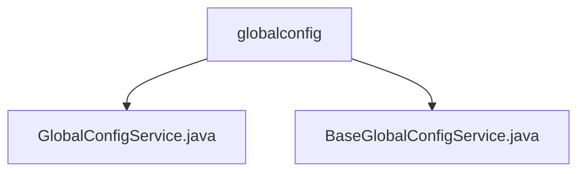

# 基础信息

|      |      |
|------|------|
| 名称 | globalconfig |
| 编码语言 | .java |
| 代码路径 | WeFe/board/board-service/src/main/java/com/welab/wefe/board/service/service/globalconfig |
| 包名 | docs.board.board-service.src.main.java.com.welab.wefe.board.service.service.globalconfig |
| 概述说明 | GlobalConfigService继承BaseGlobalConfigService，管理全局配置，依赖多个服务，功能包括更新配置、IP白名单管理和配置初始化。BaseGlobalConfigService提供配置增删改查，支持批量操作、类型转换和字段加密，确保操作可追溯。 |

# 说明

## 概述  
该模块是全局配置管理系统，核心职责为统一管理平台配置项并确保操作安全性。接口规范涵盖配置CRUD、白名单管理和初始化流程，支持批量操作与类型转换。关键数据结构包括AbstractConfigModel基类和带@Secret注解的敏感字段。外部依赖涉及GatewayService、JobService等三方服务。例如更新配置时校验任务状态并联动网关缓存刷新，类似配置中心的中枢模式。

## 主要业务场景  
典型场景包括系统启动时初始化配置项、运行时动态更新全局参数。交互模式采用"操作前校验+事务性持久化"机制，例如修改配置前检查任务运行状态。完整功能覆盖配置生命周期管理，支持加密字段自动处理。API类型包含RESTful接口与JNI调用，如通过组名查询配置列表或批量更新模型数据。

### 包内部结构视图

该流程图展示了globalconfig目录下的两个Java服务类文件：GlobalConfigService.java和BaseGlobalConfigService.java。这两个文件都位于同一层级，直接隶属于globalconfig目录，没有更深层次的嵌套结构。图表清晰地反映了这两个服务类文件的平级关系。

# 文件列表

| 名称   | 类型  | 说明 |
|-------|------|-------------|
| [GlobalConfigService.java](GlobalConfigService.md) | file | GlobalConfigService类继承BaseGlobalConfigService，提供配置更新、IP白名单添加和初始化功能。更新配置时检查运行任务数，通知网关刷新缓存，处理存储配置。IP白名单支持模糊匹配。初始化时遍历配置模型，将未存储的配置项存入数据库。 |
| [BaseGlobalConfigService.java](BaseGlobalConfigService.md) | file | BaseGlobalConfigService类提供全局配置管理功能，支持增删改查操作，包括批量处理、模型转换及加密字段解密。 |

