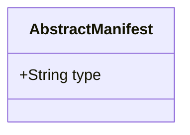
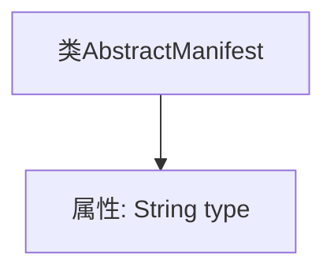

# 基础信息

|      |      |
|------|------|
| 名称 | AbstractManifest |
| 编码语言 | .java |
| 代码路径 | WeFe/board/board-service/src/main/java/com/welab/wefe/board/service/service/init/AbstractManifest.java |
| 包名 | com.welab.wefe.board.service.service.init |
| 依赖项 | [] |
| 概述说明 | 抽象清单类，包含类型属性。 |

# 说明

AbstractManifest是一个公开的Java类，包含一个公开的字符串类型字段type。该类结构简单，仅定义了一个类型标识字段，可能作为其他具体清单类的基类使用。

# 类列表 Class Summary

| 名称   | 类型  | 说明 |
|-------|------|-------------|
| AbstractManifest | class | 抽象清单类，包含类型属性。 |

## 类 AbstractManifest

|      |      |
|------|------|
| 访问范围 | public |
| 类型 | class |
| 名称 | AbstractManifest |
| 说明 | 抽象清单类，包含类型属性。 |

### UML类图

这段类图描述了一个简单的抽象清单类AbstractManifest，它包含一个公有的字符串类型字段type。该类的设计非常基础，没有定义任何方法，仅通过一个公开字段来存储清单类型信息。这种结构通常作为更复杂清单类的基类使用，后续可通过继承扩展具体功能。类图中清晰地展示了该类的唯一公有成员变量，符合面向对象设计中简单基类的建模规范。

### 内部方法调用关系图

这段代码定义了一个名为`AbstractManifest`的简单类，其中包含一个公开的字符串类型属性`type`。流程图清晰地展示了类与属性之间的从属关系，类作为父节点，属性作为子节点。该结构可用于存储清单类型等基础信息，后续可通过继承扩展功能。整个设计符合面向对象的基本封装原则。

### 字段列表 Field List

| 名称  | 类型  | 说明 |
|-------|-------|------|
| type | String | 声明一个名为type的公共字符串变量。 |

### 方法列表

| 名称  | 类型  | 说明 |
|-------|-------|------|

