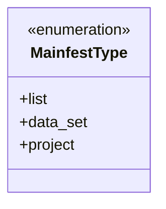
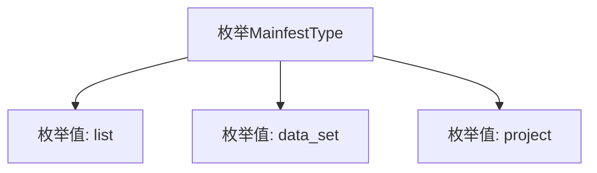

# 基础信息

|      |      |
|------|------|
| 名称 | MainfestType |
| 编码语言 | .java |
| 代码路径 | WeFe/board/board-service/src/main/java/com/welab/wefe/board/service/service/init/MainfestType.java |
| 包名 | com.welab.wefe.board.service.service.init |
| 依赖项 | [] |
| 概述说明 | MainfestType枚举定义了三种类型：列表、数据集和项目。 |

# 说明

该内容定义了一个名为MainfestType的公共枚举类型，包含三个枚举值：list表示列表类型，data_set表示数据集类型，project表示项目类型。枚举用于表示不同的清单或配置类型，适用于需要区分多种清单场景的编程环境。

# 类列表 Class Summary

| 名称   | 类型  | 说明 |
|-------|------|-------------|
| MainfestType | enum | MainfestType枚举定义了三种类型：list、data_set和project。 |

## 类 MainfestType

|      |      |
|------|------|
| 访问范围 | public |
| 类型 | enum |
| 名称 | MainfestType |
| 说明 | MainfestType枚举定义了三种类型：list、data_set和project。 |

### UML类图

这段代码定义了一个名为`MainfestType`的枚举类型，包含三个枚举常量：`list`、`data_set`和`project`。枚举用于表示一组固定的常量值，常用于状态标识或类型分类。该枚举没有定义额外方法或属性，仅作为简单的类型标记使用，适合在需要明确限定选项范围的场景下使用，如配置文件解析或类型区分。

### 内部方法调用关系图

该流程图展示了MainfestType枚举的结构，包含三个枚举值：list、data_set和project。枚举类型MainfestType作为父节点，通过箭头指向每个具体的枚举值，清晰地呈现了枚举的简单层级关系。这种结构常用于表示固定集合的常量，适用于类型标识等场景。

### 字段列表 Field List

| 名称  | 类型  | 说明 |
|-------|-------|------|

### 方法列表

| 名称  | 类型  | 说明 |
|-------|-------|------|

