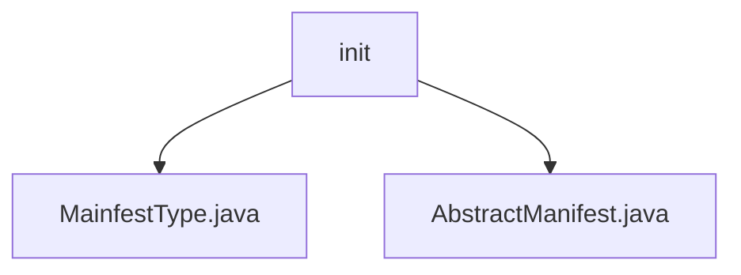

# 基础信息

|      |      |
|------|------|
| 名称 | init |
| 编码语言 | .java |
| 代码路径 | WeFe/board/board-service/src/main/java/com/welab/wefe/board/service/service/init |
| 包名 | docs.board.board-service.src.main.java.com.welab.wefe.board.service.service.init |
| 概述说明 | MainfestType枚举定义三种类型：list、data_set、project。AbstractManifest是基类，含type字段。用于区分清单类型。 |

# 说明

## 概述  
该模块核心职责是提供清单类型的基础定义和抽象结构，用于区分和管理不同种类的清单配置。定义了一个公共枚举`MainfestType`包含三种类型：`list`(列表)、`data_set`(数据集)、`project`(项目)，同时提供抽象基类`AbstractManifest`作为类型标识的父类。  

关键数据结构包括枚举类型`MainfestType`和含`type`字段的抽象类`AbstractManifest`。模块无外部依赖，通过基础类型抽象支持多场景清单管理，例如区分数据集或项目的配置类型。  

## 主要业务场景  
模块适用于需要分类处理清单配置的场景，类似资源分类器模式。通过枚举明确类型边界，抽象类提供统一类型标识扩展能力。例如项目初始化时可通过`type`字段快速识别清单类别，或基于枚举值实现差异化逻辑。交互模式表现为子类继承`AbstractManifest`并关联枚举类型，形成类型安全的配置体系。

### 包内部结构视图

该流程图展示了WeFe项目中board-service模块下的初始化服务文件结构。init目录包含两个Java文件：MainfestType.java和AbstractManifest.java，它们都属于项目初始化相关的服务类文件。这种结构清晰地反映了初始化服务的代码组织方式，其中抽象基类与具体类型定义文件并列存放。

# 文件列表

| 名称   | 类型  | 说明 |
|-------|------|-------------|
| [MainfestType.java](MainfestType.md) | file | MainfestType枚举定义了三种类型：列表、数据集和项目。 |
| [AbstractManifest.java](AbstractManifest.md) | file | 抽象清单类，包含类型属性。 |

