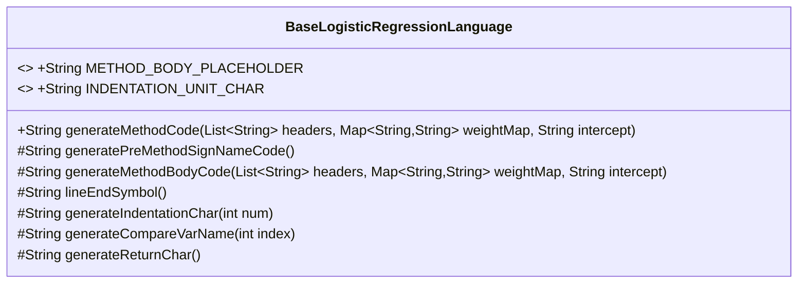
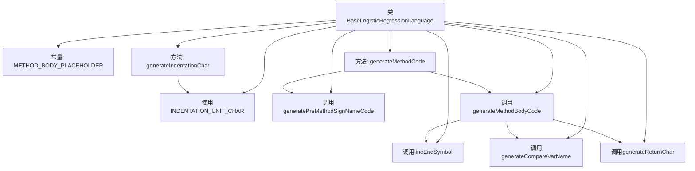

# 基础信息

|      |      |
|------|------|
| 名称 | BaseLogisticRegressionLanguage |
| 编码语言 | .java |
| 代码路径 | WeFe/board/board-service/src/main/java/com/welab/wefe/board/service/service/modelexport/BaseLogisticRegressionLanguage.java |
| 包名 | com.welab.wefe.board.service.service.modelexport |
| 依赖项 | ['org.apache.commons.collections4.CollectionUtils', 'java.util.List', 'java.util.Map'] |
| 概述说明 | BaseLogisticRegressionLanguage类用于生成逻辑回归模型代码，包含方法占位符、缩进单位、生成方法签名和主体代码等功能。 |

# 说明

该代码定义了一个名为BaseLogisticRegressionLanguage的基类，用于生成逻辑回归模型的Java代码。类中包含两个主要方法：generatePreMethodSignNameCode生成方法签名框架，generateMethodBodyCode生成方法体内容。通过占位符替换机制将两者组合成完整代码。类提供了缩进控制、变量命名、返回语句生成等辅助方法，支持通过输入特征头信息、权重映射和截距值动态生成评分方法代码。所有生成内容遵循标准Java语法格式，最终输出一个包含score方法的Model类。

# 类列表 Class Summary

| 名称   | 类型  | 说明 |
|-------|------|-------------|
| BaseLogisticRegressionLanguage | class | BaseLogisticRegressionLanguage类用于生成逻辑回归模型代码，包含方法签名和主体代码生成功能，支持自定义缩进和变量名。 |

## 类 BaseLogisticRegressionLanguage

|      |      |
|------|------|
| 访问范围 | public |
| 类型 | class |
| 名称 | BaseLogisticRegressionLanguage |
| 说明 | BaseLogisticRegressionLanguage类用于生成逻辑回归模型代码，包含方法签名和主体代码生成功能，支持自定义缩进和变量名。 |

### UML类图

类图描述：
BaseLogisticRegressionLanguage 是一个用于生成逻辑回归模型代码的基类，包含多个受保护的方法用于构建代码的不同部分。核心方法 generateMethodCode 通过组合预生成的方法签名和方法体来生成完整的模型代码。类中定义了常量占位符和缩进单位，并提供了生成变量名、返回语句、行结束符等辅助方法。该类采用模板方法模式，允许子类覆盖特定步骤的实现。

### 内部方法调用关系图

这段代码实现了一个逻辑回归模型的代码生成器，主要功能是根据输入的特征头信息、权重和截距生成可执行的Java评分方法。流程图展示了类结构及其方法调用关系，核心流程是generateMethodCode通过组合预生成方法签名和方法体来构建完整代码，其中方法体生成涉及多个辅助方法用于构建返回语句、变量名和格式控制。所有方法都围绕生成符合Java语法规范的模型评分代码这一核心目标协同工作。

### 字段列表 Field List

| 名称  | 类型  | 说明 |
|-------|-------|------|
| INDENTATION_UNIT_CHAR = "    " | String | 定义字符串常量INDENTATION_UNIT_CHAR，值为四个空格，用于缩进单位。 |
| METHOD_BODY_PLACEHOLDER = "#body#" | String | 代码中定义了一个静态常量字符串占位符"#body#"，用于表示方法体的位置。 |

### 方法列表

| 名称  | 类型  | 说明 |
|-------|-------|------|
| generateReturnChar | String | 方法生成返回字符串"return "。 |
| generateIndentationChar | String | 生成指定数量缩进字符的方法，循环添加缩进单位字符后返回结果字符串。 |
| lineEndSymbol | String | 方法返回行结束符号分号。 |
| generatePreMethodSignNameCode | String | 生成Java方法框架代码，包含类定义和score方法占位符。 |
| generateMethodCode | String | 该方法根据输入参数生成方法代码，先调用生成方法签名前导代码，再生成方法体代码，最后将方法体插入签名占位符处返回完整代码。 |
| generateCompareVarName | String | 生成比较变量名方法：根据索引返回格式为"input[index]"的字符串。 |
| generateMethodBodyCode | String | 该方法生成方法体代码，拼接截距和权重乘积之和。若无头信息则返回空，否则按格式组合变量名、权重及运算符，最后添加行结束符。 |

