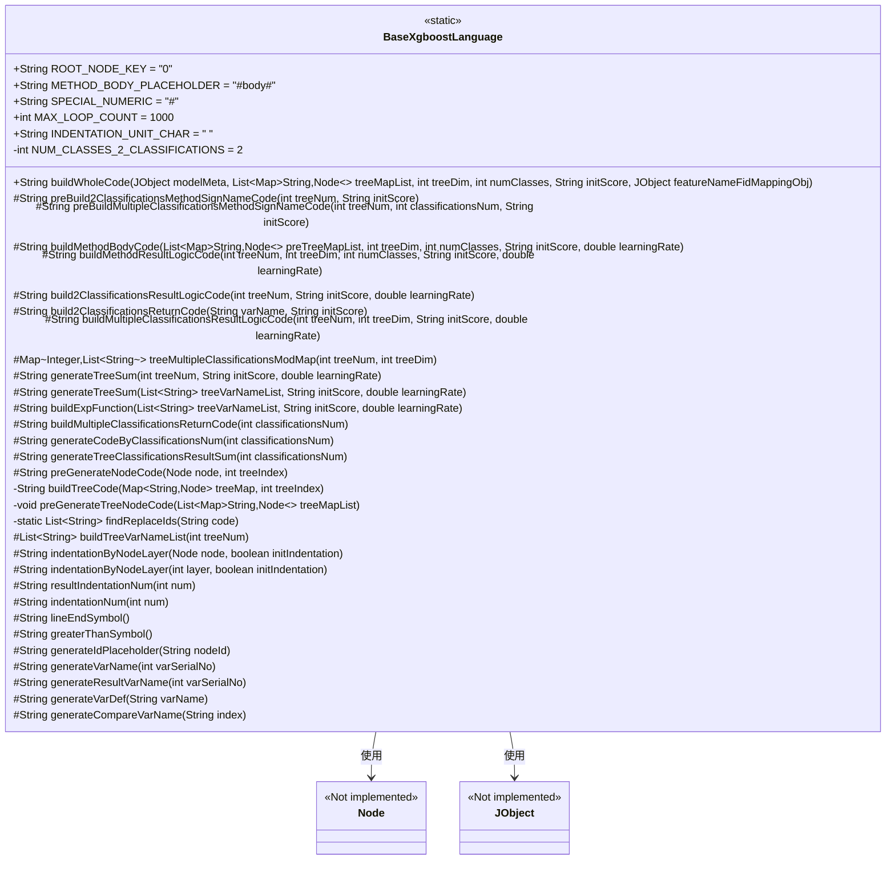
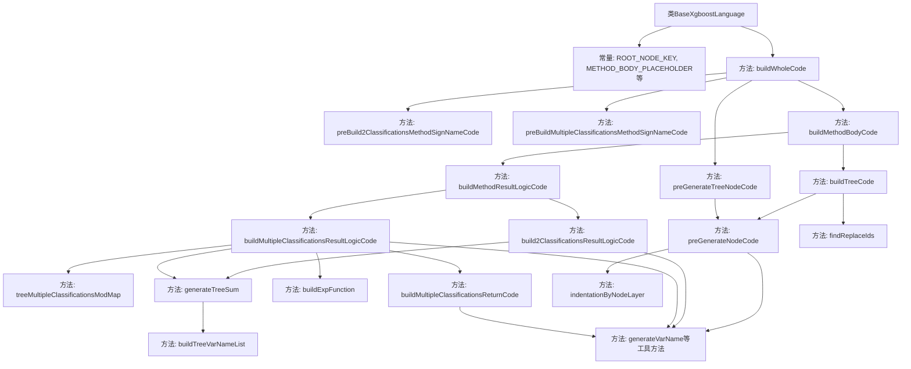

# 基础信息

|      |      |
|------|------|
| 名称 | BaseXgboostLanguage |
| 编码语言 | .java |
| 代码路径 | WeFe/board/board-service/src/main/java/com/welab/wefe/board/service/service/modelexport/BaseXgboostLanguage.java |
| 包名 | com.welab.wefe.board.service.service.modelexport |
| 依赖项 | ['com.welab.wefe.common.util.JObject', 'org.apache.commons.collections4.CollectionUtils', 'java.util.ArrayList', 'java.util.LinkedHashMap', 'java.util.List', 'java.util.Map', 'java.util.regex.Matcher', 'java.util.regex.Pattern'] |
| 概述说明 | BaseXgboostLanguage类用于生成XGBoost模型的Java代码，支持二分类和多分类任务。包含常量定义、树节点代码生成、方法签名构建、结果逻辑处理等功能。核心方法buildWholeCode整合预处理、方法签名和主体代码生成流程。 |

# 说明

BaseXgboostLanguage类是一个用于生成XGBoost模型预测代码的Java工具类。它包含多个静态常量，如根节点键、方法体占位符、最大循环次数等。核心方法buildWholeCode负责构建完整代码，根据分类数量（二分类或多分类）生成不同的方法签名和逻辑代码。类中实现了树节点代码预处理、方法体生成、结果逻辑计算等功能，支持通过模板替换生成条件判断和叶子节点赋值代码。代码生成过程考虑了缩进格式、变量命名规范，并提供了多种辅助方法如生成变量名、比较表达式、求和公式等。最终输出符合Java语法的预测模型代码。

# 类列表 Class Summary

| 名称   | 类型  | 说明 |
|-------|------|-------------|
| BaseXgboostLanguage | class | BaseXgboostLanguage类用于生成XGBoost模型代码，包含常量定义、树结构处理、分类逻辑生成及代码格式化功能。支持二分类和多分类，通过预处理节点代码、构建方法签名和结果逻辑，最终生成完整可执行代码。 |

## 类 BaseXgboostLanguage

|      |      |
|------|------|
| 访问范围 | public |
| 类型 | class |
| 名称 | BaseXgboostLanguage |
| 说明 | BaseXgboostLanguage类用于生成XGBoost模型代码，包含常量定义、树结构处理、分类逻辑生成及代码格式化功能。支持二分类和多分类，通过预处理节点代码、构建方法签名和结果逻辑，最终生成完整可执行代码。 |

### UML类图

类图描述：
BaseXgboostLanguage 是一个用于生成XGBoost模型代码的核心类，包含处理二叉树和多分类问题的各种方法。它通过静态常量定义关键参数，提供构建完整代码的方法buildWholeCode，并包含预处理、方法签名生成、方法体构建等辅助方法。该类与Node和JObject存在依赖关系，前者表示树节点结构，后者提供JSON数据访问功能。类中方法按功能分为代码生成、字符串处理、数学计算等类别，支持二分类和多分类场景的代码生成。

### 内部方法调用关系图

这段代码是XGBoost模型代码生成器的核心实现，主要功能是将XGBoost模型转换为可执行的Java代码。流程从buildWholeCode入口开始，分为方法签名生成和代码体生成两条主线，通过预处理树节点代码、构建分类逻辑、生成变量名等步骤，最终拼接成完整的模型评分代码。特别处理了二分类和多分类的不同情况，并包含循环替换占位符等健壮性设计。

### 字段列表 Field List

| 名称  | 类型  | 说明 |
|-------|-------|------|
| METHOD_BODY_PLACEHOLDER = "#body#" | String | 代码中定义了一个静态常量字符串占位符"#body#"，用于标记方法体位置。 |
| SPECIAL_NUMERIC = "#" | String | 定义特殊数字符号常量"#" |
| INDENTATION_UNIT_CHAR = "    " | String | 定义静态常量字符串，用于缩进单位，值为四个空格。 |
| ROOT_NODE_KEY = "0" | String | 定义常量ROOT_NODE_KEY，值为字符串"0"。 |
| NUM_CLASSES_2_CLASSIFICATIONS = 2 | int | 静态常量NUM_CLASSES_2_CLASSIFICATIONS值为2，用于两类分类。 |
| MAX_LOOP_COUNT = 1000 | int | 定义静态常量MAX_LOOP_COUNT，值为1000。 |

### 方法列表

| 名称  | 类型  | 说明 |
|-------|-------|------|
| generateTreeSum | String | 生成树模型得分公式，初始分加各树变量乘以学习率的总和。 |
| generateResultVarName | String | 生成方法：根据序号返回变量名"s"加序号，如输入1返回"s1"。 |
| buildExpFunction | String | 构建指数函数字符串，参数为变量列表、初始分数和学习率，返回形如Math.exp(0-(求和结果))的表达式。 |
| generateCodeByClassificationsNum | String | 该方法根据分类数量生成代码字符串，循环拼接变量名与分类总和比值，用逗号分隔不同分类结果。 |
| build2ClassificationsResultLogicCode | String | 该方法生成二分类逻辑回归代码，计算s1变量为1/(1+e^-(树模型总和))，并返回结果。参数包括树数量、初始分数和学习率。 |
| indentationByNodeLayer | String | 根据节点层级生成缩进字符串，初始缩进可选。 |
| generateTreeClassificationsResultSum | String | 生成树分类结果汇总字符串，循环拼接变量名并用加号连接。 |
| resultIndentationNum | String | 方法返回根据输入数字生成的缩进字符串。 |
| preGenerateNodeCode | String | 该方法根据节点类型生成代码：叶子节点生成变量赋值，非叶子节点生成条件判断结构。 |
| buildMethodBodyCode | String | 该方法根据输入参数构建方法体代码。若输入列表为空则返回空字符串，否则遍历列表生成每棵树的代码并拼接，最后添加结果逻辑代码后返回完整字符串。 |
| preBuildMultipleClassificationsMethodSignNameCode | String | 方法返回基于树数量和初始分数生成的双分类方法签名代码。 |
| buildTreeCode | String | 该方法通过树状结构生成代码，处理变量替换并防止死循环。从根节点开始构建代码，循环替换特殊标记为子节点代码，最多执行MAX_LOOP_COUNT次以确保安全。 |
| buildMultipleClassificationsReturnCode | String | 构建返回多分类结果的代码，生成包含指定分类数量的double数组返回语句。 |
| lineEndSymbol | String | 方法返回行结束符号分号。 |
| buildMethodResultLogicCode | String | 该方法根据分类数量选择构建二元分类或多分类逻辑代码，返回结果逻辑代码字符串。参数包括树数量、树维度、类别数、初始分数和学习率。 |
| findReplaceIds | List<String> | 该方法通过正则表达式查找字符串中所有形如#数字#的ID，并返回匹配结果列表。 |
| generateVarName | String | 生成变量名方法，将输入序号转为"var"加序号的字符串。 |
| generateVarDef | String | 生成定义双精度变量的字符串，格式为"double 变量名 行结束符"。 |
| generateCompareVarName | String | 生成比较变量名方法，返回格式为"input[索引]"。 |
| buildWholeCode | String | 构建完整代码方法，预处理树节点，根据分类数量生成方法签名，最终组合方法签名和方法体代码。 |
| build2ClassificationsReturnCode | String | 生成返回二元分类结果的代码，将变量varName和1-varName组成数组返回。 |
| buildTreeVarNameList | List<String> | 方法生成指定数量的变量名列表，循环调用generateVarName生成每个变量名并存入列表，最后返回该列表。 |
| treeMultipleClassificationsModMap | Map<Integer, List<String>> | 方法生成树分类映射，按树索引模数分组存储变量名列表。输入树数量和维度，输出模数为键、变量名列表为值的映射。 |
| buildMultipleClassificationsResultLogicCode | String | 该方法构建多分类逻辑代码，生成分类变量及计算逻辑，最终返回各分类结果。通过遍历分类映射，为每类创建变量并计算概率值，最后整合返回代码。 |
| preGenerateTreeNodeCode | void | 该方法遍历树节点列表，为每个节点预生成代码并设置。参数为树节点映射列表，通过双重循环处理每个节点，调用preGenerateNodeCode生成代码并赋值。 |
| indentationByNodeLayer | String | 根据节点层级生成缩进字符串，初始缩进可选，逐层追加缩进单位字符。 |
| generateIdPlaceholder | String | 生成ID占位符方法：输入节点ID，返回格式为#节点ID#的字符串。 |
| indentationNum | String | 该方法根据输入数字生成对应数量的缩进字符，返回字符串形式。 |
| preBuild2ClassificationsMethodSignNameCode | String | 该方法生成一个Java类框架代码，包含一个静态score方法，用于计算输入数组的得分。方法返回类定义字符串，预留了方法体占位符，使用缩进格式化代码结构。 |
| generateTreeSum | String | 生成树求和函数，接收树数量、初始分数和学习率参数，调用内部方法返回结果。 |
| greaterThanSymbol | String | 方法返回大于符号">"。 |

