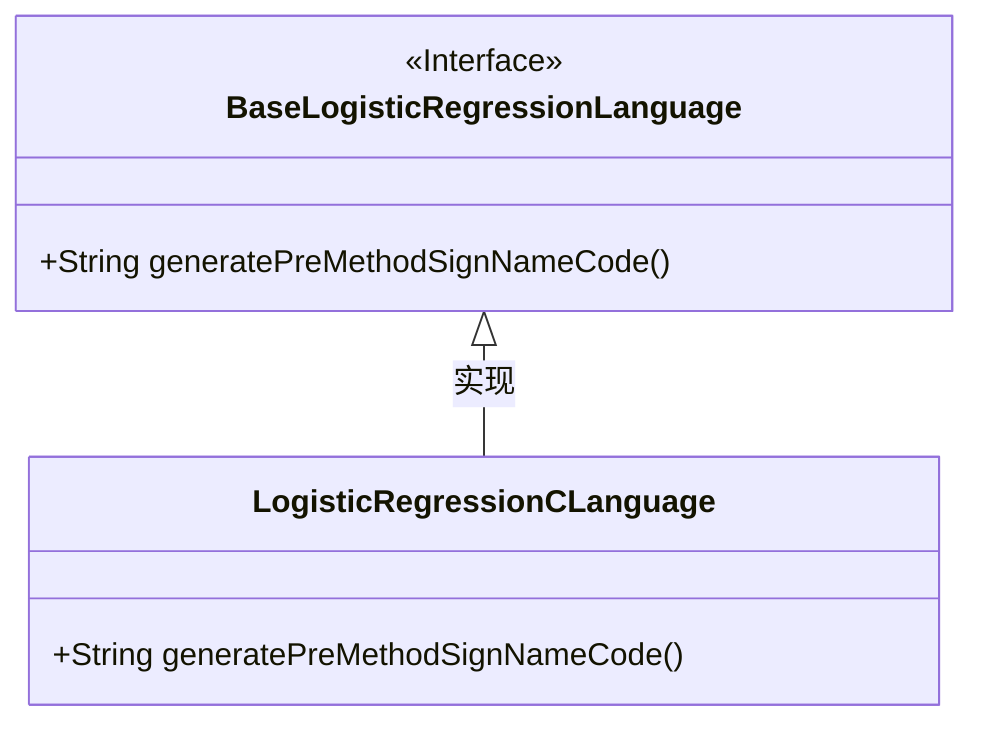
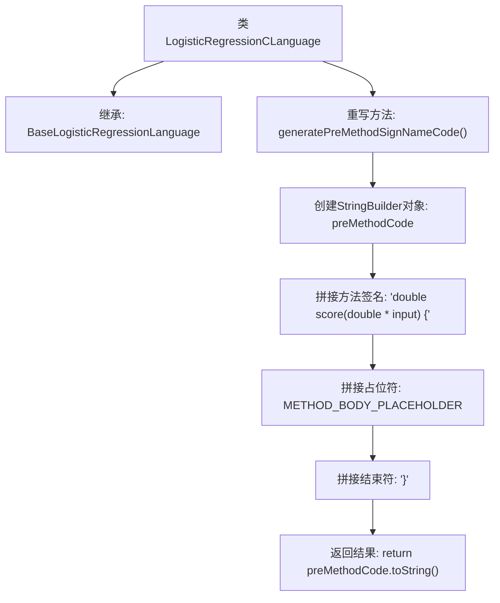

# 基础信息

|      |      |
|------|------|
| 名称 | LogisticRegressionCLanguage |
| 编码语言 | .java |
| 代码路径 | WeFe/board/board-service/src/main/java/com/welab/wefe/board/service/service/modelexport/LogisticRegressionCLanguage.java |
| 包名 | com.welab.wefe.board.service.service.modelexport |
| 依赖项 | [] |
| 概述说明 | LogisticRegressionCLanguage类继承BaseLogisticRegressionLanguage，重写generatePreMethodSignNameCode方法，生成C语言评分函数模板。 |

# 说明

该代码定义了一个名为LogisticRegressionCLanguage的类，继承自BaseLogisticRegressionLanguage。它重写了generatePreMethodSignNameCode方法，用于生成C语言格式的预定义方法签名。方法返回一个字符串，包含一个名为score的函数声明，该函数接收double指针类型的输入参数，并返回double类型结果。函数体部分使用占位符METHOD_BODY_PLACEHOLDER表示，整体代码结构遵循C语言语法规范。

# 类列表 Class Summary

| 名称   | 类型  | 说明 |
|-------|------|-------------|
| LogisticRegressionCLanguage | class | LogisticRegressionCLanguage类继承BaseLogisticRegressionLanguage，重写generatePreMethodSignNameCode方法，生成C语言评分函数模板。 |

## 类 LogisticRegressionCLanguage

|      |      |
|------|------|
| 访问范围 | public |
| 类型 | class |
| 名称 | LogisticRegressionCLanguage |
| 说明 | LogisticRegressionCLanguage类继承BaseLogisticRegressionLanguage，重写generatePreMethodSignNameCode方法，生成C语言评分函数模板。 |

### UML类图

这段类图展示了LogisticRegressionCLanguage类继承并实现了BaseLogisticRegressionLanguage接口。BaseLogisticRegressionLanguage是一个接口（用<<Interface>>标记），定义了generatePreMethodSignNameCode()方法。LogisticRegressionCLanguage作为具体实现类，重写了该方法用于生成C语言格式的逻辑回归评分函数签名和结构。继承关系通过实线空心箭头表示，符合UML规范。

### 内部方法调用关系图

该流程图描述了LogisticRegressionCLanguage类中generatePreMethodSignNameCode方法的执行流程。该方法通过StringBuilder拼接C语言风格的方法签名，包含方法头、占位符和方法尾，最终返回完整的字符串。整个过程展示了从对象创建到字符串构建的步骤，体现了代码生成器的核心逻辑。

### 字段列表 Field List

| 名称  | 类型  | 说明 |
|-------|-------|------|

### 方法列表

| 名称  | 类型  | 说明 |
|-------|-------|------|
| generatePreMethodSignNameCode | String | 生成一个返回C语言函数签名的字符串，包含方法体占位符和缩进。 |

