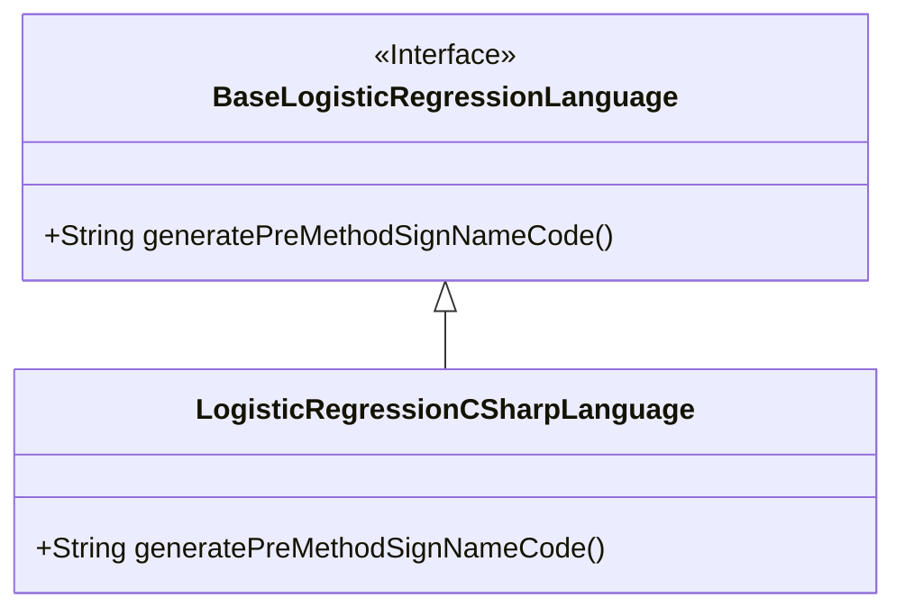
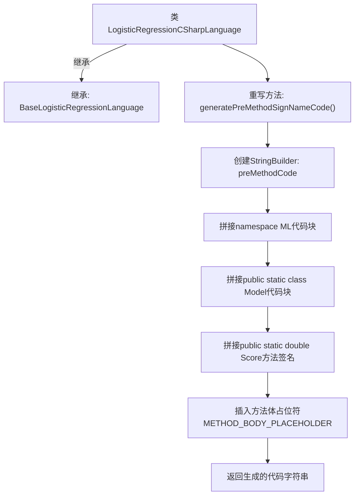

# 基础信息

|      |      |
|------|------|
| 名称 | LogisticRegressionCSharpLanguage |
| 编码语言 | .java |
| 代码路径 | WeFe/board/board-service/src/main/java/com/welab/wefe/board/service/service/modelexport/LogisticRegressionCSharpLanguage.java |
| 包名 | com.welab.wefe.board.service.service.modelexport |
| 依赖项 | [] |
| 概述说明 | C#逻辑回归类生成预方法签名代码，包含命名空间、静态类和评分方法框架。 |

# 说明

该内容描述了一个C#逻辑回归语言的实现类，继承自基础逻辑回归语言类。主要功能是生成方法签名前的代码结构，包括命名空间ML、静态类Model及静态方法Score的框架。方法返回拼接好的字符串，包含多层缩进和占位符METHOD_BODY_PLACEHOLDER用于后续填充。整体结构清晰，严格遵循C#语法规范。

# 类列表 Class Summary

| 名称   | 类型  | 说明 |
|-------|------|-------------|
| LogisticRegressionCSharpLanguage | class | C#逻辑回归类生成预方法签名代码，包含命名空间、静态类和Score方法框架。 |

## 类 LogisticRegressionCSharpLanguage

|      |      |
|------|------|
| 访问范围 | public |
| 类型 | class |
| 名称 | LogisticRegressionCSharpLanguage |
| 说明 | C#逻辑回归类生成预方法签名代码，包含命名空间、静态类和Score方法框架。 |

### UML类图

这段类图展示了LogisticRegressionCSharpLanguage类继承自BaseLogisticRegressionLanguage接口的关系。BaseLogisticRegressionLanguage是一个接口，定义了生成方法签名代码的抽象方法；LogisticRegressionCSharpLanguage作为具体实现类，重写了该方法用于生成C#语言格式的机器学习模型评分方法框架。类图清晰地体现了接口与实现类之间的继承关系，以及方法的具体实现细节。

### 内部方法调用关系图

这段代码是C#语言逻辑回归模型的代码生成器实现，继承自基础逻辑回归语言类。主要功能是生成包含命名空间、静态类和评分方法的C#代码框架，其中方法体部分使用占位符预留位置。流程图清晰展示了从类继承关系到代码字符串拼接的完整生成过程，最终输出符合C#语法的模板代码结构。

### 字段列表 Field List

| 名称  | 类型  | 说明 |
|-------|-------|------|

### 方法列表

| 名称  | 类型  | 说明 |
|-------|-------|------|
| generatePreMethodSignNameCode | String | 生成C# ML模型评分方法框架代码，包含命名空间、类定义及占位符。 |

