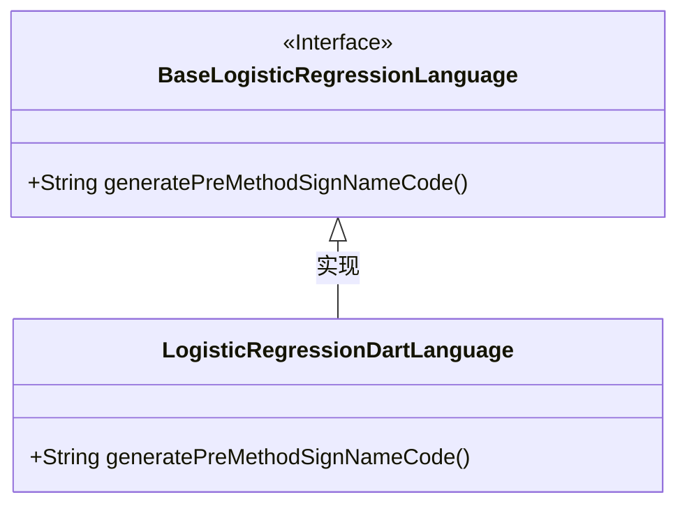
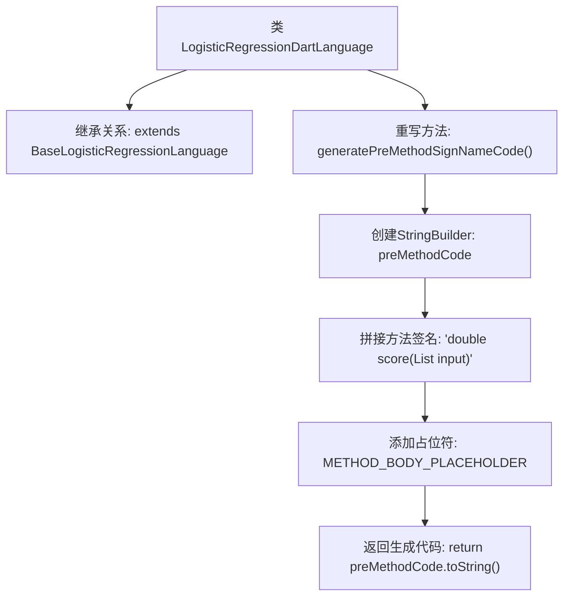

# 基础信息

|      |      |
|------|------|
| 名称 | LogisticRegressionDartLanguage |
| 编码语言 | .java |
| 代码路径 | WeFe/board/board-service/src/main/java/com/welab/wefe/board/service/service/modelexport/LogisticRegressionDartLanguage.java |
| 包名 | com.welab.wefe.board.service.service.modelexport |
| 依赖项 | [] |
| 概述说明 | Dart语言逻辑回归类，重写生成预方法签名代码方法，返回包含占位符的方法模板字符串。 |

# 说明

该内容描述了一个名为LogisticRegressionDartLanguage的类，继承自BaseLogisticRegressionLanguage。该类重写了generatePreMethodSignNameCode方法，用于生成Dart语言格式的预定义方法签名代码。方法内部使用StringBuilder构建一个返回double类型的score方法，接收List<double>类型参数input。方法体包含占位符METHOD_BODY_PLACEHOLDER，并用缩进单位字符INDENTATION_UNIT_CHAR进行格式化。最终返回完整的方法签名字符串，包含大括号和换行符。

# 类列表 Class Summary

| 名称   | 类型  | 说明 |
|-------|------|-------------|
| LogisticRegressionDartLanguage | class | Dart语言逻辑回归类，重写生成方法签名代码，返回包含占位符的方法字符串。 |

## 类 LogisticRegressionDartLanguage

|      |      |
|------|------|
| 访问范围 | public |
| 类型 | class |
| 名称 | LogisticRegressionDartLanguage |
| 说明 | Dart语言逻辑回归类，重写生成方法签名代码，返回包含占位符的方法字符串。 |

### UML类图

该类图展示了LogisticRegressionDartLanguage继承自BaseLogisticRegressionLanguage接口并实现其抽象方法。BaseLogisticRegressionLanguage作为接口定义了生成方法签名代码的规范，而LogisticRegressionDartLanguage作为具体实现类，重写了generatePreMethodSignNameCode()方法，用于生成Dart语言格式的逻辑回归评分方法模板。继承关系通过空心三角箭头表示，体现了Dart语言实现与通用接口之间的层级关系。

### 内部方法调用关系图

该流程图描述了LogisticRegressionDartLanguage类的结构及其核心方法逻辑。该类继承自BaseLogisticRegressionLanguage，并重写了generatePreMethodSignNameCode方法。该方法通过StringBuilder构建Dart语言格式的方法签名，包含返回类型、参数列表和占位符，最终返回拼接好的字符串。整个过程展示了代码生成器的模板构建流程，体现了方法签名的标准化封装机制。

### 字段列表 Field List

| 名称  | 类型  | 说明 |
|-------|-------|------|

### 方法列表

| 名称  | 类型  | 说明 |
|-------|-------|------|
| generatePreMethodSignNameCode | String | 生成一个返回字符串的方法，内容为定义score方法签名和占位符，用于后续填充方法体。 |

