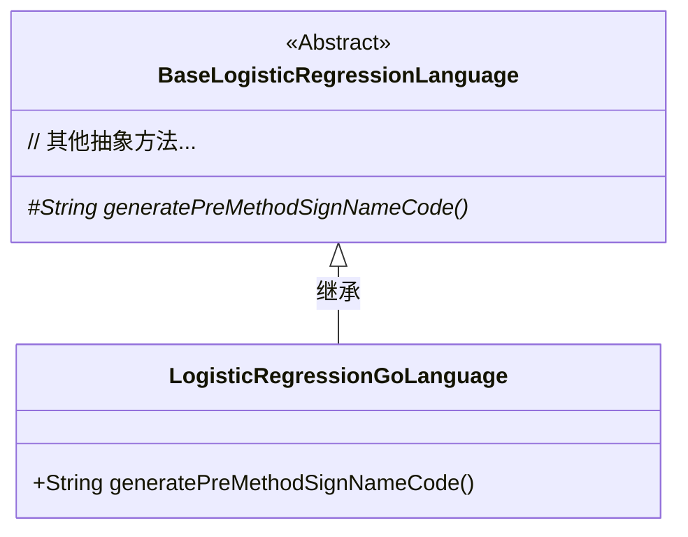
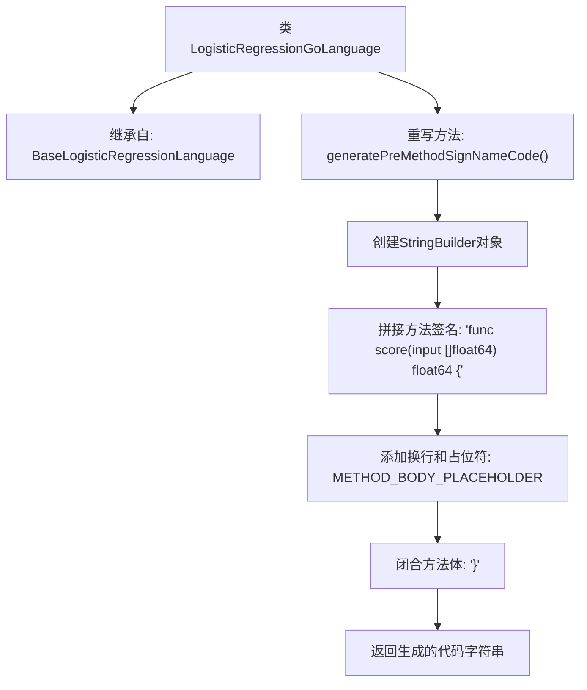

# 基础信息

|      |      |
|------|------|
| 名称 | LogisticRegressionGoLanguage |
| 编码语言 | .java |
| 代码路径 | WeFe/board/board-service/src/main/java/com/welab/wefe/board/service/service/modelexport/LogisticRegressionGoLanguage.java |
| 包名 | com.welab.wefe.board.service.service.modelexport |
| 依赖项 | [] |
| 概述说明 | Go语言逻辑回归类生成预方法签名代码，返回包含占位符的方法字符串。 |

# 说明

这段内容描述了一个名为LogisticRegressionGoLanguage的类，它继承自BaseLogisticRegressionLanguage。该类重写了generatePreMethodSignNameCode方法，用于生成Go语言格式的预定义方法签名代码。方法内部使用StringBuilder构建了一个名为score的函数，该函数接收float64类型的输入数组并返回float64类型结果。方法体中预留了占位符METHOD_BODY_PLACEHOLDER，并按照Go语言语法规范添加了必要的缩进和换行符。

# 类列表 Class Summary

| 名称   | 类型  | 说明 |
|-------|------|-------------|
| LogisticRegressionGoLanguage | class | Go语言逻辑回归类生成预方法签名代码，返回包含占位符的方法体字符串。 |

## 类 LogisticRegressionGoLanguage

|      |      |
|------|------|
| 访问范围 | public |
| 类型 | class |
| 名称 | LogisticRegressionGoLanguage |
| 说明 | Go语言逻辑回归类生成预方法签名代码，返回包含占位符的方法体字符串。 |

### UML类图

类图描述：
该图展示了一个继承关系，其中LogisticRegressionGoLanguage是BaseLogisticRegressionLanguage的具体实现子类。基类被标记为抽象类（<<Abstract>>），包含受保护的抽象方法generatePreMethodSignNameCode()，而子类实现了该方法用于生成Go语言格式的评分函数签名模板。箭头方向表示子类对父类的继承关系，符合面向对象的设计原则。

### 内部方法调用关系图

这段代码流程图展示了Go语言逻辑回归模型的代码生成过程。LogisticRegressionGoLanguage类继承基类后，重写了generatePreMethodSignNameCode方法，该方法通过StringBuilder逐步构建一个Go语言函数签名模板，包含方法声明、占位符和闭合括号，最终返回完整的模板字符串用于后续代码生成。整个过程体现了方法签名的结构化组装逻辑。

### 字段列表 Field List

| 名称  | 类型  | 说明 |
|-------|-------|------|

### 方法列表

| 名称  | 类型  | 说明 |
|-------|-------|------|
| generatePreMethodSignNameCode | String | 该方法生成Go语言函数模板，包含输入参数和返回类型，预留方法体占位符，使用缩进格式化代码。 |

