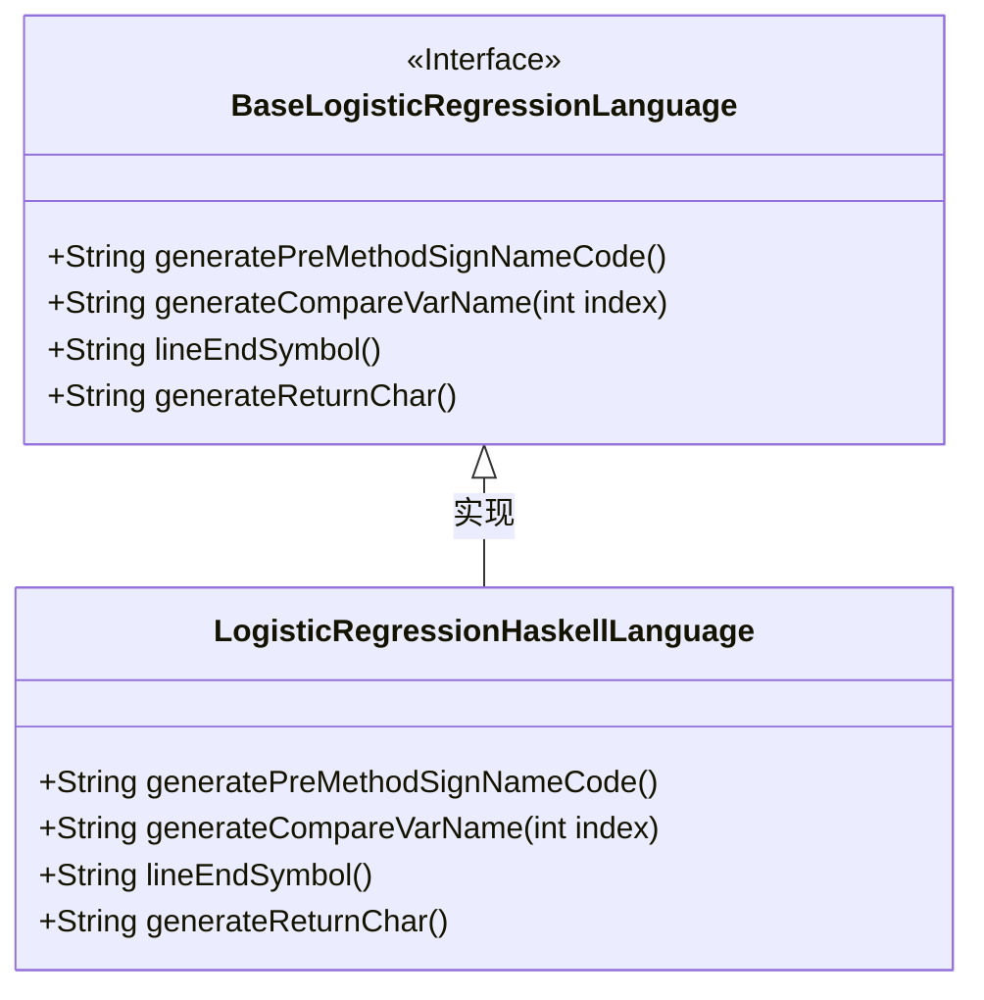
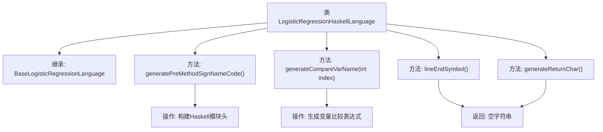

# 基础信息

|      |      |
|------|------|
| 名称 | LogisticRegressionHaskellLanguage |
| 编码语言 | .java |
| 代码路径 | WeFe/board/board-service/src/main/java/com/welab/wefe/board/service/service/modelexport/LogisticRegressionHaskellLanguage.java |
| 包名 | com.welab.wefe.board.service.service.modelexport |
| 依赖项 | [] |
| 概述说明 | Haskell逻辑回归类，生成模块定义、函数签名及占位符，无行尾符号和返回符，支持索引变量访问。 |

# 说明

该代码定义了一个名为LogisticRegressionHaskellLanguage的类，继承自BaseLogisticRegressionLanguage。它重写了多个方法以生成Haskell语言特定的逻辑回归实现代码。generatePreMethodSignNameCode方法构建了Haskell模块声明和函数签名，包含占位符用于后续填充方法体。generateCompareVarName方法生成Haskell列表索引语法。lineEndSymbol和generateReturnChar方法返回空字符串，符合Haskell语法不需要行结束符和显式返回字符的特点。整个类专注于将逻辑回归算法适配到Haskell语言环境。

# 类列表 Class Summary

| 名称   | 类型  | 说明 |
|-------|------|-------------|
| LogisticRegressionHaskellLanguage | class | Java类LogisticRegressionHaskellLanguage继承BaseLogisticRegressionLanguage，重写方法生成Haskell代码结构，包括模块定义、函数签名和占位符，处理输入索引和返回格式。 |

## 类 LogisticRegressionHaskellLanguage

|      |      |
|------|------|
| 访问范围 | public |
| 类型 | class |
| 名称 | LogisticRegressionHaskellLanguage |
| 说明 | Java类LogisticRegressionHaskellLanguage继承BaseLogisticRegressionLanguage，重写方法生成Haskell代码结构，包括模块定义、函数签名和占位符，处理输入索引和返回格式。 |

### UML类图

这段代码展示了一个Haskell语言逻辑回归模型的代码生成器实现。LogisticRegressionHaskellLanguage类继承自BaseLogisticRegressionLanguage接口，实现了四个关键方法：generatePreMethodSignNameCode()用于生成Haskell模块声明和函数签名，generateCompareVarName()生成数组索引语法，lineEndSymbol()和generateReturnChar()分别处理行尾符号和返回字符的特殊需求（在Haskell中均为空）。该实现专门针对Haskell语言的语法特性进行了定制，如使用"!!"操作符进行列表索引，模块声明格式等，体现了对函数式语言特性的适配。

### 内部方法调用关系图

该流程图展示了Haskell逻辑回归语言生成器的核心结构。类继承自基础逻辑回归语言类，包含4个关键方法：generatePreMethodSignNameCode()用于构建Haskell模块定义和函数签名模板；generateCompareVarName()生成Haskell列表索引语法；lineEndSymbol()和generateReturnChar()均返回空字符串以符合Haskell语法规范。各方法协同工作，最终生成符合Haskell语法的机器学习模型代码。

### 字段列表 Field List

| 名称  | 类型  | 说明 |
|-------|-------|------|

### 方法列表

| 名称  | 类型  | 说明 |
|-------|-------|------|
| generateCompareVarName | String | 生成比较变量名的方法，返回格式为"(input) !!(index)"，其中index为输入参数。 |
| generatePreMethodSignNameCode | String | 生成Haskell模块代码，定义score函数签名和占位体。 |
| lineEndSymbol | String | 方法重写，返回空字符串作为行结束符。 |
| generateReturnChar | String | 覆盖方法生成空字符串返回。 |

