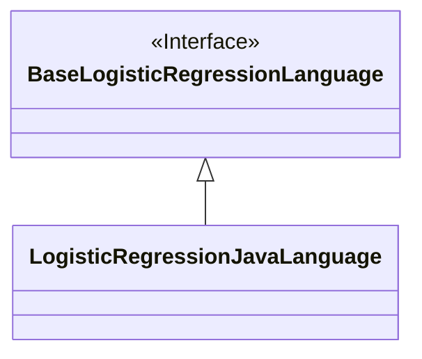
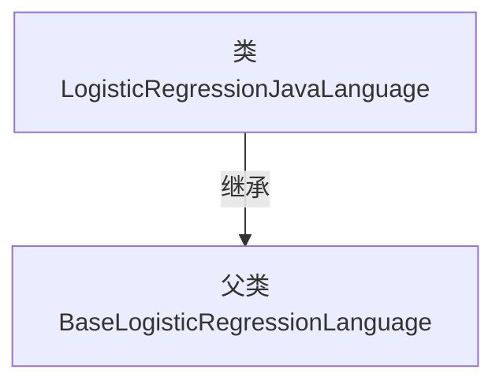

# 基础信息

|      |      |
|------|------|
| 名称 | LogisticRegressionJavaLanguage |
| 编码语言 | .java |
| 代码路径 | WeFe/board/board-service/src/main/java/com/welab/wefe/board/service/service/modelexport/LogisticRegressionJavaLanguage.java |
| 包名 | com.welab.wefe.board.service.service.modelexport |
| 依赖项 | [] |
| 概述说明 | Java实现的逻辑回归语言类，继承自基础逻辑回归语言类。 |

# 说明

该内容定义了一个名为LogisticRegressionJavaLanguage的Java类，该类继承自BaseLogisticRegressionLanguage基类。这是一个面向对象的类声明，表明该类专门用于实现逻辑回归算法，并且是基于Java语言实现的。通过继承关系，该类将具备基类中定义的功能和属性，同时可以扩展或重写相关方法以满足特定需求。整个声明简洁明了，没有包含任何具体实现细节或额外属性方法。

# 类列表 Class Summary

| 名称   | 类型  | 说明 |
|-------|------|-------------|
| LogisticRegressionJavaLanguage | class | Java实现的逻辑回归语言类，继承基础逻辑回归语言类。 |

## 类 LogisticRegressionJavaLanguage

|      |      |
|------|------|
| 访问范围 | public |
| 类型 | class |
| 名称 | LogisticRegressionJavaLanguage |
| 说明 | Java实现的逻辑回归语言类，继承基础逻辑回归语言类。 |

### UML类图

这段类图描述了一个简单的继承关系，其中`LogisticRegressionJavaLanguage`类继承自`BaseLogisticRegressionLanguage`接口。图中明确展示了接口与实现类之间的层级关系，使用空心三角箭头表示继承，符合UML规范。`BaseLogisticRegressionLanguage`被标记为接口，而`LogisticRegressionJavaLanguage`作为具体实现类没有任何额外成员，表明它可能完全继承了接口的所有抽象方法。这种结构常用于实现多态和代码复用。

### 内部方法调用关系图

这段流程图展示了LogisticRegressionJavaLanguage类的继承关系。图中明确表示LogisticRegressionJavaLanguage继承自BaseLogisticRegressionLanguage父类，体现了面向对象编程中的继承特性。该图简洁清晰地呈现了类之间的层级关系，有助于理解代码结构和设计意图。继承关系是面向对象编程中实现代码复用和扩展的重要机制。

### 字段列表 Field List

| 名称  | 类型  | 说明 |
|-------|-------|------|

### 方法列表

| 名称  | 类型  | 说明 |
|-------|-------|------|

